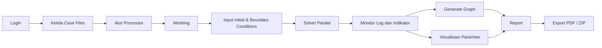
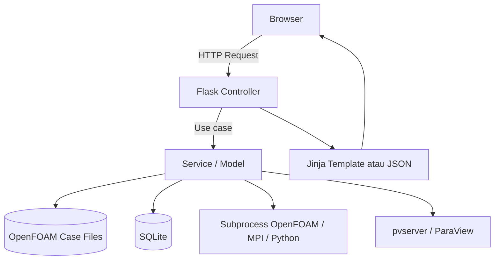
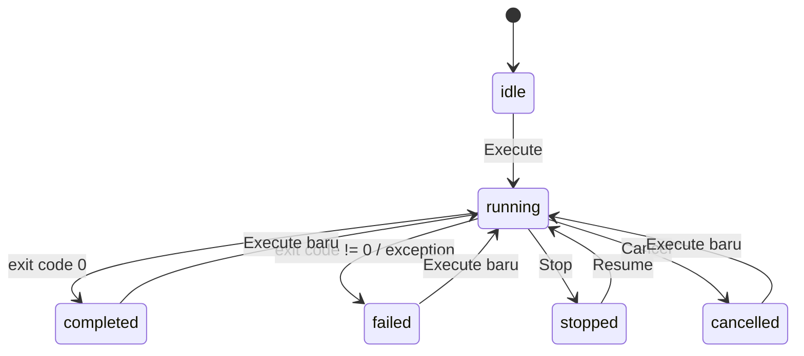
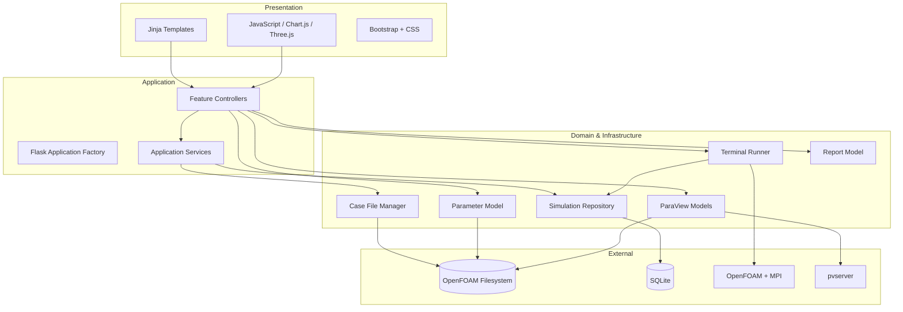
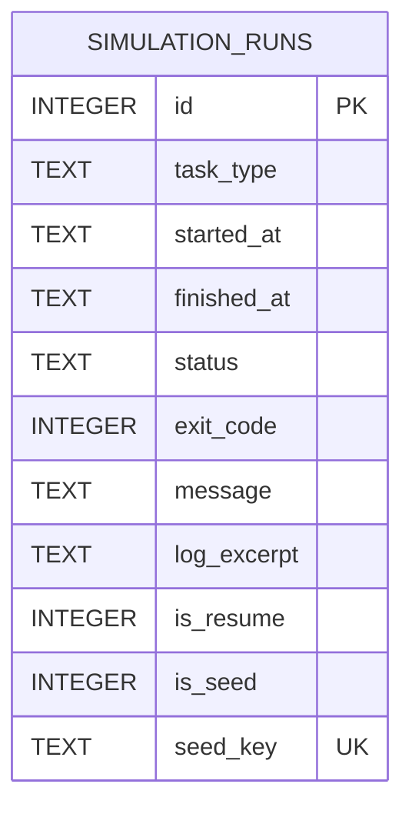

# Dokumentasi Sistem KMI CFD Simulation Platform

> Dokumen teknis dan fungsional untuk kebutuhan pengembangan, operasional, dan penyusunan skripsi.

| Informasi | Nilai |
| --- | --- |
| Nama sistem | KMI CFD Simulation Platform |
| Organisasi pada antarmuka | PT Kalbe Morinaga Indonesia |
| Domain | Simulasi Computational Fluid Dynamics (CFD) proses spray drying |
| Aplikasi utama | Web application berbasis Flask |
| Mesin simulasi | OpenFOAM dan MPI |
| Visualisasi | Three.js pada browser dan ParaView Desktop melalui `pvserver` |
| Penyimpanan aplikasi | SQLite dan filesystem |
| Versi dokumen | 1.0 |
| Tanggal pemetaan | 14 Agustus 2026 |
| Dasar dokumentasi | Implementasi aktual pada repository, bukan rancangan konseptual semata |

---

## Daftar Isi

1. [Ringkasan Eksekutif](#1-ringkasan-eksekutif)
2. [Latar Belakang](#2-latar-belakang)
3. [Tujuan, Manfaat, dan Ruang Lingkup](#3-tujuan-manfaat-dan-ruang-lingkup)
4. [Istilah dan Singkatan](#4-istilah-dan-singkatan)
5. [Aktor dan Hak Akses](#5-aktor-dan-hak-akses)
6. [Alur Kerja Sistem](#6-alur-kerja-sistem)
7. [Dokumentasi Fitur](#7-dokumentasi-fitur)
8. [Kebutuhan Fungsional](#8-kebutuhan-fungsional)
9. [Kebutuhan Nonfungsional](#9-kebutuhan-nonfungsional)
10. [Arsitektur Sistem](#10-arsitektur-sistem)
11. [Struktur Source Code](#11-struktur-source-code)
12. [Model Data dan Database](#12-model-data-dan-database)
13. [Integrasi dengan OpenFOAM](#13-integrasi-dengan-openfoam)
14. [Daftar Endpoint](#14-daftar-endpoint)
15. [Algoritma dan Aturan Bisnis Penting](#15-algoritma-dan-aturan-bisnis-penting)
16. [Teknologi yang Digunakan](#16-teknologi-yang-digunakan)
17. [Konfigurasi Sistem](#17-konfigurasi-sistem)
18. [Instalasi dan Menjalankan Aplikasi](#18-instalasi-dan-menjalankan-aplikasi)
19. [Panduan Penggunaan](#19-panduan-penggunaan)
20. [Pengujian](#20-pengujian)
21. [Keamanan](#21-keamanan)
22. [Kinerja, Keandalan, dan Skalabilitas](#22-kinerja-keandalan-dan-skalabilitas)
23. [Batasan Implementasi Saat Ini](#23-batasan-implementasi-saat-ini)
24. [Rekomendasi Pengembangan](#24-rekomendasi-pengembangan)
25. [Pemeliharaan dan Troubleshooting](#25-pemeliharaan-dan-troubleshooting)
26. [Bahan Penyusunan Skripsi](#26-bahan-penyusunan-skripsi)
27. [Matriks Ketertelusuran](#27-matriks-ketertelusuran)

---

## 1. Ringkasan Eksekutif

KMI CFD Simulation Platform adalah aplikasi web yang mengintegrasikan pengelolaan *case* OpenFOAM, pengaturan parameter, alokasi prosesor, proses *meshing*, eksekusi *solver*, pemantauan log, pembuatan grafik diagnostik, visualisasi hasil, dan penyusunan laporan ke dalam satu antarmuka.

Masalah utama yang diselesaikan sistem adalah tersebarnya aktivitas simulasi CFD di berbagai alat dan perintah terminal. Tanpa sistem ini, pengguna harus mengedit *dictionary* OpenFOAM secara manual, menjalankan rangkaian perintah *meshing* satu per satu, mengatur MPI, membaca log teks, membuat grafik dengan skrip terpisah, membuka ParaView, serta mengarsipkan gambar dan laporan secara manual.

Website tidak menggantikan perhitungan numerik OpenFOAM. Website bertindak sebagai lapisan orkestrasi dan antarmuka pengguna. Komputasi utama tetap dilakukan oleh executable OpenFOAM dan MPI di sistem operasi server.

Nilai utama sistem meliputi:

- alur kerja simulasi yang terpusat;
- pengurangan kesalahan akibat pengeditan file konfigurasi secara manual;
- transparansi proses melalui log dan indikator progres;
- pencatatan riwayat eksekusi ke SQLite;
- dukungan analisis residual dan Courant number;
- visualisasi geometri langsung di browser;
- integrasi ParaView Desktop untuk analisis hasil yang lebih lengkap;
- pengarsipan screenshot, grafik, ZIP case, ZIP log, dan PDF report.

---

## 2. Latar Belakang

Computational Fluid Dynamics adalah metode komputasi untuk menganalisis perilaku aliran fluida, perpindahan panas, perpindahan massa, turbulensi, serta interaksi fase berdasarkan persamaan konservasi dan model numerik. Dalam konteks spray drying, simulasi dapat digunakan untuk mempelajari aliran udara panas, distribusi temperatur, tekanan, kelembapan, lintasan droplet, penguapan, serta interaksi droplet dengan dinding ruang pengering.

OpenFOAM menyediakan solver, utilitas pembentukan mesh, format dictionary, pemrosesan paralel, dan hasil numerik yang dibutuhkan. Namun, penggunaan OpenFOAM secara langsung membutuhkan pemahaman struktur folder case, sintaks dictionary, command-line Linux, MPI, interpretasi log, dan ParaView. Hambatan ini dapat meningkatkan waktu persiapan dan risiko kesalahan konfigurasi.

KMI CFD Simulation Platform dikembangkan sebagai antarmuka terintegrasi agar proses tersebut dapat dijalankan dan dipantau melalui browser. Sistem juga menyediakan mode parameter produksi untuk menerjemahkan masukan operasional yang lebih mudah dipahami menjadi nilai teknis OpenFOAM melalui rumus yang telah dikonfigurasi.

### 2.1 Identifikasi masalah

Permasalahan yang menjadi dasar pengembangan sistem adalah:

1. Konfigurasi simulasi tersebar pada banyak file di folder `0`, `constant`, dan `system`.
2. Kesalahan penulisan path, nama blok, atau satuan dapat menyebabkan simulasi gagal.
3. Rangkaian *meshing* dan solver paralel memerlukan banyak perintah terminal.
4. Log OpenFOAM berukuran besar dan sulit dipantau oleh pengguna nonspesialis.
5. Data proses, grafik, screenshot, dan laporan belum berada dalam satu alur kerja.
6. Riwayat eksekusi perlu disimpan untuk evaluasi keberhasilan dan waktu komputasi.
7. Visualisasi pada server tanpa antarmuka grafis memerlukan mekanisme remote yang aman.

### 2.2 Gagasan solusi

Sistem menyediakan antarmuka web sebagai penghubung antara pengguna, file case OpenFOAM, executable simulasi, penyimpanan riwayat, generator grafik, dan ParaView. Setiap fungsi dipisahkan ke dalam controller, model, dan service agar aplikasi lebih mudah diuji dan dikembangkan.

---

## 3. Tujuan, Manfaat, dan Ruang Lingkup

### 3.1 Tujuan sistem

Tujuan utama sistem adalah membangun platform web terintegrasi yang dapat:

1. mengelola file case OpenFOAM secara aman dari browser;
2. mengubah parameter simulasi tanpa mengedit dictionary secara manual;
3. mengatur jumlah subdomain untuk komputasi paralel;
4. menjalankan dan memantau proses meshing serta solver;
5. mencatat status dan durasi proses secara persisten;
6. menampilkan indikator kestabilan solver dari log;
7. menghasilkan grafik diagnostik dari log OpenFOAM;
8. menyediakan visualisasi geometri melalui browser dan ParaView Desktop;
9. menyusun arsip hasil dalam bentuk folder report dan PDF.

### 3.2 Manfaat

#### Bagi process engineer

- Menjalankan alur CFD dari satu antarmuka.
- Mengurangi interaksi langsung dengan terminal.
- Mempercepat pemeriksaan log dan status simulasi.
- Mempermudah penggunaan kembali case dan hasil.

#### Bagi peneliti

- Menjaga parameter dan hasil eksperimen lebih terstruktur.
- Menyediakan riwayat eksekusi sebagai data evaluasi.
- Mempermudah pembuatan dokumentasi visual dan laporan.

#### Bagi pengembang atau administrator

- Konfigurasi path dapat dipindahkan melalui environment variable.
- Arsitektur modular memudahkan penambahan fitur.
- Pengujian otomatis mengurangi risiko regresi.

### 3.3 Ruang lingkup yang termasuk

- autentikasi satu akun berbasis session;
- dashboard dan riwayat proses;
- pengelolaan file case;
- parameter mode developer dan production;
- produk CKR dan BMT pada mode production;
- konfigurasi prosesor OpenFOAM;
- rangkaian meshing;
- solver paralel menggunakan MPI;
- pemantauan log dan indikator numerik;
- grafik residual, Courant number, dan time step;
- preview geometri internal mesh;
- remote ParaView Desktop;
- pembuatan folder report dan PDF;
- SQLite untuk riwayat eksekusi.

### 3.4 Ruang lingkup yang belum termasuk

- manajemen banyak pengguna dan *role-based access control*;
- antrean pekerjaan terdistribusi;
- eksekusi beberapa case secara simultan;
- penyimpanan parameter eksperimen sebagai versi terpisah;
- pembacaan nilai skalar CFD asli pada preview Three.js;
- validasi ilmiah otomatis terhadap data laboratorium atau data lapangan;
- notifikasi email atau aplikasi pesan;
- penyimpanan objek di cloud;
- audit trail lengkap untuk setiap perubahan file.

---

## 4. Istilah dan Singkatan

| Istilah | Penjelasan |
| --- | --- |
| CFD | Computational Fluid Dynamics, simulasi numerik aliran fluida dan fenomena terkait. |
| OpenFOAM | Perangkat lunak open source untuk simulasi CFD. |
| Case | Satu paket simulasi OpenFOAM yang umumnya berisi folder `0`, `constant`, dan `system`. |
| Dictionary | File konfigurasi OpenFOAM dengan struktur key, value, dan block. |
| Mesh | Diskretisasi domain geometri menjadi sel komputasi. |
| Meshing | Proses pembentukan dan pemeriksaan mesh. |
| Solver | Program yang menyelesaikan persamaan numerik pada mesh. |
| Boundary condition | Kondisi fisik pada batas domain, seperti inlet, outlet, dan wall. |
| Initial condition | Nilai awal variabel pada domain simulasi. |
| MPI | Message Passing Interface untuk komputasi paralel. |
| Processor/subdomain | Bagian domain hasil dekomposisi untuk satu proses MPI. |
| Residual | Ukuran ketidakseimbangan persamaan pada proses iterasi. |
| Courant number | Besaran tak berdimensi untuk menilai hubungan kecepatan, ukuran sel, dan time step. |
| Time step | Interval waktu numerik antarperhitungan transient. |
| ParaView | Aplikasi visualisasi data ilmiah dan hasil OpenFOAM. |
| `pvserver` | Proses ParaView di server untuk koneksi client/server dari ParaView Desktop. |
| VTP | VTK PolyData, format geometri yang dapat dimuat oleh viewer. |
| Checkpoint | Kondisi hasil sementara yang dapat digunakan untuk melanjutkan solver. |
| CSRF | Cross-Site Request Forgery, serangan yang memicu request perubahan tanpa kehendak pengguna. |
| WAL | Write-Ahead Logging, mode SQLite yang meningkatkan ketahanan dan konkurensi akses. |

---

## 5. Aktor dan Hak Akses

Implementasi saat ini hanya mempunyai satu tingkat akses setelah login. Seluruh pengguna yang berhasil masuk dapat mengakses semua modul. Pembagian aktor berikut adalah pembagian konseptual untuk analisis kebutuhan, bukan role yang sudah diterapkan pada kode.

| Aktor konseptual | Aktivitas utama | Kondisi implementasi |
| --- | --- | --- |
| Process Engineer | Mengisi parameter, menjalankan meshing dan solver, membaca hasil. | Menggunakan akun login umum. |
| Peneliti | Menganalisis grafik, visualisasi, riwayat, dan report. | Menggunakan akun login umum. |
| Administrator CFD | Mengatur server, path, prosesor, OpenFOAM, ParaView, dan keamanan. | Administrasi dilakukan melalui environment/server; UI tidak memiliki role admin khusus. |

### 5.1 Autentikasi pengguna

- Semua route selain `/login` dan asset `/static` dilindungi oleh pemeriksaan session.
- Kredensial dibandingkan menggunakan `hmac.compare_digest`.
- Setelah login berhasil, session berisi status autentikasi, username, dan token CSRF.
- Parameter `next` hanya menerima path internal yang diawali `/` dan menolak awalan `//`, sehingga mengurangi risiko *open redirect*.
- Logout menghapus seluruh session.

---

## 6. Alur Kerja Sistem

### 6.1 Alur utama simulasi



Urutan pada dashboard menampilkan Case Files, Meshing, Boundary Condition, Solving, dan Result. Dalam praktik, pengaturan prosesor sebaiknya dilakukan sebelum meshing karena tahap terakhir meshing adalah `decomposePar` dan solver memeriksa folder `processorN` sesuai nilai `numberOfSubdomains`.

### 6.2 Alur request aplikasi



### 6.3 Siklus status proses



Pada UI, status selesai disebut `completed`, sedangkan pada database status persisten disebut `success`.

---

## 7. Dokumentasi Fitur

### 7.1 Login dan logout

Halaman login menerima username dan password. Bila kredensial sesuai konfigurasi, aplikasi:

1. menghapus session lama;
2. menandai session sebagai terautentikasi;
3. menyimpan username;
4. membuat token CSRF acak;
5. mengarahkan pengguna ke halaman tujuan yang aman atau dashboard.

Fitur antarmuka login mencakup validasi field wajib dan tombol tampil/sembunyikan password. Kredensial default untuk kompatibilitas pengembangan adalah `kmi.cfd` / `kmi.cfd` dan wajib diganti pada deployment.

### 7.2 Dashboard

Dashboard menampilkan ringkasan data langsung dari SQLite:

| Komponen | Cara perhitungan |
| --- | --- |
| Total Runs | Jumlah seluruh record meshing dan solver. |
| Compute Time | Total durasi dari waktu mulai sampai selesai; proses aktif dihitung sampai waktu saat dashboard dibuka. |
| Success Rate | Jumlah proses `success` dibagi proses yang telah selesai. Proses `running` tidak menjadi penyebut. |
| Active Runs | Jumlah record berstatus `running`. |
| Simulation Activity | Jumlah proses yang dimulai per hari selama tujuh hari terakhir dalam zona waktu aplikasi. |
| Status Breakdown | Distribusi `success`, `failed`, `running`, `stopped`, dan `cancelled`. |
| Recent Runs | Maksimal sepuluh proses terbaru, dengan filter All, Meshing, atau Solver. |

Tabel riwayat memuat jenis proses, indikator resume, penanda demo data, waktu mulai, waktu selesai, durasi, status, pesan, dan exit code.

Ketika aplikasi dinyalakan ulang, record yang masih `running` ditandai `failed` dengan exit code `-1`. Kebijakan ini mencegah dashboard menampilkan proses aktif yang sebenarnya sudah terputus.

### 7.3 Case File Manager

Case File Manager mengindeks seluruh file di bawah folder case secara rekursif. Symlink tidak diikuti agar akses tidak keluar dari root yang diizinkan.

#### Kemampuan utama

- menampilkan statistik jumlah dan ukuran file;
- mencari berdasarkan nama atau path;
- memfilter file text, STL, log, binary, dan result;
- pagination sebanyak 100 file per halaman;
- membaca dan mengedit file UTF-8 berukuran maksimal 2 MB;
- mengunggah maksimal 100 file dalam satu request;
- memilih folder tujuan atau membuat folder baru;
- mengganti isi file tanpa mengubah nama/path target;
- mengunduh satu file;
- menghapus satu file;
- mengunduh seluruh case, report, dan grafik sebagai ZIP;
- mengunduh seluruh log sebagai ZIP;
- membersihkan hasil, log, upload, atau mereset case.

#### Klasifikasi file

| Jenis | Aturan umum |
| --- | --- |
| Log | Nama `log`, awalan `log.`, `log_`, `log-`, atau ekstensi `.log`, `.out`, `.err`. |
| STL | Ekstensi `.stl`. |
| Text | UTF-8, tidak memiliki null byte, bukan ekstensi binary, maksimal 2 MB. |
| Binary | File selain kategori di atas yang tidak aman untuk editor teks. |
| Result | Berada di time directory positif, `processorN`, `postProcessing`, `VTK`, atau `constant/polyMesh`. |

#### Keamanan path

Path dinormalisasi sebagai path relatif POSIX. Sistem menolak:

- path absolut;
- komponen `..`;
- karakter `:` dan null byte;
- symlink pada setiap bagian path;
- hasil resolve yang berada di luar `CASE_ROOT`.

#### Upload dan mekanisme pemulihan

Upload disimpan terlebih dahulu ke staging directory. Untuk file yang menggantikan file asli, sistem membuat backup dengan nama UUID pada `.case_file_manager/backups` dan mencatatnya di `uploads.json`. Opsi **Clear uploaded files** akan:

- menghapus file baru yang dibuat melalui UI;
- mengembalikan file asli yang pernah diganti;
- membersihkan manifest upload.

Perubahan melalui editor teks tidak dimasukkan ke manifest backup. Karena itu, pengeditan manual melalui editor tidak otomatis dapat dipulihkan oleh **Clear uploaded files**.

#### Mode clear/reset

| Mode | Dampak |
| --- | --- |
| Results | Menghapus time directory positif, `processor*`, `postProcessing`, `VTK`, `constant/polyMesh`, dan log. |
| Logs | Menghapus file yang dikenali sebagai log. |
| Uploads | Menghapus file baru dari UI dan memulihkan file yang diganti melalui UI. |
| Reset | Menggabungkan clear uploads dan clear results. Folder input inti seperti `0`, `constant` selain `polyMesh`, `system`, script, dan `Allrun` dipertahankan. |

Operasi clear membutuhkan token CSRF, teks konfirmasi `CLEAR`, dan konfirmasi tambahan dari browser.

### 7.4 Input Parameter

Fitur Input Parameter mempunyai dua mode.

#### 7.4.1 Mode Developer

Mode Developer menampilkan parameter teknis yang dipetakan langsung ke entry dictionary OpenFOAM. Nilai awal form dibaca dari file case bila location didukung.

| Grup | Isi parameter |
| --- | --- |
| 0. Initial Conditions | Temperatur, kecepatan, fraksi massa H2O, tekanan, `p_rgh`, `k`, dan `omega` pada internal field. |
| 1. Boundary Conditions | Kondisi inlet gas, outlet, perpindahan panas wall, temperatur ambient, dan obstacle. |
| 2. Droplet & Nozzle | Properti droplet, konfigurasi cone nozzle, Rosin-Rammler, komposisi fase, dan interaksi wall. |
| 3. Thermophysical Properties | `Cp`, viskositas, Prandtl number, densitas solid, kapasitas panas, dan konduktivitas. |
| 4. Physical Sub-Models | Heat transfer, dispersion, drag/particle forces, dan turbulence model. |
| 5. Numerical Settings | Courant limits, time step, limiter, PIMPLE, residual control, subcycle parcel, dan jumlah subdomain. |
| 6. Validation Parameters | Target validasi temperatur, tekanan, dan moisture. Saat ini bersifat tampilan dan belum ditulis ke output. |

Beberapa field sengaja dinonaktifkan atau dilewati karena location belum didukung, yaitu nozzle operating pressure langsung, water activity correction, gas-phase turbulence model, location bertanda `indirect`, `not yet implemented`, `postProcessing`, `Lagrangian`, atau `+`.

Tab Validation Parameters belum melakukan write karena targetnya merupakan hasil post-processing atau data pembanding, bukan input dictionary sederhana.

#### 7.4.2 Mode Production

Mode Production menyederhanakan input bagi pengguna proses. Pengguna memilih produk CKR atau BMT. Masukan operasional kemudian dikonversi ke satuan dan parameter OpenFOAM.

##### Formula umum CKR

| Input | Transformasi | Target utama |
| --- | --- | --- |
| Flow Feed, kg/h | `input / 60` | `massTotal` |
| Feed density, kg/L | `input * 1000` | `rho0` |
| Temperature of heater, °C | `input + 273.15` | `T0` |
| Temperature inlet chamber, °C | `input + 273.15` | inlet `T` |
| Chamber pressure, mbar | `100000 + input * 100` | outlet `p_rgh` |
| Nozzle pressure, bar | `Nozzle_A × input^Nozzle_B` | Rosin-Rammler `lambda` |
| Rosin-Rammler minimum | `lambda × MinFactor` | `minValue` |
| Rosin-Rammler maximum | `lambda × MaxFactor` | `maxValue` |
| Rosin-Rammler spread | `RosinRammler_n` | `n` |
| Supply Air Fan Frequency, Hz | `input × FanVelocityCoeff` | inlet `U` |
| Supply air humidity, % | `input / 100 × HumidityCoeff` | inlet `H2O` |

Konstanta CKR saat dokumen dibuat: `Nozzle_A=0.001045`, `Nozzle_B=-0.5`, `MinFactor=0.221314`, `MaxFactor=4.436`, `RosinRammler_n=2.3`, `FanVelocityCoeff=0.2`, dan `HumidityCoeff=0.019835`.

##### Tambahan formula BMT

BMT menggunakan rangkaian input umum serupa dengan konstanta produk BMT dan menambahkan:

| Input | Transformasi | Target utama |
| --- | --- | --- |
| Nozzle diameter, mm | `input / 1000` | `outerDiameter` |
| `thetaInner`, degree | nilai langsung | `thetaInner` |
| `thetaOuter`, degree | nilai langsung | `thetaOuter` |
| Total Solid, % | `input / 100` | `YSolidTot0` |
| Liquid mass fraction | `1 - YSolidTot0` | `YLiquidTot0` |

Formula dievaluasi dengan parser AST terbatas. Operator yang diizinkan hanya penjumlahan, pengurangan, perkalian, pembagian, pangkat, plus unary, dan minus unary. Sistem tidak menggunakan `eval()` Python umum, sehingga formula tidak dapat mengeksekusi fungsi atau kode arbitrer.

#### Cara penulisan parameter

Location JSON mempunyai format berikut:

```text
file/relatif > block > subBlock > key
```

Contoh:

```text
0/T > boundaryField > inletGas > value
```

Model membaca file, mencari block dengan pasangan kurung kurawal, mencari entry yang diakhiri `;`, kemudian mengganti nilainya. Qualifier `uniform` dan `constant` dipertahankan bila nilai lama menggunakannya.

### 7.5 Set Processor

Fitur ini membaca dan memperbarui `system/decomposeParDict`.

- Nilai minimum: 1 prosesor.
- Nilai maksimum default: 32 prosesor.
- Nilai default ketika tidak terbaca: 16.
- Nilai di luar batas akan dinormalisasi ke rentang yang diizinkan.
- `numberOfSubdomains` diperbarui.
- `processorWeight` ditulis ulang dengan satu bobot untuk setiap prosesor.
- Bila entry tidak ada, service mencoba menyisipkannya pada posisi yang sesuai.

Perubahan jumlah prosesor harus diikuti proses meshing/dekomposisi ulang agar jumlah folder `processorN` cocok dengan konfigurasi.

### 7.6 Meshing

Meshing berjalan pada background thread agar request HTTP dapat segera mengembalikan status. Setiap tahap dijalankan sebagai subprocess di `CASE_ROOT`.

| Tahap | Command | Progres setelah berhasil |
| --- | --- | ---: |
| Membersihkan mesh/run lama | `rm -rf processor* constant/polyMesh log.*` | 10% |
| Membuat base mesh | `blockMesh` | 25% |
| Mengekstrak fitur surface | `surfaceFeatureExtract` | 40% |
| Menyesuaikan mesh ke geometri | `snappyHexMesh -overwrite` | 60% |
| Memeriksa kualitas mesh | `checkMesh` | 80% |
| Dekomposisi paralel | `decomposePar -force` | 100% |

Setiap output stdout/stderr ditambahkan ke terminal web. Jika satu tahap menghasilkan exit code selain nol, tahap berikutnya tidak dijalankan dan status menjadi failed.

#### Stop, cancel, dan resume meshing

- **Stop** menghentikan process group dan mempertahankan informasi step agar dapat di-resume.
- **Cancel** menghentikan proses dan menghapus hak resume.
- Resume meshing berbasis tahapan, bukan checkpoint native.
- Jika stop terjadi di tengah satu tahap, tahap tersebut akan dijalankan ulang saat resume.

### 7.7 Solver

Sebelum solver dijalankan, aplikasi memeriksa kesiapan hasil dekomposisi. Untuk setiap prosesor dari `processor0` sampai `processorN-1`, folder `constant/polyMesh` harus memuat file:

- `boundary`;
- `faces`;
- `neighbour`;
- `owner`;
- `points`.

Jika syarat tidak terpenuhi, tombol solver dinonaktifkan dan API mengembalikan pesan bahwa meshing harus diselesaikan.

Command solver yang dipanggil implementasi saat ini adalah:

```bash
mpirun --allow-run-as-root --oversubscribe -np N buoyantPimpleFoam -parallel
```

Nilai `N` dibaca dari `numberOfSubdomains`. Environment `OMPI_ALLOW_RUN_AS_ROOT` dan `OMPI_ALLOW_RUN_AS_ROOT_CONFIRM` diset pada subprocess untuk deployment container yang berjalan sebagai root.

#### Stop, cancel, dan resume solver

- **Stop** mengirim sinyal ke process group dan memungkinkan resume.
- **Resume** menjalankan solver kembali; karena case menggunakan `startFrom latestTime`, solver diharapkan melanjutkan dari time directory terbaru.
- **Cancel** menghentikan proses tanpa menawarkan resume dari UI.

Sistem hanya mengizinkan satu jenis task aktif pada satu waktu. Meshing tidak dapat dimulai ketika solver aktif dan sebaliknya.

### 7.8 Terminal log dan progress

Browser melakukan polling status proses setiap sekitar satu detik. Response berisi:

- status running;
- return code;
- maksimal 300 baris log terbaru;
- nilai progress;
- status UI;
- ketersediaan resume;
- kesiapan meshing untuk solver.

Log yang tampil dapat diunduh sebagai file `meshing_log.txt` atau `solver_log.txt`. Riwayat database hanya menyimpan maksimal 80 baris terakhir dan dibatasi 12.000 karakter sebagai excerpt.

### 7.9 Indikator kestabilan solver

Halaman solver mengekstrak nilai terbaru langsung di browser dari log OpenFOAM.

| Parameter | Target pada UI | Klasifikasi |
| --- | --- | --- |
| Courant max | `< 0.8–1.0` | Aman `<0.8`, waspada `<1.0`, lewat batas `>=1.0`. |
| Courant mean | `< 0.1` | Aman bila di bawah limit. |
| Final residual U | `< 1e-6` | Menggunakan residual maksimum dari U/Ux/Uy/Uz. |
| Final residual `p_rgh` | `< 1e-5` | Menggunakan nilai terakhir. |
| Final residual `h/H2O` | `< 1e-6` | Menggunakan nilai maksimum field terkait. |
| Continuity local/global | `< 1e-5` | Menggunakan nilai absolut terbesar. |

Indikator ini merupakan alat bantu monitoring, bukan mekanisme penghentian solver otomatis dan bukan bukti tunggal validitas atau konvergensi ilmiah.

### 7.10 Riwayat proses dan seed data

Setiap start membuat record `running`. Setelah proses selesai, record diperbarui dengan waktu selesai, status, exit code, pesan, dan log excerpt.

CLI menyediakan data demo sebanyak 12 record yang tersebar selama tujuh hari. Seed mempunyai `seed_key` unik sehingga perintah dapat dijalankan berulang tanpa duplikasi. Opsi reset seed hanya menghapus data demo dan tidak menghapus riwayat asli.

### 7.11 Graph

Fitur Graph menjalankan script `grafik/2plot_residuals.py` menggunakan interpreter Python aplikasi. Sumber default adalah `CASE_ROOT/log.run`, sedangkan output disimpan sebagai PNG di `grafik/output` atau lokasi hasil override.

Parser mengenali pola:

- `Time = ...`;
- `Solving for ..., Initial residual = ...`;
- `Courant Number mean: ... max: ...`;
- `deltaT = ...`;
- `ExecutionTime = ...`.

Output yang mungkin dihasilkan:

- satu grafik untuk setiap field residual yang ditemukan;
- `courant.png` untuk Courant mean dan max;
- `deltaT.png` untuk perubahan time step.

Jumlah gambar tidak selalu sembilan karena bergantung pada field yang ditemukan dalam log. Proses update memiliki timeout 300 detik. Halaman hanya menyajikan file `.png` yang berada langsung di output directory dan mencegah path traversal saat mengambil gambar.

### 7.12 ParaView Visualization pada browser

Halaman ParaView menampilkan metadata case:

- keberadaan `case.foam`;
- latest time directory;
- jumlah time directory;
- field pada time directory terbaru;
- jumlah folder processor;
- ketersediaan internal mesh;
- jumlah source points dan boundary faces.

#### Proses preview internal mesh

1. Model membaca `constant/polyMesh/points`, `faces`, dan `boundary`.
2. Patch boundary digunakan untuk menentukan rentang face luar.
3. Reader membaca list binary OpenFOAM dan memadatkan point yang dipakai.
4. Geometri ditulis sebagai cache `postProcessing/webInternalMesh/internalMesh.vtp`.
5. Cache digunakan kembali jika lebih baru dari file sumber.
6. Browser memuat VTP, membentuk `BufferGeometry`, lalu merendernya dengan Three.js.

Kontrol viewer meliputi orbit, zoom, enam arah kamera, opacity, solid color, pilihan nama field, block color, capture tampilan aktif, dan capture enam sisi.

Penting: cache VTP browser saat ini berisi geometri, connectivity, dan offsets, tetapi tidak memasukkan array nilai field OpenFOAM. Karena itu, pilihan coloring selain solid menggunakan pseudo-color berbasis posisi geometri dan nama field sebagai seed. Coloring tersebut berguna sebagai bantuan visual UI, tetapi tidak boleh ditafsirkan sebagai kontur temperatur, tekanan, kecepatan, atau hasil fisik yang sebenarnya. Kontur ilmiah harus dilakukan melalui ParaView Desktop/remote atau pengembangan reader field lebih lanjut.

### 7.13 Remote ParaView Desktop

Fitur ini mengelola lifecycle `pvserver` pada server Linux dan menampilkan:

- status proses;
- PID;
- versi ParaView server;
- backend rendering;
- alamat koneksi;
- perintah SSH tunnel;
- path `case.foam`;
- maksimal 300 baris log terbaru.

Status remote dapat berupa idle, starting, waiting, connected, stopping, finalizing, stopped, atau failed. State dan log disimpan pada runtime directory sehingga dapat dibaca lintas worker.

Backend dipilih berdasarkan konfigurasi:

1. OSMesa atau EGL bila dikonfigurasi;
2. X11 bila `DISPLAY` tersedia;
3. Xvfb dan Mesa software bila `xvfb-run` tersedia;
4. offscreen yang belum terverifikasi sebagai fallback.

Koneksi yang direkomendasikan menggunakan SSH tunnel karena `pvserver` tidak menyediakan autentikasi dan enkripsi sendiri:

```bash
ssh -L 11112:localhost:11112 user-vps@host-vps -p 8822
```

Setelah tunnel aktif, ParaView Desktop terhubung ke `cs://localhost:11112` dan membuka path `case.foam` di filesystem server.

### 7.14 Report

Ketika **Get Report** dipilih, sistem:

1. mencoba memperbarui grafik dari log terbaru;
2. membuat folder report bernama `DD_MM_YYYY_NNN`;
3. membuat subfolder `graphs` dan `screenshots`;
4. menyalin seluruh PNG grafik yang tersedia ke folder report;
5. menampilkan report baru pada halaman detail.

Nomor `NNN` dimulai dari `001` dan maksimum `999` report per hari.

Screenshot dari viewer dikirim sebagai base64, diverifikasi menggunakan Pillow, lalu disimpan sebagai PNG. Capture dengan nama sisi yang sama akan mengganti screenshot sisi tersebut dalam report yang sama.

PDF dibuat sebagai dokumen bergambar:

- halaman judul berisi tanggal dan jumlah asset;
- satu halaman untuk setiap screenshot;
- satu halaman untuk setiap grafik;
- gambar diperkecil secara proporsional agar sesuai halaman.

Report dapat dipilih, ditampilkan, diekspor sebagai PDF, atau dihapus.

### 7.15 Tema dan antarmuka responsif

- Antarmuka menggunakan Bootstrap dan CSS khusus.
- Tema light/dark disimpan pada `localStorage` browser.
- Chart dirender ulang saat tema berubah.
- Navigasi utama menghubungkan seluruh modul.
- Flash message digunakan untuk hasil operasi sinkron.
- Endpoint proses panjang menggunakan JSON dan polling.

---

## 8. Kebutuhan Fungsional

| ID | Kebutuhan fungsional | Implementasi |
| --- | --- | --- |
| FR-01 | Sistem harus meminta autentikasi sebelum mengakses workspace. | Session guard pada seluruh request kecuali login/static. |
| FR-02 | Sistem harus menampilkan ringkasan dan aktivitas simulasi. | Dashboard SQLite dan Chart.js. |
| FR-03 | Sistem harus mencatat lifecycle meshing dan solver. | Repository `simulation_runs`. |
| FR-04 | Sistem harus mengindeks file case secara rekursif. | Case File Manager. |
| FR-05 | Sistem harus mencari dan memfilter file. | Query `q`, kategori, dan pagination. |
| FR-06 | Sistem harus mendukung upload, replace, edit, download, dan delete file. | Route case files dan backup manifest. |
| FR-07 | Sistem harus menyediakan arsip ZIP case dan log. | ZIP64 temporary archive. |
| FR-08 | Sistem harus membersihkan hasil/log/upload berdasarkan pilihan. | Mode results, logs, uploads, reset. |
| FR-09 | Sistem harus membaca dan menulis parameter teknis OpenFOAM. | Mode Developer dan location parser. |
| FR-10 | Sistem harus mengonversi input operasional produk. | Mode Production CKR/BMT dan safe formula evaluator. |
| FR-11 | Sistem harus mengatur jumlah prosesor. | Update `decomposeParDict`, batas 1–32. |
| FR-12 | Sistem harus menjalankan tahapan meshing berurutan. | Enam subprocess meshing. |
| FR-13 | Sistem harus mencegah solver sebelum mesh paralel siap. | Pemeriksaan file polyMesh setiap processor. |
| FR-14 | Sistem harus menjalankan solver paralel. | MPI subprocess. |
| FR-15 | Sistem harus menyediakan stop, cancel, dan resume. | State machine in-memory dan process signal. |
| FR-16 | Sistem harus menampilkan log dan progress. | Polling endpoint terminal. |
| FR-17 | Sistem harus menampilkan indikator batas numerik solver. | Regex log pada halaman solver. |
| FR-18 | Sistem harus membuat grafik dari log. | Python, Matplotlib, dan NumPy. |
| FR-19 | Sistem harus menampilkan preview geometri 3D. | Konversi internal mesh ke VTP dan Three.js. |
| FR-20 | Sistem harus mendukung koneksi ParaView Desktop. | `pvserver`, state manager, SSH tunnel info. |
| FR-21 | Sistem harus menyimpan screenshot dan grafik per report. | Folder report bertanggal. |
| FR-22 | Sistem harus mengekspor report ke PDF. | Pillow multi-page PDF. |
| FR-23 | Sistem harus menyediakan data demo riwayat yang aman diulang. | CLI seeder idempotent. |

---

## 9. Kebutuhan Nonfungsional

| ID | Aspek | Kebutuhan/implementasi |
| --- | --- | --- |
| NFR-01 | Usability | Alur dapat dioperasikan melalui browser dan memberi feedback status. |
| NFR-02 | Maintainability | Controller dipisah per fitur, model/service tidak bergantung pada controller. |
| NFR-03 | Testability | Application factory menerima konfigurasi pengganti dan service disimpan app-scoped. |
| NFR-04 | Data integrity | SQLite memakai transaksi, WAL, constraint status, dan unique seed key. |
| NFR-05 | File integrity | Edit text dan manifest menggunakan temporary file serta atomic replace. |
| NFR-06 | Security | Login session, HttpOnly cookie, SameSite Lax, validasi path, dan CSRF pada sebagian operasi. |
| NFR-07 | Responsiveness | UI memakai layout Bootstrap dan dapat digunakan pada beberapa ukuran layar. |
| NFR-08 | Observability | Log proses, status, exit code, pesan kegagalan, dan remote server log tersedia. |
| NFR-09 | Configurability | Path, kredensial, cookie, timezone, dan ParaView dapat diubah melalui environment. |
| NFR-10 | Portability | Web dapat dikembangkan di Windows, tetapi OpenFOAM runner dan pvserver ditujukan untuk Linux/container. |
| NFR-11 | Performance | Proses berat dijalankan sebagai subprocess/background thread; grafik memiliki timeout. |
| NFR-12 | Recoverability | Upload replacement mempunyai backup; abandoned run ditutup otomatis saat startup. |

---

## 10. Arsitektur Sistem

### 10.1 Pola arsitektur

Aplikasi menggunakan pola MVC dengan lapisan service:

- **Controller** menangani route, request, validasi HTTP, flash/JSON, dan pemilihan template.
- **Model** menangani domain, parsing dictionary, filesystem, subprocess, ParaView, report, dan repository.
- **Service** mengorkestrasi use case yang menggabungkan model atau resource.
- **View** adalah template Jinja, CSS, dan JavaScript.
- **Application factory** adalah composition root yang memuat konfigurasi, service, controller, dan CLI.



### 10.2 Prinsip dependensi

```text
Request -> Controller -> Service/Model -> Filesystem, SQLite, atau process eksternal
                    |
                    +-> Template/JSON -> Response
```

Model dan service tidak mengimpor controller. Semua controller fitur berbagi blueprint `dashboard` agar nama endpoint `dashboard.*` tetap stabil.

### 10.3 Application factory

`create_app()` menjalankan urutan:

1. membuat instance Flask;
2. memuat `AppConfig`;
3. menerapkan override untuk test/deployment;
4. memuat session secret;
5. membuat service app-scoped;
6. menginisialisasi dan memigrasikan SQLite;
7. menutup abandoned runs;
8. mendaftarkan controller;
9. mendaftarkan CLI.

---

## 11. Struktur Source Code

```text
Interface 1onproduct/
├── app.py                         # Application factory dan entry point
├── config.py                      # Konfigurasi dan lokasi resource
├── cli.py                         # Command seed/remove demo data
├── requirements.txt               # Dependency Python
├── ARCHITECTURE.md                 # Ringkasan aturan arsitektur
├── PARAVIEW_REMOTE.md              # Panduan operasional pvserver
├── DOKUMENTASI_SISTEM.md           # Dokumen lengkap ini
├── controllers/
│   ├── auth_controller.py          # Login, logout, route guard
│   ├── dashboard_controller.py     # Dashboard dan filter history
│   ├── case_file_controller.py     # HTTP Case File Manager
│   ├── parameter_controller.py     # Input Parameter
│   ├── processor_controller.py     # Set Processor
│   ├── simulation_controller.py    # Meshing, solver, log API
│   ├── graph_controller.py         # Grafik residual
│   ├── paraview_controller.py      # Viewer dan remote pvserver
│   ├── report_controller.py        # Report, capture, PDF
│   └── helpers.py                  # CSRF dan temporary archive
├── models/
│   ├── case_file_manager.py        # Operasi aman pada file case
│   ├── parameter_model.py          # Mapping/edit dictionary dan formula
│   ├── terminal_runner.py          # Background process dan state
│   ├── simulation_run_repository.py# Repository SQLite
│   ├── paraview_model.py           # Metadata dan konversi mesh ke VTP
│   ├── paraview_server.py          # Lifecycle pvserver
│   ├── report_model.py             # Folder report, capture, PDF
│   ├── parameter_templates.json    # Parameter mode Developer
│   ├── parameter_ckr.json          # Parameter mode Production CKR
│   ├── parameter_bmt.json          # Parameter mode Production BMT
│   ├── const_ckr.json              # Konstanta CKR
│   └── const_bmt.json              # Konstanta BMT
├── services/
│   ├── graph_service.py            # Menjalankan generator grafik
│   ├── processor_service.py        # Baca/tulis decomposeParDict
│   ├── simulation_history_service.py# Metrik dan presentasi history
│   └── database_seeder.py          # Demo history idempotent
├── templates/                      # View Jinja per modul
├── static/
│   ├── css/style.css               # Desain dan tema
│   └── js/                          # UI, viewer, remote ParaView
├── grafik/
│   └── 2plot_residuals.py          # Parser log dan generator PNG
├── report/                         # Output report, diabaikan Git
├── instance/                       # SQLite runtime, diabaikan Git
└── tests/                          # Unit dan integration tests
```

Folder case default berada sebagai sibling aplikasi:

```text
1onproduct/
├── Interface 1onproduct/
└── sprayDryer-6.0.0-onProduct-Trial02/
```

---

## 12. Model Data dan Database

### 12.1 Teknologi database

Sistem menggunakan SQLite pada `instance/simulation_history.sqlite3`. Database dibuat otomatis. Koneksi bersifat singkat per operasi dengan:

- `journal_mode = WAL`;
- `synchronous = NORMAL`;
- `foreign_keys = ON`;
- `busy_timeout = 30000` ms;
- commit otomatis bila berhasil;
- rollback bila terjadi exception.

Versi schema disimpan melalui `PRAGMA user_version`. Versi saat dokumen dibuat adalah 3.

### 12.2 Entity Relationship Diagram



### 12.3 Data dictionary `simulation_runs`

| Kolom | Tipe | Aturan | Keterangan |
| --- | --- | --- | --- |
| `id` | INTEGER | PK, autoincrement | Identitas run. |
| `task_type` | TEXT | `meshing` atau `solver` | Jenis proses. |
| `started_at` | TEXT | wajib | Timestamp ISO-8601 UTC. |
| `finished_at` | TEXT | nullable | Waktu selesai UTC. |
| `status` | TEXT | running/success/failed/stopped/cancelled | Status persisten. |
| `exit_code` | INTEGER | nullable | Kode keluar process. |
| `message` | TEXT | maksimal 2.000 karakter pada service | Ringkasan hasil/kegagalan. |
| `log_excerpt` | TEXT | maksimal 12.000 karakter | Potongan log terakhir. |
| `is_resume` | INTEGER | 0 atau 1 | Run dimulai sebagai resume. |
| `is_seed` | INTEGER | 0 atau 1 | Penanda data demo. |
| `seed_key` | TEXT | unique, nullable | Identitas idempotent seed. |

### 12.4 Index

- `idx_simulation_runs_started_at` untuk urutan history;
- `idx_simulation_runs_status` untuk status;
- `idx_simulation_runs_task_type` untuk filter task;
- `idx_simulation_runs_seed_key` sebagai unique index seed.

### 12.5 Data filesystem

Selain SQLite, sistem menggunakan filesystem sebagai penyimpanan utama untuk:

| Data | Lokasi default |
| --- | --- |
| Input dan hasil CFD | `../sprayDryer-6.0.0-onProduct-Trial02` |
| Grafik sementara | `grafik/output` |
| Report | `report` |
| Manifest/backup upload | `.case_file_manager` |
| Cache preview mesh | `<case>/postProcessing/webInternalMesh` |
| State/log pvserver | `/run/kmi-cfd-paraview` |
| Session secret Linux | `/run/kmi-cfd-session-secret` |

---

## 13. Integrasi dengan OpenFOAM

### 13.1 Struktur case

| Bagian | Fungsi |
| --- | --- |
| `0/` | Initial field dan boundary condition seperti `U`, `T`, `p`, `p_rgh`, `H2O`, `k`, dan `omega`. |
| `constant/` | Properti fisik, gravitasi, turbulence, reacting cloud, radiation, dan geometri. |
| `constant/triSurface/` | Geometri STL dan feature mesh. |
| `constant/polyMesh/` | Mesh hasil. |
| `system/` | `controlDict`, `fvSchemes`, `fvSolution`, meshing dictionary, dan decomposition. |
| `processorN/` | Hasil dekomposisi domain untuk MPI. |
| Time directory | Hasil field per waktu simulasi. |
| `postProcessing/` | Surface, field min/max, cloud info, dan cache web. |

### 13.2 Model fisik yang terlihat pada case

Berdasarkan dictionary case saat pemetaan:

- simulasi transient dan compressible;
- `application` pada `controlDict` adalah `reactingParcelFoam`;
- carrier gas adalah campuran `air` dan `H2O`;
- parcel/droplet memakai `reactingCloud1`;
- injection model memakai `coneNozzleInjection`;
- ukuran droplet memakai mass Rosin-Rammler;
- komposisi memakai `singleMixtureFraction` untuk gas, liquid water, dan solid proxy;
- heat transfer model memakai Ranz-Marshall;
- particle forces memuat sphere drag dan gravity;
- turbulence memakai RAS `kOmegaSST`;
- radiation dimatikan;
- adaptive time step diaktifkan;
- algoritma coupling memakai PIMPLE;
- limiter field dan function object monitoring tersedia.

Model dan nilai tersebut adalah konfigurasi case saat ini, bukan ketetapan permanen aplikasi. Perubahan dictionary dapat mengubah model fisik tanpa perubahan kode web.

### 13.3 Pemrosesan paralel

Metode dekomposisi menggunakan `scotch`. Service web menyelaraskan `numberOfSubdomains` dan `processorWeight`. Tahap `decomposePar -force` membuat folder processor, kemudian solver dijalankan dengan jumlah proses MPI yang sama.

### 13.4 Perbedaan solver yang harus diperhatikan

Terdapat ketidaksesuaian penting pada snapshot saat ini:

- `system/controlDict` menyatakan `application reactingParcelFoam`;
- `terminal_runner.py` dan `Allrun` menjalankan `buoyantPimpleFoam`.

Sebelum eksperimen skripsi final, solver harus diselaraskan dan divalidasi terhadap versi OpenFOAM yang digunakan. Ketidaksesuaian executable, dictionary, atau model parcel dapat menyebabkan konfigurasi tidak dipakai sebagaimana dimaksud atau solver gagal dijalankan.

### 13.5 Perbedaan header versi

Beberapa dictionary menampilkan header OpenFOAM Foundation version 12, sedangkan file lain menampilkan OpenFOAM.com version 2506. Header komentar tidak selalu menentukan parser runtime, tetapi campuran fork/versi dapat mempunyai perbedaan keyword dan model. Seluruh case sebaiknya divalidasi menggunakan satu distribusi OpenFOAM yang menjadi lingkungan penelitian resmi.

---

## 14. Daftar Endpoint

Semua endpoint berikut memerlukan session login kecuali `/login` dan `/static/*`.

### 14.1 Autentikasi dan dashboard

| Method | Endpoint | Fungsi |
| --- | --- | --- |
| GET, POST | `/login` | Menampilkan form dan memproses login. |
| GET | `/logout` | Menghapus session dan kembali ke login. |
| GET | `/` | Redirect ke dashboard. |
| GET | `/dashboard` | Dashboard; query `history_type=all|meshing|solver`. |

### 14.2 Case File Manager

| Method | Endpoint | Fungsi |
| --- | --- | --- |
| GET | `/case-files` | List, statistik, search, filter, pagination. |
| GET | `/case-files/text/<path>` | Membaca file text sebagai JSON. |
| POST | `/case-files/upload` | Upload satu/banyak file; memerlukan CSRF. |
| POST | `/case-files/replace/<path>` | Mengganti isi file; memerlukan CSRF. |
| POST | `/case-files/save/<path>` | Menyimpan edit text; memerlukan CSRF. |
| GET | `/case-files/download/<path>` | Download satu file. |
| POST | `/case-files/delete/<path>` | Menghapus file; memerlukan CSRF. |
| GET | `/case-files/download-all` | ZIP case + report + graph. |
| GET | `/case-files/download-logs` | ZIP seluruh sumber log. |
| POST | `/case-files/clear` | Clear/reset; CSRF dan konfirmasi `CLEAR`. |

### 14.3 Parameter dan prosesor

| Method | Endpoint | Fungsi |
| --- | --- | --- |
| GET, POST | `/input-parameter` | Memuat/menyimpan parameter Developer atau Production. |
| GET, POST | `/set-processor` | Membaca/menulis jumlah prosesor. |

### 14.4 Meshing dan solver

| Method | Endpoint | Fungsi |
| --- | --- | --- |
| GET | `/meshing` | Halaman progress meshing. |
| GET | `/solver` | Halaman progress solver dan safety monitor. |
| POST | `/terminal/<task>/start` | Start atau resume `meshing|solver`. |
| POST | `/terminal/<task>/stop` | Stop dengan resume tersedia. |
| POST | `/terminal/<task>/cancel` | Cancel tanpa resume. |
| GET | `/terminal/<task>/logs` | State dan log JSON. |
| GET | `/terminal/<task>/download-logs` | Download log text. |

### 14.5 Graph

| Method | Endpoint | Fungsi |
| --- | --- | --- |
| GET | `/graph` | Menampilkan daftar PNG. |
| GET | `/graph/image/<filename>` | Mengirim satu PNG yang valid. |
| POST | `/graph/update` | Menjalankan parser/generator grafik. |

### 14.6 ParaView

| Method | Endpoint | Fungsi |
| --- | --- | --- |
| GET | `/paraview` | Preview web dan metadata case. |
| POST | `/paraview/open` | Membuka `case.foam` melalui ParaView lokal/default app. |
| GET | `/paraview/internal-mesh` | Membuat/mengirim cache VTP internal mesh. |
| GET | `/paraview/surface/<surface_id>` | Mengirim VTP surface post-processing yang terdaftar. |
| GET | `/paraview/remote` | Halaman kontrol remote ParaView. |
| POST | `/paraview/remote/start` | Menyalakan `pvserver`; CSRF header. |
| POST | `/paraview/remote/stop` | Menghentikan `pvserver`; CSRF header. |
| GET | `/paraview/remote/status` | Status, log, dan konfigurasi koneksi JSON. |

### 14.7 Report

| Method | Endpoint | Fungsi |
| --- | --- | --- |
| GET | `/report` | List dan report terbaru. |
| GET | `/report/<report_name>` | Detail report. |
| POST | `/report/get` | Membuat report baru dan menyalin grafik. |
| POST | `/report/<report_name>/delete` | Menghapus report. |
| POST | `/report/capture` | Menyimpan screenshot base64. |
| GET | `/report/file/<report>/<folder>/<filename>` | Mengirim screenshot/graph. |
| GET | `/report/<report_name>/export-pdf` | Download report PDF. |

---

## 15. Algoritma dan Aturan Bisnis Penting

### 15.1 Start proses

```text
1. Validasi task meshing/solver.
2. Pastikan task lain tidak running.
3. Untuk solver, pastikan semua processor polyMesh tersedia.
4. Tentukan apakah run merupakan resume.
5. Buat record SQLite berstatus running.
6. Reset atau pertahankan state sesuai kondisi resume.
7. Buat background thread.
8. Jalankan subprocess dan stream stdout.
9. Perbarui progress/state.
10. Finalisasi record SQLite berdasarkan exit code atau aksi pengguna.
```

### 15.2 Deteksi kesiapan solver

Misalkan jumlah processor adalah `N`. Solver dinyatakan siap jika:

```text
untuk setiap i pada 0 <= i < N:
    processor{i}/constant/polyMesh tersedia
    boundary, faces, neighbour, owner, points semuanya tersedia
```

### 15.3 Success rate

```math
Success\ Rate = \frac{Jumlah\ run\ success}{Jumlah\ run\ selesai} \times 100\%
```

Run selesai adalah semua status selain `running`.

### 15.4 Compute time

Untuk setiap run:

```math
durasi_i = max(0, waktu\ selesai_i - waktu\ mulai_i)
```

Untuk proses aktif, waktu selesai diganti waktu saat ini. Total compute time adalah jumlah seluruh durasi, bukan penggunaan CPU core-hour.

### 15.5 Aktivitas tujuh hari

Timestamp mulai disimpan dalam UTC, dikonversi ke `APP_TIMEZONE`, dikelompokkan berdasarkan tanggal lokal, kemudian dihitung untuk hari ini dan enam hari sebelumnya.

### 15.6 Atomic text save

```text
1. Validasi path dan jenis file.
2. Encode content sebagai UTF-8 dan cek batas 2 MB.
3. Tulis ke temporary file pada folder yang sama.
4. Salin permission file asli.
5. Ganti file asli menggunakan os.replace.
6. Hapus temporary file bila terjadi kegagalan.
```

### 15.7 Pemilihan pesan kegagalan

Sistem menelusuri log dari baris terakhir dan mencari marker `error`, `fatal`, `failed`, `cannot`, `not found`, atau `traceback`. Detail relevan ditambahkan ke pesan fallback agar dashboard memberi penyebab yang lebih informatif.

### 15.8 Cache internal mesh

Cache VTP dianggap valid jika timestamp cache lebih baru atau sama dengan `points`, `faces`, dan `boundary`. Jika salah satu sumber lebih baru, cache dibangun ulang secara atomik.

---

## 16. Teknologi yang Digunakan

### 16.1 Backend

| Teknologi | Versi pada requirements | Fungsi |
| --- | ---: | --- |
| Python | Lingkungan lokal terdeteksi 3.14.3 | Bahasa aplikasi dan otomasi. |
| Flask | 3.1.3 | Web framework, routing, session, template. |
| Jinja2 | 3.1.6 | Template HTML. |
| Werkzeug | 3.1.8 | Utilitas WSGI dan file upload. |
| Click | 8.3.3 | Flask CLI. |
| SQLite | Bawaan Python | Riwayat proses. |
| Matplotlib | 3.10.9 | Pembuatan grafik PNG. |
| NumPy | 2.4.4 | Dukungan data grafik. |
| Pillow | 12.2.0 | Validasi gambar dan pembuatan PDF. |

`reportlab` tercantum pada requirements tetapi implementasi PDF saat ini menggunakan Pillow.

### 16.2 Frontend

| Teknologi | Versi | Fungsi |
| --- | ---: | --- |
| HTML5/CSS3 | - | Struktur dan tampilan. |
| JavaScript | Native ES6+ | Polling, editor, viewer, theme, kontrol UI. |
| Bootstrap | 5.3.3 via CDN | Grid, component, responsivitas. |
| Bootstrap Icons | 1.11.3 via CDN | Ikon UI. |
| Chart.js | 4.4.7 via CDN | Grafik dashboard. |
| Three.js | 0.160.0 via CDN | Preview geometri 3D. |

### 16.3 Komputasi eksternal

- OpenFOAM utilities;
- solver OpenFOAM;
- OpenMPI/`mpirun`;
- ParaView dan `pvserver`;
- Xvfb/Mesa untuk headless rendering bila diperlukan.

---

## 17. Konfigurasi Sistem

### 17.1 Konfigurasi web dan path

| Environment variable | Default | Fungsi |
| --- | --- | --- |
| `CFD_CASE_ROOT` | sibling `sprayDryer-6.0.0-onProduct-Trial02` | Root case OpenFOAM. |
| `CFD_GRAPH_ROOT` | `grafik/output` | Output grafik. |
| `CFD_REPORT_ROOT` | `report` | Root report. |
| `CFD_CASE_FILE_STATE_ROOT` | `.case_file_manager` | Manifest dan backup upload. |
| `CFD_DATABASE_PATH` | `instance/simulation_history.sqlite3` | File SQLite. |
| `CFD_LOGIN_USERNAME` | `kmi.cfd` | Username login. |
| `CFD_LOGIN_PASSWORD` | `kmi.cfd` | Password login. |
| `FLASK_SECRET_KEY` | kosong | Secret eksplisit session. |
| `FLASK_SECRET_FILE` | `/run/kmi-cfd-session-secret` | File secret otomatis Linux. |
| `FLASK_COOKIE_SECURE` | `0` | Set `1` untuk HTTPS. |
| `TRUST_PROXY_HEADERS` | `0` | Percaya `X-Forwarded-Host` dari proxy tepercaya. |
| `APP_TIMEZONE` | `Asia/Jakarta` | Zona waktu dashboard. |

Konfigurasi internal default:

| Nama | Nilai |
| --- | ---: |
| `DEFAULT_PROCESSOR_COUNT` | 16 |
| `MAX_PROCESSOR_COUNT` | 32 |
| `SESSION_COOKIE_HTTPONLY` | True |
| `SESSION_COOKIE_SAMESITE` | Lax |

### 17.2 Konfigurasi remote ParaView

| Environment variable | Default | Fungsi |
| --- | --- | --- |
| `PVSERVER_PUBLIC_HOST` | host request | IP/domain yang ditampilkan. |
| `PVSERVER_SSH_USER` | `user-vps` | User pada contoh tunnel. |
| `PVSERVER_PORT` | 11112 | Port internal. |
| `PVSERVER_PUBLIC_PORT` | sama dengan internal | Port publik/tunnel. |
| `PVSERVER_BINARY` | autodetect | Path executable. |
| `PVSERVER_RUNTIME_DIR` | `/run/kmi-cfd-paraview` | State, lock, dan log. |
| `PVSERVER_HEADLESS_BACKEND` | `auto` | `auto`, `osmesa`, atau `egl`. |
| `PVSERVER_SOFTWARE_THREADS` | 4 | Thread software rendering, dibatasi 1–64. |

### 17.3 Contoh environment production

```bash
export CFD_LOGIN_USERNAME="admin-cfd"
export CFD_LOGIN_PASSWORD="PASSWORD_YANG_KUAT"
export FLASK_SECRET_KEY="SECRET_RANDOM_MINIMAL_32_KARAKTER"
export FLASK_COOKIE_SECURE="1"
export TRUST_PROXY_HEADERS="1"
export CFD_CASE_ROOT="/home/openfoam/project/sprayDryer-6.0.0-onProduct-Trial02"
export PVSERVER_PUBLIC_HOST="cfd.example.com"
export PVSERVER_SSH_USER="ubuntu"
export PVSERVER_BINARY="/opt/paraview-5.10.1/bin/pvserver"
```

Jangan menyimpan password dan secret nyata pada Git.

---

## 18. Instalasi dan Menjalankan Aplikasi

### 18.1 Prasyarat pengembangan web

- Python minimal 3.10; snapshot telah diuji dengan Python 3.14.3.
- `pip` dan `venv`.
- Browser modern.
- Folder case sesuai konfigurasi.

### 18.2 Prasyarat eksekusi simulasi

- Sistem operasi Linux atau container Linux;
- OpenFOAM yang kompatibel dengan dictionary case;
- MPI dan `mpirun`;
- command `rm`, `blockMesh`, `surfaceFeatureExtract`, `snappyHexMesh`, `checkMesh`, dan `decomposePar` tersedia pada PATH;
- executable solver yang telah diselaraskan;
- permission read/write pada case.

### 18.3 Membuat virtual environment

PowerShell:

```powershell
cd "C:\Users\Lenovo\Documents\KMI Projek\1onproduct\Interface 1onproduct"
py -m venv venv
.\venv\Scripts\Activate.ps1
python -m pip install --upgrade pip
pip install -r requirements.txt
```

Linux:

```bash
cd "/path/to/Interface 1onproduct"
python3 -m venv venv
source venv/bin/activate
python -m pip install --upgrade pip
pip install -r requirements.txt
```

### 18.4 Menjalankan mode development

PowerShell:

```powershell
.\venv\Scripts\python.exe app.py
```

Linux:

```bash
source /opt/openfoam*/etc/bashrc
source venv/bin/activate
python app.py
```

Server development default dapat diakses melalui `http://127.0.0.1:5000`.

`debug=True` pada entry point hanya untuk development. Jangan menggunakannya pada production.

### 18.5 Menjalankan CLI database

```powershell
.\venv\Scripts\flask.exe --app app seed-db
.\venv\Scripts\flask.exe --app app seed-db --reset
.\venv\Scripts\flask.exe --app app remove-seed-data
```

### 18.6 Deployment production

Untuk production Linux, gunakan WSGI server dan reverse proxy HTTPS. Contoh konseptual setelah menambahkan Gunicorn sebagai dependency deployment:

```bash
gunicorn --workers 1 --threads 4 --bind 127.0.0.1:8000 'app:create_app()'
```

Satu worker direkomendasikan untuk implementasi terminal runner saat ini karena state meshing/solver disimpan di memory proses. Menambah worker tanpa memindahkan task state ke penyimpanan bersama dapat membuat status tidak konsisten antarrequest.

Reverse proxy harus:

- menyediakan HTTPS;
- membatasi ukuran request upload;
- meneruskan host hanya bila `TRUST_PROXY_HEADERS=1` dan proxy dipercaya;
- memberi timeout yang sesuai untuk download file besar;
- tidak mengekspos port `pvserver` ke internet publik.

### 18.7 Menyiapkan remote ParaView

```bash
install -d -m 0700 -o USER_APLIKASI -g GROUP_APLIKASI /run/kmi-cfd-paraview
apt-get update
apt-get install -y --no-install-recommends xvfb xauth
```

Publish port container hanya ke loopback:

```text
127.0.0.1:11112:11112
```

Versi ParaView Desktop sebaiknya sama dengan `pvserver`.

---

## 19. Panduan Penggunaan

### 19.1 Menyiapkan simulasi baru

1. Login menggunakan akun yang dikonfigurasi.
2. Buka **Case File Manager**.
3. Pastikan folder `0`, `constant`, `system`, geometri STL, dan dictionary tersedia.
4. Upload atau replace file yang diperlukan.
5. Download ZIP case sebagai backup awal bila diperlukan.
6. Buka **Set Processor** dan pilih jumlah core sesuai sumber daya server.
7. Simpan konfigurasi.

### 19.2 Menjalankan meshing

1. Buka **Meshing**.
2. Pilih **Execute Meshing**.
3. Pantau enam tahap dan log terminal.
4. Jika perlu berhenti sementara, tekan tombol utama yang berubah menjadi **Stop**.
5. Gunakan **Resume** untuk mengulang tahap yang terputus dan melanjutkan.
6. Gunakan **Cancel** bila hasil sementara tidak akan dilanjutkan.
7. Pastikan proses mencapai 100% dan exit code 0.

### 19.3 Mengisi parameter

#### Untuk pengembang CFD

1. Pilih mode **Developer**.
2. Buka grup parameter.
3. Periksa nilai yang dibaca dari dictionary.
4. Ubah nilai dengan satuan yang tertera.
5. Simpan setiap section yang diubah.
6. Periksa flash message jumlah entry yang berhasil diperbarui atau dilewati.

#### Untuk pengguna produksi

1. Pilih mode **Production**.
2. Pilih CKR atau BMT.
3. Masukkan nilai operasional.
4. Simpan parameter.
5. Sistem menghitung nilai turunan dan menulis dictionary target.
6. Lakukan pemeriksaan ulang nilai teknis sebelum eksperimen penting.

### 19.4 Menjalankan solver

1. Pastikan meshing/decomposePar berhasil untuk jumlah prosesor aktif.
2. Buka **Solver**.
3. Pastikan peringatan meshing tidak tampil.
4. Pilih **Execute Solver**.
5. Pantau terminal dan tabel batas aman.
6. Jika nilai melewati batas, evaluasi time step, mesh, boundary condition, dan model numerik.
7. Gunakan Stop jika ingin melanjutkan dari latest time.
8. Download log untuk analisis atau lampiran penelitian.

### 19.5 Membaca dashboard

1. Buka **Dashboard**.
2. Periksa total run, waktu komputasi, success rate, dan active run.
3. Gunakan grafik tujuh hari untuk melihat frekuensi eksekusi.
4. Gunakan doughnut status untuk melihat distribusi hasil.
5. Filter table ke Meshing atau Solver ketika menganalisis kegagalan tertentu.

### 19.6 Membuat grafik

1. Pastikan `log.run` berisi output solver yang sesuai pola parser.
2. Buka **Graph**.
3. Pilih **Update Graph**.
4. Periksa setiap residual, Courant number, dan deltaT.
5. Jika grafik kosong, periksa lokasi dan isi log.

### 19.7 Visualisasi hasil

#### Preview browser

1. Buka **ParaView**.
2. Tunggu internal mesh dimuat.
3. Gunakan mouse untuk orbit/zoom.
4. Gunakan tombol Left, Right, Front, Back, Top, dan Bottom.
5. Atur opacity bila perlu.
6. Gunakan solid color untuk interpretasi geometri yang aman.
7. Gunakan **Capture** atau **6 Sides** untuk report.

#### ParaView Desktop remote

1. Buka **Remote ParaView**.
2. Jalankan SSH tunnel dari komputer pengguna.
3. Pilih **Jalankan Server** pada web.
4. Tunggu status `waiting`.
5. Di ParaView Desktop pilih File → Connect.
6. Hubungkan ke localhost dan port tunnel.
7. Buka path `case.foam` yang ditampilkan.
8. Pilih reader OpenFOAM dan lakukan visualisasi field asli.

### 19.8 Membuat report

1. Buka **Report** dan pilih **Get Report**.
2. Sistem membuat snapshot grafik yang tersedia.
3. Buka **ParaView**, lakukan capture ke report terbaru.
4. Kembali ke Report untuk melihat screenshot dan graph.
5. Pilih **Export PDF**.
6. Simpan ZIP case/log secara terpisah bila diperlukan untuk reproduksibilitas.

---

## 20. Pengujian

### 20.1 Menjalankan test suite

```powershell
.\venv\Scripts\python.exe -m unittest discover -s tests -v
```

Hasil verifikasi pada 14 Agustus 2026:

```text
Ran 23 tests
OK
```

### 20.2 Cakupan pengujian yang tersedia

| Area | Skenario yang diuji |
| --- | --- |
| Application factory | Controller dan service terdaftar. |
| Authentication | Redirect ke login dan pencegahan external next URL. |
| Dashboard | Data SQLite nyata, filter task, bukan angka statis. |
| Seeder | Membuat 12 data, idempotent, reset, mempertahankan history asli. |
| Migration | Upgrade schema/index ke version 3. |
| History lifecycle | Success, failed, running, abandoned run. |
| Terminal runner | Kegagalan meshing dan penyimpanan alasan/log. |
| Processor | Load, normalize, update subdomain dan weights. |
| ParaView page | Kontrol model tetap tersedia dan stream tracer sudah dihapus. |
| Case file listing | Klasifikasi text, STL, log. |
| Path security | Penolakan path traversal. |
| File editing | Edit text dan penolakan binary. |
| Upload/replace | File baru, replacement, backup, restore. |
| Archive | Isi ZIP case, report, graph, dan log. |
| Clear results | Menghapus hasil sambil menjaga input inti. |
| Routes | CSRF case manager, upload, edit, download, delete, legacy route. |

### 20.3 Pengujian yang disarankan untuk skripsi

#### Black-box functional testing

Gunakan tabel berisi ID test, prasyarat, langkah, input, expected result, actual result, dan status. Minimal uji:

- login benar/salah;
- akses tanpa session;
- input parameter valid/tidak valid;
- pemilihan jumlah prosesor di bawah/di atas batas;
- meshing sukses/gagal;
- solver sebelum/sesudah meshing;
- stop/cancel/resume;
- grafik dengan log valid/kosong;
- report dan PDF;
- upload file aman/path berbahaya;
- remote pvserver tersedia/tidak tersedia/port sibuk.

#### Usability testing

Gunakan System Usability Scale (SUS) atau instrumen sejenis kepada process engineer/peneliti. Jangan mengklaim peningkatan usability tanpa hasil responden.

#### Performance testing

Ukur terpisah:

- response time halaman web;
- waktu index case berdasarkan jumlah file;
- waktu membuat ZIP;
- waktu membuat grafik;
- waktu konversi internal mesh ke VTP;
- durasi meshing;
- durasi solver dan pengaruh jumlah prosesor.

#### Scientific validation

Validasi ilmiah CFD harus mencakup, bila tersedia:

- mesh independence study;
- pemeriksaan kualitas mesh;
- convergence/residual history;
- conservation error;
- perbandingan temperatur/tekanan/moisture dengan data aktual;
- sensitivitas time step dan model turbulensi;
- dokumentasi versi solver dan boundary condition.

Keberhasilan test aplikasi web tidak sama dengan validitas hasil CFD.

---

## 21. Keamanan

### 21.1 Kontrol yang sudah diterapkan

| Kontrol | Implementasi |
| --- | --- |
| Route guard | Semua area kerja membutuhkan session autentikasi. |
| Constant-time comparison | Username/password dibandingkan dengan `hmac.compare_digest`. |
| Safe redirect | `next` dibatasi ke path internal. |
| Session cookie | HttpOnly dan SameSite Lax. Secure dapat diaktifkan. |
| CSRF | Diterapkan pada perubahan Case File Manager dan start/stop remote ParaView. |
| Path traversal | Normalisasi, containment check, dan penolakan symlink. |
| Atomic writes | Editor dan manifest memakai temporary file/replace. |
| Image validation | Screenshot diverifikasi dengan Pillow sebelum disimpan. |
| Report path | Nama report memakai regex dan hasil resolve harus berada di root. |
| Graph path | File gambar harus child langsung output root. |
| Runtime ParaView | Directory harus milik user proses, mode 0700, bukan symlink. |
| Inter-worker lock | Lifecycle pvserver menggunakan file lock pada Linux. |
| Log cap | Log pvserver dibatasi ukuran/tail. |
| SQLite integrity | Constraint, transaksi, WAL, dan rollback. |

### 21.2 Risiko yang belum sepenuhnya ditangani

1. Kredensial default diketahui dan berbahaya bila tidak diganti.
2. Tidak ada hashing password karena aplikasi membandingkan satu password dari environment.
3. Tidak ada role atau pembatasan fitur per pengguna.
4. Tidak ada rate limiting atau lockout login.
5. CSRF belum diterapkan secara konsisten pada input parameter, set processor, start/stop/cancel simulasi, update graph, pembuatan/penghapusan report, capture, dan logout.
6. Logout menggunakan GET, padahal perubahan state idealnya POST dengan CSRF.
7. Tidak ada global batas ukuran request upload pada konfigurasi Flask.
8. Capture base64 belum memiliki batas ukuran eksplisit sebelum decode.
9. File upload tidak memiliki allowlist ekstensi karena sistem memang harus menerima banyak format case.
10. Process command memakai `shell=True`; command berasal dari konstanta internal, tetapi tetap memperbesar permukaan risiko.
11. Log dapat berisi path atau detail sistem yang sensitif.
12. `pvserver` tidak menyediakan autentikasi/enkripsi bawaan.

### 21.3 Baseline keamanan production

- ganti username/password default;
- gunakan secret acak minimal 32 karakter;
- aktifkan HTTPS dan `FLASK_COOKIE_SECURE=1`;
- tambahkan CSRF ke seluruh operasi perubahan;
- tambahkan rate limit login;
- set batas upload pada Flask dan reverse proxy;
- jalankan service dengan user non-root bila memungkinkan;
- expose `pvserver` hanya ke loopback dan gunakan SSH tunnel;
- batasi permission folder case;
- simpan backup di media terpisah;
- audit dependency dan update keamanan secara berkala.

---

## 22. Kinerja, Keandalan, dan Skalabilitas

### 22.1 Karakteristik saat ini

- Meshing dan solver berjalan di background thread dalam proses web.
- State task tersimpan pada dictionary global di memory.
- Hanya satu meshing/solver boleh aktif.
- Log task di memory tidak mempunyai batas total selama proses, walaupun response hanya mengirim 300 baris terakhir.
- History persisten di SQLite.
- Remote pvserver mempunyai state file dan lock lintas worker.
- Grafik dijalankan sinkron terhadap request dengan timeout lima menit.
- ZIP dibuat ke temporary file lalu dihapus setelah response ditutup.
- Listing case melakukan scan filesystem pada setiap request.

### 22.2 Konsekuensi

- Restart aplikasi menghentikan background thread dan menghilangkan state resume in-memory.
- Deployment multi-worker dapat mengarahkan polling ke worker berbeda sehingga state terminal tidak konsisten.
- Log solver yang sangat panjang dapat meningkatkan pemakaian memory.
- Case dengan sangat banyak file dapat memperlambat listing dan pembuatan ZIP.
- Pembuatan grafik atau PDF menggunakan resource proses web.

### 22.3 Arah skalabilitas

Untuk skala lebih besar, pindahkan pekerjaan ke task queue seperti Celery/RQ atau service runner terpisah, simpan state/log ke Redis atau database, dan gunakan object storage untuk hasil besar. Gunakan job ID dan case ID agar banyak simulasi dapat diantrikan tanpa berbagi state global.

---

## 23. Batasan Implementasi Saat Ini

Bagian ini penting untuk menjaga akurasi laporan skripsi.

1. Sistem hanya mendukung satu case root aktif per instance aplikasi.
2. Autentikasi hanya satu akun dan tidak mempunyai manajemen pengguna.
3. Terminal state berada di memory dan tidak aman untuk banyak worker.
4. Resume meshing hanya berbasis step; proses yang terputus di tengah step diulang.
5. Resume solver bergantung pada time directory dan `startFrom latestTime`, bukan checkpoint yang dikelola web.
6. Solver command `buoyantPimpleFoam` tidak selaras dengan `reactingParcelFoam` pada `controlDict`.
7. Dictionary case memuat header dari versi/fork OpenFOAM berbeda.
8. Preview browser hanya memvisualisasikan boundary geometry dari internal mesh.
9. Coloring field pada browser adalah pseudo-color geometris, bukan nilai hasil CFD.
10. Route surface VTP tersedia, tetapi UI utama saat ini hanya memilih internal mesh.
11. Parameter tertentu dan tab Validation belum dapat ditulis.
12. Parser dictionary berbasis regex/block matching, bukan parser grammar OpenFOAM lengkap.
13. Perubahan parameter tidak mempunyai version history atau rollback.
14. Threshold solver pada UI bersifat rule-of-thumb dan tidak otomatis menghentikan proses.
15. Graph bergantung pada format teks log yang cocok dengan regex.
16. PDF berisi gambar dan ringkasan dasar, belum memuat metadata parameter/run secara otomatis.
17. CSRF belum konsisten pada semua operasi perubahan.
18. Tidak ada batas upload global atau kuota penyimpanan.
19. CDN diperlukan untuk Bootstrap, Chart.js, dan Three.js; tampilan tertentu tidak lengkap saat offline.
20. Pengujian otomatis belum menjalankan OpenFOAM nyata, MPI nyata, atau ParaView nyata.

---

## 24. Rekomendasi Pengembangan

### 24.1 Prioritas kritis sebelum eksperimen final

1. Tetapkan satu distribusi dan versi OpenFOAM resmi.
2. Selaraskan solver web, `Allrun`, dan `controlDict`.
3. Jalankan end-to-end meshing dan solver pada server target.
4. Validasi seluruh mapping parameter CKR/BMT dan satuannya.
5. Tambahkan backup/version snapshot sebelum parameter ditulis.
6. Terapkan CSRF pada semua perubahan state.
7. Ganti kredensial default dan aktifkan HTTPS.

### 24.2 Prioritas arsitektur

1. Pindahkan job CFD ke worker/service khusus.
2. Simpan log secara streaming ke file atau database, bukan seluruhnya di memory.
3. Tambahkan entitas `cases`, `simulation_configs`, `users`, dan `artifacts`.
4. Tambahkan job queue dan resource scheduler.
5. Gunakan WebSocket atau Server-Sent Events untuk log realtime.
6. Tambahkan locking saat file dictionary diubah.

### 24.3 Prioritas fitur penelitian

1. Simpan snapshot parameter setiap run.
2. Kaitkan report dengan run ID tertentu.
3. Masukkan parameter, durasi, exit code, dan metrik konvergensi ke PDF.
4. Implementasikan validation dataset dan perhitungan error, misalnya MAE, RMSE, atau MAPE.
5. Tambahkan mesh quality summary dari `checkMesh`.
6. Tambahkan parser mass/energy balance dan moisture outlet.
7. Tambahkan perbandingan antar-run.
8. Tambahkan ekspor CSV untuk metrik.

### 24.4 Prioritas visualisasi

1. Ekspor array scalar/vector aktual ke VTP.
2. Tambahkan color bar, range, timestep selector, dan unit.
3. Tambahkan surface selector ke UI.
4. Tambahkan slice, clip, glyph, dan stream tracer hanya setelah field asli tersedia.
5. Bedakan tegas preview geometri dan scientific result visualization.

---

## 25. Pemeliharaan dan Troubleshooting

### 25.1 Aplikasi tidak dapat login

Periksa:

- `CFD_LOGIN_USERNAME` dan `CFD_LOGIN_PASSWORD` pada environment service;
- service telah direstart setelah environment berubah;
- session secret konsisten pada seluruh worker;
- cookie Secure tidak diaktifkan pada akses HTTP biasa.

### 25.2 Folder case tidak ditemukan

Periksa nilai `CFD_CASE_ROOT` dan permission user aplikasi:

```bash
ls -la "$CFD_CASE_ROOT"
```

Folder harus memuat `0`, `constant`, dan `system`.

### 25.3 Meshing gagal pada tahap pertama

Periksa:

- aplikasi berjalan di Linux/container, bukan PowerShell native untuk command `rm`;
- environment OpenFOAM sudah di-*source*;
- `blockMesh` tersedia di PATH;
- user dapat menghapus `processor*`, `constant/polyMesh`, dan `log.*`;
- dictionary serta geometri valid.

### 25.4 Solver tetap terkunci

Periksa:

1. nilai `numberOfSubdomains`;
2. jumlah folder `processorN`;
3. setiap `processorN/constant/polyMesh` berisi lima file wajib;
4. jalankan kembali `decomposePar -force` setelah jumlah prosesor diubah.

### 25.5 Solver command not found atau konfigurasi tidak cocok

```bash
which buoyantPimpleFoam
which reactingParcelFoam
grep application system/controlDict
```

Selaraskan executable yang dipanggil oleh runner dengan solver yang memang kompatibel dengan case.

### 25.6 Grafik tidak muncul

Periksa:

- `CFD_GRAPH_ROOT` dapat ditulis;
- `GRAPH_LOG_PATH` menunjuk `log.run` yang benar;
- log mengandung `Time =`, `Solving for`, atau `Courant Number`;
- Matplotlib dan NumPy terinstal;
- lihat flash message baris error terakhir.

Jalankan parser manual:

```powershell
.\venv\Scripts\python.exe grafik\2plot_residuals.py "..\sprayDryer-6.0.0-onProduct-Trial02\log.run" --output grafik\output --linear --dpi 150
```

### 25.7 Preview internal mesh gagal

Periksa:

- `constant/polyMesh/points`, `faces`, dan `boundary` tersedia;
- file menggunakan format binary yang didukung reader saat ini;
- boundary mempunyai `nFaces` dan `startFace`;
- cache directory dapat ditulis;
- hapus hanya cache `postProcessing/webInternalMesh/internalMesh.vtp` bila perlu dibangun ulang.

### 25.8 Remote ParaView gagal start

Periksa:

```bash
which pvserver
pvserver --version
ss -ltnp | grep 11112
ls -la /run/kmi-cfd-paraview
```

Kemungkinan penyebab:

- binary tidak ditemukan;
- port dipakai proses lain;
- runtime directory salah owner;
- Xvfb/Mesa tidak tersedia;
- versi desktop dan server tidak kompatibel;
- firewall/tunnel tidak benar.

### 25.9 Database terkunci atau history tidak muncul

Periksa permission `instance`, ruang disk, dan proses yang mengakses SQLite. Aplikasi mempunyai busy timeout 30 detik. Jangan menaruh SQLite pada filesystem jaringan yang tidak mendukung locking dengan baik.

### 25.10 Backup rutin

Backup minimal harus mencakup:

- folder case inti;
- SQLite history;
- report;
- grafik yang dibutuhkan;
- JSON parameter dan konstanta;
- environment template tanpa secret;
- catatan versi OpenFOAM/ParaView.

---

## 26. Bahan Penyusunan Skripsi

### 26.1 Contoh judul

> Rancang Bangun Platform Web Terintegrasi untuk Pengelolaan dan Pemantauan Simulasi Computational Fluid Dynamics pada Proses Spray Drying Menggunakan Flask dan OpenFOAM

Alternatif fokus:

- implementasi antarmuka web untuk otomasi workflow CFD;
- sistem monitoring dan visualisasi simulasi spray dryer;
- integrasi OpenFOAM, MPI, dan ParaView pada platform berbasis web;
- transformasi parameter operasional menjadi boundary condition CFD.

### 26.2 Contoh rumusan masalah

1. Bagaimana merancang platform web yang mengintegrasikan konfigurasi, meshing, solving, monitoring, visualisasi, dan reporting OpenFOAM?
2. Bagaimana menerjemahkan parameter operasional pengguna menjadi konfigurasi teknis OpenFOAM secara terstruktur?
3. Bagaimana menyajikan status, log, dan metrik diagnostik agar proses simulasi lebih mudah dipantau?
4. Bagaimana menguji fungsi, keamanan dasar, usability, dan kinerja platform yang dibangun?

### 26.3 Contoh batasan penelitian

1. Sistem menggunakan satu case spray dryer aktif.
2. Mesin numerik menggunakan OpenFOAM pada server Linux.
3. Komputasi paralel menggunakan MPI dengan maksimum konfigurasi UI 32 prosesor.
4. Produk pada mode production dibatasi pada CKR dan BMT.
5. Visualisasi browser difokuskan pada geometri; kontur hasil ilmiah menggunakan ParaView Desktop.
6. Pengujian ilmiah disesuaikan dengan data validasi yang tersedia.

### 26.4 Metodologi pengembangan yang dapat digunakan

Metodologi dapat disesuaikan dengan aturan kampus. Salah satu pilihan adalah prototyping iteratif:

1. **Communication**: wawancara process engineer dan identifikasi workflow manual.
2. **Quick plan**: definisi fitur, actor, data, dan batasan.
3. **Modeling**: use case, activity diagram, arsitektur, database, dan rancangan UI.
4. **Construction**: Flask, OpenFOAM integration, database, visualization, dan report.
5. **Deployment and feedback**: pengujian dengan pengguna, revisi, dan evaluasi.

Jika kampus mewajibkan Waterfall, artefak yang sama dapat disusun sebagai analisis kebutuhan, desain, implementasi, pengujian, dan pemeliharaan.

### 26.5 Variabel evaluasi yang dapat diukur

| Aspek | Contoh metrik |
| --- | --- |
| Fungsional | Persentase test case yang lulus. |
| Usability | Nilai SUS, task completion rate, waktu menyelesaikan task. |
| Efisiensi workflow | Perbandingan jumlah langkah/waktu sebelum dan sesudah sistem. |
| Web performance | Response time, waktu render, waktu pembuatan grafik/PDF. |
| Computational performance | Durasi solver pada variasi jumlah prosesor dan speedup. |
| Reliability | Jumlah kegagalan yang terdeteksi dan tercatat dengan benar. |
| CFD validity | Error terhadap data aktual, residual, mesh independence, conservation. |

### 26.6 Rumus evaluasi komputasi paralel

Jika menguji pengaruh prosesor:

```math
Speedup(N) = \frac{T_1}{T_N}
```

```math
Efficiency(N) = \frac{Speedup(N)}{N} \times 100\%
```

`T1` adalah waktu eksekusi satu prosesor dan `TN` adalah waktu pada `N` prosesor. Gunakan case, mesh, parameter, hardware, dan kondisi server yang sama.

### 26.7 Artefak yang sebaiknya disertakan dalam lampiran

- diagram use case;
- activity/sequence diagram;
- arsitektur sistem;
- struktur database;
- daftar endpoint;
- data dictionary parameter;
- screenshot setiap modul;
- black-box test table;
- hasil unit test;
- sample log meshing dan solver;
- grafik residual dan Courant number;
- hasil mesh quality;
- konfigurasi hardware/software;
- versi OpenFOAM, MPI, ParaView, Python, dan dependency;
- hasil validasi ilmiah;
- source code atau tautan repository sesuai kebijakan kampus.

### 26.8 Pernyataan akurasi akademik

Dalam penulisan skripsi, bedakan tiga jenis hasil:

1. **Keberhasilan perangkat lunak**, yaitu fitur web bekerja sesuai requirement.
2. **Keberhasilan komputasi**, yaitu proses OpenFOAM selesai tanpa error dan menunjukkan konvergensi yang memadai.
3. **Validitas ilmiah**, yaitu hasil CFD mewakili kondisi nyata berdasarkan verifikasi dan validasi.

Sistem yang lulus unit test belum otomatis menghasilkan model CFD yang valid. Klaim ilmiah harus didukung studi mesh, konvergensi, parameter fisik, dan perbandingan data aktual.

---

## 27. Matriks Ketertelusuran

| Tujuan | Fitur | Komponen kode | Data/output | Metode verifikasi |
| --- | --- | --- | --- | --- |
| Mengelola case | Case File Manager | `case_file_controller.py`, `case_file_manager.py` | File, manifest, ZIP | Unit test path/upload/archive dan black-box UI. |
| Mempermudah konfigurasi | Input Parameter | `parameter_controller.py`, `parameter_model.py`, JSON | Dictionary OpenFOAM | Uji nilai sebelum/sesudah dan validasi engineer. |
| Menyiapkan paralelisme | Set Processor | `processor_service.py` | `decomposeParDict` | Unit test dan pemeriksaan folder processor. |
| Mengotomasi mesh | Meshing | `terminal_runner.py` | polyMesh, processor, log | Exit code, `checkMesh`, history. |
| Menjalankan simulasi | Solver | `terminal_runner.py` | Time directory dan log | End-to-end OpenFOAM, exit code, convergence. |
| Memantau proses | Terminal dan dashboard | `progress.html`, history service | JSON state, SQLite | Unit test lifecycle dan observasi polling. |
| Menganalisis diagnostik | Graph | `graph_service.py`, `2plot_residuals.py` | PNG | Bandingkan parser dengan sample log. |
| Melihat geometri | Web ParaView | `paraview_model.py`, `paraview_viewer.js` | VTP/cache/capture | Uji load mesh dan pemeriksaan visual. |
| Melihat field ilmiah | Remote ParaView | `paraview_server.py` | Koneksi client/server | Uji pvserver, tunnel, OpenFOAMReader. |
| Mengarsipkan hasil | Report | `report_controller.py`, `report_model.py` | Folder, PNG, PDF | Uji create/capture/export/delete. |
| Menjaga history | SQLite repository | `simulation_run_repository.py` | `simulation_runs` | Unit test schema/lifecycle/seeder. |

---

## Penutup

KMI CFD Simulation Platform telah menyediakan fondasi terintegrasi untuk mengelola workflow CFD spray dryer melalui web. Kekuatan utamanya terletak pada penyatuan filesystem case, parameter, eksekusi OpenFOAM, monitoring, history, visualisasi, dan report dalam arsitektur modular yang telah memiliki pengujian otomatis.

Untuk digunakan sebagai objek skripsi dan sistem production, tahap berikutnya yang paling penting adalah menyelaraskan solver serta versi OpenFOAM, menjalankan pengujian end-to-end pada server target, menerapkan hardening keamanan secara menyeluruh, dan melakukan verifikasi serta validasi CFD dengan data yang dapat dipertanggungjawabkan.

