# Dokumentasi Sistem KMI CFD Simulation Platform

> Dokumen teknis dan fungsional untuk kebutuhan pengembangan, operasional, dan penyusunan skripsi.

| Informasi | Nilai |
| --- | --- |
| Nama sistem | KMI CFD Simulation Platform |
| Organisasi pada antarmuka | PT Kalbe Morinaga Indonesia |
| Domain | Simulasi Computational Fluid Dynamics (CFD) proses spray drying |
| Aplikasi utama | Web application berbasis Flask |
| Mesin simulasi | OpenFOAM dan MPI |
| Visualisasi | Three.js pada browser dan ParaView Desktop melalui `pvserver` |
| Penyimpanan aplikasi | SQLite dan filesystem |
| Versi dokumen | 1.3 |
| Tanggal pemetaan | 14 Agustus 2026 |
| Tanggal pembaruan | 30 September 2026 |
| Metode pengembangan | Agile dengan pendekatan iteratif dan inkremental |
| Dasar dokumentasi | Implementasi aktual pada repository, bukan rancangan konseptual semata |

Dokumentasi diagram UML terpisah tersedia pada folder [UML](UML/README.md), dengan file khusus untuk Use Case, Activity, Sequence, dan ERD.

---

## Daftar Isi

1. [Ringkasan Eksekutif](#1-ringkasan-eksekutif)
2. [Latar Belakang](#2-latar-belakang)
3. [Tujuan, Manfaat, dan Ruang Lingkup](#3-tujuan-manfaat-dan-ruang-lingkup)
4. [Istilah dan Singkatan](#4-istilah-dan-singkatan)
5. [Aktor dan Hak Akses](#5-aktor-dan-hak-akses)
6. [Alur Kerja Sistem](#6-alur-kerja-sistem)
7. [Dokumentasi Fitur](#7-dokumentasi-fitur)
8. [Kebutuhan Fungsional](#8-kebutuhan-fungsional)
9. [Kebutuhan Nonfungsional](#9-kebutuhan-nonfungsional)
10. [Arsitektur Sistem](#10-arsitektur-sistem)
11. [Struktur Source Code](#11-struktur-source-code)
12. [Model Data dan Database](#12-model-data-dan-database)
13. [Integrasi dengan OpenFOAM](#13-integrasi-dengan-openfoam)
14. [Daftar Endpoint](#14-daftar-endpoint)
15. [Algoritma dan Aturan Bisnis Penting](#15-algoritma-dan-aturan-bisnis-penting)
16. [Teknologi yang Digunakan](#16-teknologi-yang-digunakan)
17. [Konfigurasi Sistem](#17-konfigurasi-sistem)
18. [Instalasi dan Menjalankan Aplikasi](#18-instalasi-dan-menjalankan-aplikasi)
19. [Panduan Penggunaan](#19-panduan-penggunaan)
20. [Pengujian](#20-pengujian)
21. [Keamanan](#21-keamanan)
22. [Kinerja, Keandalan, dan Skalabilitas](#22-kinerja-keandalan-dan-skalabilitas)
23. [Batasan Implementasi Saat Ini](#23-batasan-implementasi-saat-ini)
24. [Rekomendasi Pengembangan](#24-rekomendasi-pengembangan)
25. [Pemeliharaan dan Troubleshooting](#25-pemeliharaan-dan-troubleshooting)
26. [Bahan Penyusunan Skripsi](#26-bahan-penyusunan-skripsi)
27. [Matriks Ketertelusuran](#27-matriks-ketertelusuran)
28. [Realisasi Pengembangan Sistem](#28-realisasi-pengembangan-sistem)
29. [Alur Teknis Per Halaman](#29-alur-teknis-per-halaman)

---

## 1. Ringkasan Eksekutif

KMI CFD Simulation Platform adalah aplikasi web yang mengintegrasikan pengelolaan *case* OpenFOAM, pengaturan parameter, alokasi prosesor, proses *meshing*, eksekusi *solver*, pemantauan log, pembuatan grafik diagnostik, visualisasi hasil, dan penyusunan laporan ke dalam satu antarmuka.

Masalah utama yang diselesaikan sistem adalah tersebarnya aktivitas simulasi CFD di berbagai alat dan perintah terminal. Tanpa sistem ini, pengguna harus mengedit *dictionary* OpenFOAM secara manual, menjalankan rangkaian perintah *meshing* satu per satu, mengatur MPI, membaca log teks, membuat grafik dengan skrip terpisah, membuka ParaView, serta mengarsipkan gambar dan laporan secara manual.

Website tidak menggantikan perhitungan numerik OpenFOAM. Website bertindak sebagai lapisan orkestrasi dan antarmuka pengguna. Komputasi utama tetap dilakukan oleh executable OpenFOAM dan MPI di sistem operasi server.

Nilai utama sistem meliputi:

- alur kerja simulasi yang terpusat;
- pengurangan kesalahan akibat pengeditan file konfigurasi secara manual;
- transparansi proses melalui log dan indikator progres;
- pencatatan riwayat eksekusi ke SQLite;
- dukungan analisis residual dan Courant number;
- visualisasi geometri langsung di browser;
- integrasi ParaView Desktop untuk analisis hasil yang lebih lengkap;
- terminal case berbasis web yang memulai command dari folder case aktif dan menerapkan filter command;
- pengarsipan screenshot, grafik, ZIP case, ZIP log, dan PDF report.

---

## 2. Latar Belakang

Computational Fluid Dynamics adalah metode komputasi untuk menganalisis perilaku aliran fluida, perpindahan panas, perpindahan massa, turbulensi, serta interaksi fase berdasarkan persamaan konservasi dan model numerik. Dalam konteks spray drying, simulasi dapat digunakan untuk mempelajari aliran udara panas, distribusi temperatur, tekanan, kelembapan, lintasan droplet, penguapan, serta interaksi droplet dengan dinding ruang pengering.

OpenFOAM menyediakan solver, utilitas pembentukan mesh, format dictionary, pemrosesan paralel, dan hasil numerik yang dibutuhkan. Namun, penggunaan OpenFOAM secara langsung membutuhkan pemahaman struktur folder case, sintaks dictionary, command-line Linux, MPI, interpretasi log, dan ParaView. Hambatan ini dapat meningkatkan waktu persiapan dan risiko kesalahan konfigurasi.

Pada praktik kerja tim CAE, simulasi CFD untuk geometri spray dryer tidak selalu dapat dijalankan secara efektif pada perangkat komputer perusahaan yang tersedia. Tahap pembentukan mesh dan eksekusi solver OpenFOAM merupakan proses yang sangat bergantung pada kemampuan CPU, jumlah core, kapasitas memori, dan kestabilan sistem selama komputasi berjalan. Semakin kompleks geometri, semakin halus mesh, dan semakin panjang durasi simulasi transient, semakin besar pula kebutuhan komputasinya. Keterbatasan hardware lokal dapat menyebabkan waktu meshing dan solving menjadi sangat lama, komputer pengguna tidak responsif, atau proses berhenti sebelum selesai.

Untuk mengatasi keterbatasan tersebut, tim CAE menjalankan alur simulasi melalui Virtual Private Server (VPS) yang disewa dengan spesifikasi prosesor lebih besar. VPS digunakan sebagai lingkungan komputasi utama untuk mengedit parameter case, menjalankan rangkaian meshing, mengeksekusi solver paralel, serta membaca log proses secara berkelanjutan. Dengan pendekatan ini, beban CPU yang berat dipindahkan dari komputer pengguna ke server, sementara pengguna tetap dapat mengakses sistem melalui browser.

Kebutuhan visualisasi hasil juga menjadi faktor penting. Karena hasil OpenFOAM berada pada filesystem VPS dan ukuran datanya dapat besar, pemindahan seluruh hasil ke komputer lokal tidak selalu efisien. Oleh karena itu, preview dan analisis hasil dilakukan secara remote menggunakan `pvserver` yang berjalan di VPS. ParaView Desktop pada komputer pengguna dapat terhubung ke `pvserver` sehingga hasil simulasi dapat dilihat tanpa harus memiliki hardware lokal yang setara dengan server komputasi. Pendekatan client/server ini memisahkan pekerjaan komputasi berat, penyimpanan data hasil, dan aktivitas analisis visual.

KMI CFD Simulation Platform dikembangkan sebagai antarmuka terintegrasi agar proses tersebut dapat dijalankan dan dipantau melalui browser. Sistem juga menyediakan mode parameter produksi untuk menerjemahkan masukan operasional yang lebih mudah dipahami menjadi nilai teknis OpenFOAM melalui rumus yang telah dikonfigurasi.

### 2.1 Identifikasi masalah

Permasalahan yang menjadi dasar pengembangan sistem adalah:

1. Konfigurasi dan output pendukung simulasi tersebar pada banyak file di folder `0`, `constant`, `system`, dan `postProcessing`.
2. Kesalahan penulisan path, nama blok, atau satuan dapat menyebabkan simulasi gagal.
3. Rangkaian *meshing* dan solver paralel memerlukan banyak perintah terminal.
4. Log OpenFOAM berukuran besar dan sulit dipantau oleh pengguna nonspesialis.
5. Data proses, grafik, screenshot, dan laporan belum berada dalam satu alur kerja.
6. Riwayat eksekusi perlu disimpan untuk evaluasi keberhasilan dan waktu komputasi.
7. Visualisasi pada server tanpa antarmuka grafis memerlukan mekanisme remote yang aman.
8. Hardware lokal perusahaan tidak selalu mencukupi untuk menjalankan proses meshing dan solver CFD yang dominan menggunakan CPU.
9. Hasil simulasi yang berada di VPS perlu dapat divisualisasikan tanpa memindahkan seluruh data besar ke komputer pengguna.

### 2.2 Gagasan solusi

Sistem menyediakan antarmuka web sebagai penghubung antara pengguna, file case OpenFOAM, executable simulasi, penyimpanan riwayat, generator grafik, dan ParaView. Setiap fungsi dipisahkan ke dalam controller, model, dan service agar aplikasi lebih mudah diuji dan dikembangkan.

Dalam implementasi operasional, aplikasi ditempatkan pada VPS Linux yang juga menjalankan OpenFOAM, MPI, dan `pvserver`. Browser pengguna berfungsi sebagai antarmuka kendali, sedangkan VPS menjadi pusat komputasi dan penyimpanan hasil. Alur ini memungkinkan proses editing parameter, meshing, solver, monitoring log, pembuatan grafik, dan visualisasi ParaView dilakukan dalam satu workflow remote yang lebih sesuai dengan keterbatasan hardware lokal.

---

## 3. Tujuan, Manfaat, dan Ruang Lingkup

### 3.1 Tujuan sistem

Tujuan utama sistem adalah membangun platform web terintegrasi yang dapat:

1. mengelola file case OpenFOAM secara aman dari browser;
2. mengubah parameter simulasi tanpa mengedit dictionary secara manual;
3. mengatur jumlah subdomain untuk komputasi paralel;
4. menjalankan dan memantau proses meshing serta solver;
5. mencatat status dan durasi proses secara persisten;
6. menampilkan indikator kestabilan solver dari log;
7. menghasilkan grafik diagnostik dari log OpenFOAM;
8. menyediakan visualisasi geometri melalui browser dan ParaView Desktop;
9. mendukung penggunaan VPS sebagai mesin komputasi dan visualisasi remote;
10. menyusun arsip hasil dalam bentuk folder report dan PDF.

### 3.2 Manfaat

#### Bagi process engineer

- Menjalankan alur CFD dari satu antarmuka.
- Mengurangi interaksi langsung dengan terminal.
- Mempercepat pemeriksaan log dan status simulasi.
- Mempermudah penggunaan kembali case dan hasil.
- Mengakses komputasi CFD berat di VPS tanpa harus memakai komputer lokal berspesifikasi tinggi.

#### Bagi peneliti

- Menjaga parameter dan hasil eksperimen lebih terstruktur.
- Menyediakan riwayat eksekusi sebagai data evaluasi.
- Mempermudah pembuatan dokumentasi visual dan laporan.

#### Bagi pengembang atau administrator

- Konfigurasi path dapat dipindahkan melalui environment variable.
- Arsitektur modular memudahkan penambahan fitur.
- Pengujian otomatis mengurangi risiko regresi.

### 3.3 Ruang lingkup yang termasuk

- autentikasi satu akun berbasis session;
- dashboard dan riwayat proses;
- pengelolaan file case;
- parameter mode developer dan production;
- produk CKR dan BMT pada mode production;
- konfigurasi prosesor OpenFOAM;
- Case Terminal untuk operasi administratif dari folder case, dengan validasi command dasar;
- rangkaian meshing;
- solver paralel menggunakan MPI;
- eksekusi OpenFOAM pada VPS atau server Linux;
- pemantauan log dan indikator numerik;
- grafik residual, Courant number, dan time step;
- preview geometri internal mesh;
- remote ParaView Desktop;
- pembuatan folder report dan PDF;
- SQLite untuk riwayat eksekusi.

### 3.4 Ruang lingkup yang belum termasuk

- manajemen banyak pengguna dan *role-based access control*;
- antrean pekerjaan terdistribusi;
- eksekusi beberapa case secara simultan;
- penyimpanan parameter eksperimen sebagai versi terpisah;
- pembacaan nilai skalar CFD asli pada preview Three.js;
- validasi ilmiah otomatis terhadap data laboratorium atau data lapangan;
- notifikasi email atau aplikasi pesan;
- penyimpanan objek di cloud;
- audit trail lengkap untuk setiap perubahan file.

---

## 4. Istilah dan Singkatan

| Istilah | Penjelasan |
| --- | --- |
| CFD | Computational Fluid Dynamics, simulasi numerik aliran fluida dan fenomena terkait. |
| OpenFOAM | Perangkat lunak open source untuk simulasi CFD. |
| Case | Satu paket simulasi OpenFOAM yang umumnya berisi folder `0`, `constant`, dan `system`. |
| Dictionary | File konfigurasi OpenFOAM dengan struktur key, value, dan block. |
| Mesh | Diskretisasi domain geometri menjadi sel komputasi. |
| Meshing | Proses pembentukan dan pemeriksaan mesh. |
| Solver | Program yang menyelesaikan persamaan numerik pada mesh. |
| Boundary condition | Kondisi fisik pada batas domain, seperti inlet, outlet, dan wall. |
| Initial condition | Nilai awal variabel pada domain simulasi. |
| MPI | Message Passing Interface untuk komputasi paralel. |
| Processor/subdomain | Bagian domain hasil dekomposisi untuk satu proses MPI. |
| VPS | Virtual Private Server, server sewaan yang digunakan sebagai lingkungan komputasi dan penyimpanan simulasi. |
| CPU-bound | Karakter proses yang kinerjanya terutama ditentukan oleh kemampuan prosesor. Dalam sistem ini terutama terjadi pada meshing dan solver. |
| Residual | Ukuran ketidakseimbangan persamaan pada proses iterasi. |
| Courant number | Besaran tak berdimensi untuk menilai hubungan kecepatan, ukuran sel, dan time step. |
| Time step | Interval waktu numerik antarperhitungan transient. |
| ParaView | Aplikasi visualisasi data ilmiah dan hasil OpenFOAM. |
| `pvserver` | Proses ParaView di server untuk koneksi client/server dari ParaView Desktop. |
| VTP | VTK PolyData, format geometri yang dapat dimuat oleh viewer. |
| Checkpoint | Kondisi hasil sementara yang dapat digunakan untuk melanjutkan solver. |
| CSRF | Cross-Site Request Forgery, serangan yang memicu request perubahan tanpa kehendak pengguna. |
| WAL | Write-Ahead Logging, mode SQLite yang meningkatkan ketahanan dan konkurensi akses. |

---

## 5. Aktor dan Hak Akses

Implementasi saat ini hanya mempunyai satu tingkat akses setelah login. Seluruh pengguna yang berhasil masuk dapat mengakses semua modul. Pembagian aktor berikut adalah pembagian konseptual untuk analisis kebutuhan, bukan role yang sudah diterapkan pada kode.

| Aktor konseptual | Aktivitas utama | Kondisi implementasi |
| --- | --- | --- |
| Process Engineer | Mengisi parameter, menjalankan meshing dan solver, membaca hasil. | Menggunakan akun login umum. |
| Peneliti | Menganalisis grafik, visualisasi, riwayat, dan report. | Menggunakan akun login umum. |
| Administrator CFD | Mengatur server, path, prosesor, OpenFOAM, ParaView, dan keamanan. | Administrasi dilakukan melalui environment/server; UI tidak memiliki role admin khusus. |

### 5.1 Autentikasi pengguna

- Semua route selain `/login` dan asset `/static` dilindungi oleh pemeriksaan session.
- Kredensial dibandingkan menggunakan `hmac.compare_digest`.
- Setelah login berhasil, session berisi status autentikasi, username, dan token CSRF.
- Parameter `next` hanya menerima path internal yang diawali `/` dan menolak awalan `//`, sehingga mengurangi risiko *open redirect*.
- Logout menghapus seluruh session.

---

## 6. Alur Kerja Sistem

### 6.1 Alur utama simulasi

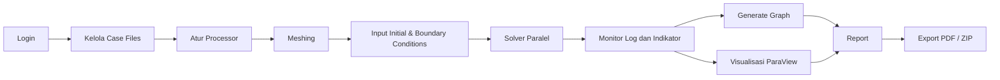
```mermaid
flowchart LR
    A[Login] --> B[Kelola Case Files]
    B --> C[Atur Processor]
    C --> D[Meshing]
    D --> E[Input Initial & Boundary Conditions]
    E --> F[Solver Paralel]
    F --> G[Monitor Log dan Indikator]
    G --> H[Generate Graph]
    G --> I[Visualisasi ParaView]
    H --> J[Report]
    I --> J
    J --> K[Export PDF / ZIP]
```

Urutan pada dashboard menampilkan Case Files, Meshing, Boundary Condition, Solving, dan Result. Dalam praktik, pengaturan prosesor sebaiknya dilakukan sebelum meshing karena tahap terakhir meshing adalah `decomposePar` dan solver memeriksa folder `processorN` sesuai nilai `numberOfSubdomains`.

### 6.2 Alur request aplikasi

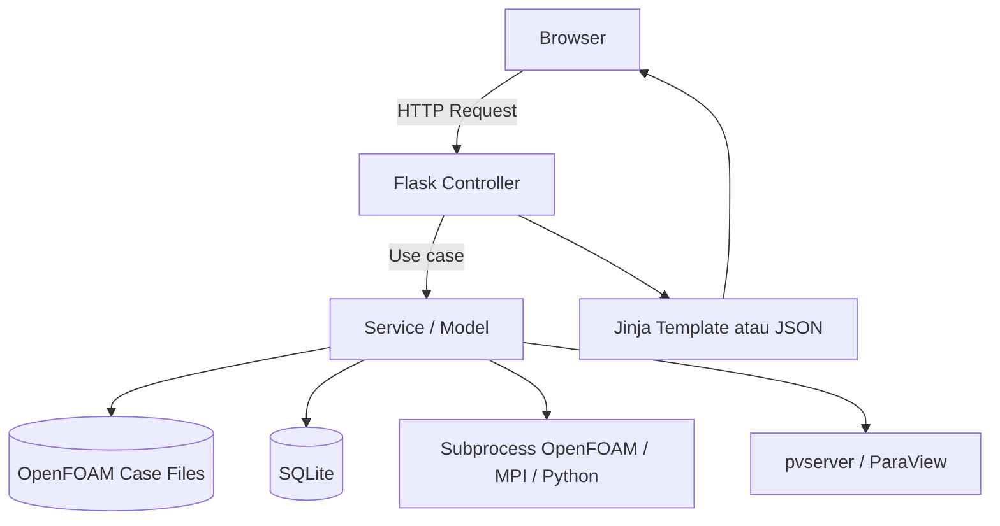
```mermaid
flowchart TD
    U[Browser] -->|HTTP Request| C[Flask Controller]
    C -->|Use case| S[Service / Model]
    S --> F[(OpenFOAM Case Files)]
    S --> D[(SQLite)]
    S --> P[Subprocess OpenFOAM / MPI / Python]
    S --> V[pvserver / ParaView]
    C --> T[Jinja Template atau JSON]
    T --> U
```

### 6.3 Siklus status proses

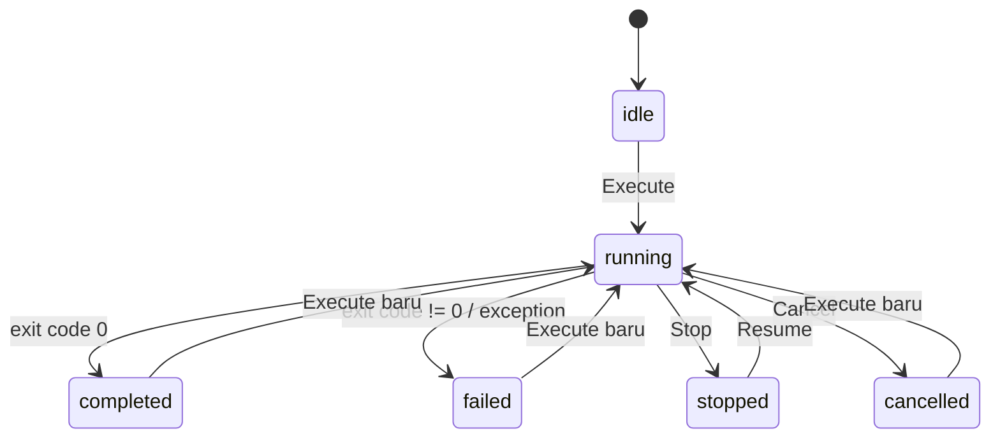
```mermaid
stateDiagram-v2
    [*] --> idle
    idle --> running: Execute
    running --> completed: exit code 0
    running --> failed: exit code != 0 / exception
    running --> stopped: Stop
    running --> cancelled: Cancel
    stopped --> running: Resume
    completed --> running: Execute baru
    failed --> running: Execute baru
    cancelled --> running: Execute baru
```

Pada UI, status selesai disebut `completed`, sedangkan pada database status persisten disebut `success`.

---

## 7. Dokumentasi Fitur

### 7.1 Login dan logout

Halaman login menerima username dan password. Bila kredensial sesuai konfigurasi, aplikasi:

1. menghapus session lama;
2. menandai session sebagai terautentikasi;
3. menyimpan username;
4. membuat token CSRF acak;
5. mengarahkan pengguna ke halaman tujuan yang aman atau dashboard.

Fitur antarmuka login mencakup validasi field wajib dan tombol tampil/sembunyikan password. Kredensial default untuk kompatibilitas pengembangan adalah `kmi.cfd` / `kmi.cfd` dan wajib diganti pada deployment.

### 7.2 Dashboard

Dashboard menampilkan ringkasan data langsung dari SQLite:

| Komponen | Cara perhitungan |
| --- | --- |
| Total Runs | Jumlah seluruh record meshing dan solver. |
| Compute Time | Total durasi dari waktu mulai sampai selesai; proses aktif dihitung sampai waktu saat dashboard dibuka. |
| Success Rate | Jumlah proses `success` dibagi proses yang telah selesai. Proses `running` tidak menjadi penyebut. |
| Active Runs | Jumlah record berstatus `running`. |
| Simulation Activity | Jumlah proses yang dimulai per hari selama tujuh hari terakhir dalam zona waktu aplikasi. |
| Status Breakdown | Distribusi `success`, `failed`, `running`, `stopped`, dan `cancelled`. |
| Recent Runs | Maksimal sepuluh proses terbaru, dengan filter All, Meshing, atau Solver. |

Tabel riwayat memuat jenis proses, indikator resume, penanda demo data, waktu mulai, waktu selesai, durasi, status, pesan, dan exit code.

Ketika aplikasi dinyalakan ulang, record yang masih `running` ditandai `failed` dengan exit code `-1`. Kebijakan ini mencegah dashboard menampilkan proses aktif yang sebenarnya sudah terputus.

### 7.3 Case File Manager

Case File Manager mengindeks seluruh file di bawah folder case secara rekursif. Symlink tidak diikuti agar akses tidak keluar dari root yang diizinkan.

Folder utama yang ditampilkan sebagai workspace edit adalah `0`, `constant`, `system`, dan `postProcessing`. Dalam implementasi saat ini, `postProcessing` sengaja dimasukkan agar file hasil post-processing, ringkasan, cache, atau data pendukung analisis dapat diperiksa dan dikelola dari antarmuka yang sama.

#### Kemampuan utama

- menampilkan statistik jumlah dan ukuran file;
- mencari berdasarkan nama atau path;
- memfilter file text, STL, log, binary, dan result;
- pagination sebanyak 100 file per halaman;
- membaca dan mengedit file UTF-8 berukuran maksimal 2 MB;
- mengunggah file/folder tanpa batas jumlah file aplikasi dalam satu request;
- memilih folder tujuan atau membuat folder baru;
- mengganti isi file tanpa mengubah nama/path target;
- mengganti satu folder dengan isi folder baru dan menyinkronkan file lama;
- mengunduh satu file;
- menghapus satu file;
- mengunduh seluruh case, report, dan grafik sebagai ZIP;
- mengunduh seluruh log sebagai ZIP;
- membersihkan hasil, log, upload, atau mereset case.

#### Klasifikasi file

| Jenis | Aturan umum |
| --- | --- |
| Log | Nama `log`, awalan `log.`, `log_`, `log-`, atau ekstensi `.log`, `.out`, `.err`. |
| STL | Ekstensi `.stl`. |
| Text | UTF-8, tidak memiliki null byte, bukan ekstensi binary, maksimal 2 MB. |
| Binary | File selain kategori di atas yang tidak aman untuk editor teks. |
| Result | Berada di time directory positif, `processorN`, `postProcessing`, `VTK`, atau `constant/polyMesh`. |

#### Keamanan path

Path dinormalisasi sebagai path relatif POSIX. Sistem menolak:

- path absolut;
- komponen `..`;
- karakter `:` dan null byte;
- symlink pada setiap bagian path;
- hasil resolve yang berada di luar `CASE_ROOT`.

#### Upload dan mekanisme pemulihan

Upload disimpan terlebih dahulu ke staging directory. Untuk file yang menggantikan file asli, sistem membuat backup dengan nama UUID pada `.case_file_manager/backups` dan mencatatnya di `uploads.json`. Opsi **Clear uploaded files** akan:

- menghapus file baru yang dibuat melalui UI;
- mengembalikan file asli yang pernah diganti;
- membersihkan manifest upload.

Perubahan melalui editor teks tidak dimasukkan ke manifest backup. Karena itu, pengeditan manual melalui editor tidak otomatis dapat dipulihkan oleh **Clear uploaded files**.

Perubahan file melalui editor, upload, replace, replace folder, dan delete hanya diizinkan pada folder `0`, `constant`, `system`, dan `postProcessing`. File lain tetap dapat terlihat pada daftar dan dapat diunduh bila aman, tetapi tidak dapat diubah dari UI.

Catatan khusus: `postProcessing` termasuk folder yang dapat dikelola, tetapi juga diklasifikasikan sebagai hasil simulasi. Karena itu, opsi **Clear results only** akan menghapus folder `postProcessing` bersama time directory, `processor*`, `VTK`, `constant/polyMesh`, dan log.

#### Mode clear/reset

| Mode | Dampak |
| --- | --- |
| Results | Menghapus time directory positif, `processor*`, `postProcessing`, `VTK`, `constant/polyMesh`, dan log. |
| Logs | Menghapus file yang dikenali sebagai log. |
| Uploads | Menghapus file baru dari UI dan memulihkan file yang diganti melalui UI. |
| Reset | Menggabungkan clear uploads dan clear results. Folder input inti seperti `0`, `constant` selain `polyMesh`, `system`, script, dan `Allrun` dipertahankan. |

Operasi clear membutuhkan token CSRF, teks konfirmasi `CLEAR`, dan konfirmasi tambahan dari browser.

### 7.4 Input Parameter

Fitur Input Parameter mempunyai dua mode.

#### 7.4.1 Mode Developer

Mode Developer menampilkan parameter teknis yang dipetakan langsung ke entry dictionary OpenFOAM. Nilai awal form dibaca dari file case bila location didukung.

| Grup | Isi parameter |
| --- | --- |
| 0. Initial Conditions | Temperatur, kecepatan, fraksi massa H2O, tekanan, `p_rgh`, `k`, dan `omega` pada internal field. |
| 1. Boundary Conditions | Kondisi inlet gas, outlet, perpindahan panas wall, temperatur ambient, dan obstacle. |
| 2. Droplet & Nozzle | Properti droplet, konfigurasi cone nozzle, Rosin-Rammler, komposisi fase, dan interaksi wall. |
| 3. Thermophysical Properties | `Cp`, viskositas, Prandtl number, densitas solid, kapasitas panas, dan konduktivitas. |
| 4. Physical Sub-Models | Heat transfer, dispersion, drag/particle forces, dan turbulence model. |
| 5. Numerical Settings | Courant limits, time step, limiter, PIMPLE, residual control, subcycle parcel, dan jumlah subdomain. |
| 6. Validation Parameters | Target validasi temperatur, tekanan, dan moisture. Saat ini bersifat tampilan dan belum ditulis ke output. |

Beberapa field sengaja dinonaktifkan atau dilewati karena location belum didukung, yaitu nozzle operating pressure langsung, water activity correction, gas-phase turbulence model, location bertanda `indirect`, `not yet implemented`, `postProcessing`, `Lagrangian`, atau `+`.

Tab Validation Parameters belum melakukan write karena targetnya merupakan hasil post-processing atau data pembanding, bukan input dictionary sederhana.

#### 7.4.2 Mode Production

Mode Production menyederhanakan input bagi pengguna proses. Pengguna memilih produk CKR atau BMT. Masukan operasional kemudian dikonversi ke satuan dan parameter OpenFOAM.

##### Formula umum CKR

| Input | Transformasi | Target utama |
| --- | --- | --- |
| Flow Feed, kg/h | `input / 60` | `massTotal` |
| Feed density, kg/L | `input * 1000` | `rho0` |
| Temperature of heater, °C | `input + 273.15` | `T0` |
| Temperature inlet chamber, °C | `input + 273.15` | inlet `T` |
| Chamber pressure, mbar | `100000 + input * 100` | outlet `p_rgh` |
| Nozzle pressure, bar | `Nozzle_A × input^Nozzle_B` | Rosin-Rammler `lambda` |
| Rosin-Rammler minimum | `lambda × MinFactor` | `minValue` |
| Rosin-Rammler maximum | `lambda × MaxFactor` | `maxValue` |
| Rosin-Rammler spread | `RosinRammler_n` | `n` |
| Supply Air Fan Frequency, Hz | `input × FanVelocityCoeff` | inlet `U` |
| Supply air humidity, % | `input / 100 × HumidityCoeff` | inlet `H2O` |

Konstanta CKR saat dokumen dibuat: `Nozzle_A=0.001045`, `Nozzle_B=-0.5`, `MinFactor=0.221314`, `MaxFactor=4.436`, `RosinRammler_n=2.3`, `FanVelocityCoeff=0.2`, dan `HumidityCoeff=0.019835`.

##### Tambahan formula BMT

BMT menggunakan rangkaian input umum serupa dengan konstanta produk BMT dan menambahkan:

| Input | Transformasi | Target utama |
| --- | --- | --- |
| Nozzle diameter, mm | `input / 1000` | `outerDiameter` |
| `thetaInner`, degree | nilai langsung | `thetaInner` |
| `thetaOuter`, degree | nilai langsung | `thetaOuter` |
| Total Solid, % | `input / 100` | `YSolidTot0` |
| Liquid mass fraction | `1 - YSolidTot0` | `YLiquidTot0` |

Formula dievaluasi dengan parser AST terbatas. Operator yang diizinkan hanya penjumlahan, pengurangan, perkalian, pembagian, pangkat, plus unary, dan minus unary. Sistem tidak menggunakan `eval()` Python umum, sehingga formula tidak dapat mengeksekusi fungsi atau kode arbitrer.

#### Cara penulisan parameter

Location JSON mempunyai format berikut:

```text
file/relatif > block > subBlock > key
```

Contoh:

```text
0/T > boundaryField > inletGas > value
```

Model membaca file, mencari block dengan pasangan kurung kurawal, mencari entry yang diakhiri `;`, kemudian mengganti nilainya. Qualifier `uniform` dan `constant` dipertahankan bila nilai lama menggunakannya.

### 7.5 Set Processor

Fitur ini membaca dan memperbarui `system/decomposeParDict`.

- Nilai minimum: 1 prosesor.
- Nilai maksimum default: 32 prosesor.
- Nilai default ketika tidak terbaca: 16.
- Nilai di luar batas akan dinormalisasi ke rentang yang diizinkan.
- `numberOfSubdomains` diperbarui.
- `processorWeight` ditulis ulang dengan satu bobot untuk setiap prosesor.
- Bila entry tidak ada, service mencoba menyisipkannya pada posisi yang sesuai.

Perubahan jumlah prosesor harus diikuti proses meshing/dekomposisi ulang agar jumlah folder `processorN` cocok dengan konfigurasi.

### 7.6 Case Terminal

Case Terminal menyediakan command line berbasis web untuk operasi ringan di folder case aktif. Terminal ini berbeda dari terminal log meshing/solver. Semua command dijalankan dengan working directory di bawah `CASE_ROOT`, dan state terminal disimpan per proses aplikasi.

Kemampuan utama:

- menampilkan prompt `case:/`;
- menjalankan satu command pada satu waktu;
- melakukan polling status dan output setiap satu detik;
- menghentikan command aktif melalui tombol stop;
- menyimpan riwayat command pada browser;
- mendukung builtin `cd`, `pwd`, `clear`, `cls`, `exit`, dan `logout`;
- membatasi jumlah output yang ditampilkan agar halaman tetap responsif.

Pembatasan keamanan Case Terminal:

- menolak command multi-line;
- menolak path parent `..`, path home `~`, path absolut Linux, path absolut Windows, dan UNC path;
- menolak ekspansi environment path seperti `$HOME`, `$PWD`, `$env:`, `${...}`, atau `%VAR%`;
- menolak nested shell seperti `powershell`, `pwsh`, `cmd`, dan `wsl`;
- menolak interpreter inline seperti `python -c`, `node -e`, `perl -e`, dan `ruby -e`;
- `cd` harus dijalankan sebagai command terpisah agar batas folder tetap dapat dijaga.

Walaupun cwd dan perpindahan directory telah dijaga di bawah folder case, Case Terminal bukan sandbox OS penuh. Terminal ini tetap harus dianggap fitur administratif dan pada deployment production hanya boleh diberikan kepada pengguna tepercaya dengan permission user service yang minimum.

### 7.7 Meshing

Meshing berjalan pada background thread agar request HTTP dapat segera mengembalikan status. Setiap tahap dijalankan sebagai subprocess di `CASE_ROOT`.

| Tahap | Command | Progres setelah berhasil |
| --- | --- | ---: |
| Membersihkan mesh/run lama | `rm -rf processor* constant/polyMesh log.*` | 10% |
| Membuat base mesh | `blockMesh` | 25% |
| Mengekstrak fitur surface | `surfaceFeatureExtract` | 40% |
| Menyesuaikan mesh ke geometri | `snappyHexMesh -overwrite` | 60% |
| Memeriksa kualitas mesh | `checkMesh` | 80% |
| Dekomposisi paralel | `decomposePar -force` | 100% |

Setiap output stdout/stderr ditambahkan ke terminal web. Jika satu tahap menghasilkan exit code selain nol, tahap berikutnya tidak dijalankan dan status menjadi failed.

#### Stop, cancel, dan resume meshing

- **Stop** menghentikan process group dan mempertahankan informasi step agar dapat di-resume.
- **Cancel** menghentikan proses dan menghapus hak resume.
- Resume meshing berbasis tahapan, bukan checkpoint native.
- Jika stop terjadi di tengah satu tahap, tahap tersebut akan dijalankan ulang saat resume.

### 7.8 Solver

Sebelum solver dijalankan, aplikasi memeriksa kesiapan hasil dekomposisi. Untuk setiap prosesor dari `processor0` sampai `processorN-1`, folder `constant/polyMesh` harus memuat file:

- `boundary`;
- `faces`;
- `neighbour`;
- `owner`;
- `points`.

Jika syarat tidak terpenuhi, tombol solver dinonaktifkan dan API mengembalikan pesan bahwa meshing harus diselesaikan.

Command solver yang dipanggil implementasi saat ini adalah:

```bash
mpirun --allow-run-as-root --oversubscribe -np N buoyantPimpleFoam -parallel
```

Nilai `N` dibaca dari `numberOfSubdomains`. Environment `OMPI_ALLOW_RUN_AS_ROOT` dan `OMPI_ALLOW_RUN_AS_ROOT_CONFIRM` diset pada subprocess untuk deployment container yang berjalan sebagai root.

#### Stop, cancel, dan resume solver

- **Stop** mengirim sinyal ke process group dan memungkinkan resume.
- **Resume** menjalankan solver kembali; karena case menggunakan `startFrom latestTime`, solver diharapkan melanjutkan dari time directory terbaru.
- **Cancel** menghentikan proses tanpa menawarkan resume dari UI.

Sistem hanya mengizinkan satu jenis task aktif pada satu waktu. Meshing tidak dapat dimulai ketika solver aktif dan sebaliknya.

### 7.9 Terminal log dan progress

Browser melakukan polling status proses setiap sekitar satu detik. Response berisi:

- status running;
- return code;
- maksimal 300 baris log terbaru;
- nilai progress;
- status UI;
- ketersediaan resume;
- kesiapan meshing untuk solver.

Log yang tampil dapat diunduh sebagai file `meshing_log.txt` atau `solver_log.txt`. Riwayat database hanya menyimpan maksimal 80 baris terakhir dan dibatasi 12.000 karakter sebagai excerpt.

### 7.10 Indikator kestabilan solver

Halaman solver mengekstrak nilai terbaru langsung di browser dari log OpenFOAM.

| Parameter | Target pada UI | Klasifikasi |
| --- | --- | --- |
| Courant max | `< 0.8–1.0` | Aman `<0.8`, waspada `<1.0`, lewat batas `>=1.0`. |
| Courant mean | `< 0.1` | Aman bila di bawah limit. |
| Final residual U | `< 1e-6` | Menggunakan residual maksimum dari U/Ux/Uy/Uz. |
| Final residual `p_rgh` | `< 1e-5` | Menggunakan nilai terakhir. |
| Final residual `h/H2O` | `< 1e-6` | Menggunakan nilai maksimum field terkait. |
| Continuity local/global | `< 1e-5` | Menggunakan nilai absolut terbesar. |

Indikator ini merupakan alat bantu monitoring, bukan mekanisme penghentian solver otomatis dan bukan bukti tunggal validitas atau konvergensi ilmiah.

### 7.11 Riwayat proses dan seed data

Setiap start membuat record `running`. Setelah proses selesai, record diperbarui dengan waktu selesai, status, exit code, pesan, dan log excerpt.

CLI menyediakan data demo sebanyak 12 record yang tersebar selama tujuh hari. Seed mempunyai `seed_key` unik sehingga perintah dapat dijalankan berulang tanpa duplikasi. Opsi reset seed hanya menghapus data demo dan tidak menghapus riwayat asli.

### 7.12 Graph

Fitur Graph menjalankan script `grafik/2plot_residuals.py` menggunakan interpreter Python aplikasi. Sumber default adalah `CASE_ROOT/log.run`, sedangkan output disimpan sebagai PNG di `grafik/output` atau lokasi hasil override.

Parser mengenali pola:

- `Time = ...`;
- `Solving for ..., Initial residual = ...`;
- `Courant Number mean: ... max: ...`;
- `deltaT = ...`;
- `ExecutionTime = ...`.

Output yang mungkin dihasilkan:

- satu grafik untuk setiap field residual yang ditemukan;
- `courant.png` untuk Courant mean dan max;
- `deltaT.png` untuk perubahan time step.

Jumlah gambar tidak selalu sembilan karena bergantung pada field yang ditemukan dalam log. Proses update memiliki timeout 300 detik. Halaman hanya menyajikan file `.png` yang berada langsung di output directory dan mencegah path traversal saat mengambil gambar.

### 7.13 ParaView Visualization pada browser

Halaman ParaView menampilkan metadata case:

- keberadaan `case.foam`;
- latest time directory;
- jumlah time directory;
- field pada time directory terbaru;
- jumlah folder processor;
- ketersediaan internal mesh;
- jumlah source points dan boundary faces.

#### Proses preview internal mesh

1. Model membaca `constant/polyMesh/points`, `faces`, dan `boundary`.
2. Patch boundary digunakan untuk menentukan rentang face luar.
3. Reader membaca list binary OpenFOAM dan memadatkan point yang dipakai.
4. Geometri ditulis sebagai cache `postProcessing/webInternalMesh/internalMesh.vtp`.
5. Cache digunakan kembali jika lebih baru dari file sumber.
6. Browser memuat VTP, membentuk `BufferGeometry`, lalu merendernya dengan Three.js.

Kontrol viewer meliputi orbit, zoom, enam arah kamera, opacity, solid color, pilihan nama field, block color, capture tampilan aktif, dan capture enam sisi.

Penting: cache VTP browser saat ini berisi geometri, connectivity, dan offsets, tetapi tidak memasukkan array nilai field OpenFOAM. Karena itu, pilihan coloring selain solid menggunakan pseudo-color berbasis posisi geometri dan nama field sebagai seed. Coloring tersebut berguna sebagai bantuan visual UI, tetapi tidak boleh ditafsirkan sebagai kontur temperatur, tekanan, kecepatan, atau hasil fisik yang sebenarnya. Kontur ilmiah harus dilakukan melalui ParaView Desktop/remote atau pengembangan reader field lebih lanjut.

### 7.14 Remote ParaView Desktop

Fitur ini mengelola lifecycle `pvserver` pada server Linux dan menampilkan:

- status proses;
- PID;
- versi ParaView server;
- backend rendering;
- alamat koneksi;
- perintah SSH tunnel;
- path `case.foam`;
- maksimal 300 baris log terbaru.

Status remote dapat berupa idle, starting, waiting, connected, stopping, finalizing, stopped, atau failed. State dan log disimpan pada runtime directory sehingga dapat dibaca lintas worker.

Backend dipilih berdasarkan konfigurasi:

1. OSMesa atau EGL bila dikonfigurasi;
2. X11 bila `DISPLAY` tersedia;
3. Xvfb dan Mesa software bila `xvfb-run` tersedia;
4. offscreen yang belum terverifikasi sebagai fallback.

Koneksi yang direkomendasikan menggunakan SSH tunnel karena `pvserver` tidak menyediakan autentikasi dan enkripsi sendiri:

```bash
ssh -L 11112:localhost:11112 user-vps@host-vps -p 8822
```

Setelah tunnel aktif, ParaView Desktop terhubung ke `cs://localhost:11112` dan membuka path `case.foam` di filesystem server.

### 7.15 Report

Ketika **Get Report** dipilih, sistem:

1. mencoba memperbarui grafik dari log terbaru;
2. membuat folder report bernama `DD_MM_YYYY_NNN`;
3. membuat subfolder `graphs` dan `screenshots`;
4. menyalin seluruh PNG grafik yang tersedia ke folder report;
5. menampilkan report baru pada halaman detail.

Nomor `NNN` dimulai dari `001` dan maksimum `999` report per hari.

Screenshot dari viewer dikirim sebagai base64, diverifikasi menggunakan Pillow, lalu disimpan sebagai PNG. Capture dengan nama sisi yang sama akan mengganti screenshot sisi tersebut dalam report yang sama.

PDF dibuat sebagai dokumen bergambar:

- halaman judul berisi tanggal dan jumlah asset;
- satu halaman untuk setiap screenshot;
- satu halaman untuk setiap grafik;
- gambar diperkecil secara proporsional agar sesuai halaman.

Report dapat dipilih, ditampilkan, diekspor sebagai PDF, atau dihapus.

### 7.16 Tema dan antarmuka responsif

- Antarmuka menggunakan Bootstrap dan CSS khusus.
- Tema light/dark disimpan pada `localStorage` browser.
- Chart dirender ulang saat tema berubah.
- Navigasi utama menghubungkan seluruh modul.
- Flash message digunakan untuk hasil operasi sinkron.
- Endpoint proses panjang menggunakan JSON dan polling.

---

## 8. Kebutuhan Fungsional

| ID | Kebutuhan fungsional | Implementasi |
| --- | --- | --- |
| FR-01 | Sistem harus meminta autentikasi sebelum mengakses workspace. | Session guard pada seluruh request kecuali login/static. |
| FR-02 | Sistem harus menampilkan ringkasan dan aktivitas simulasi. | Dashboard SQLite dan Chart.js. |
| FR-03 | Sistem harus mencatat lifecycle meshing dan solver. | Repository `simulation_runs`. |
| FR-04 | Sistem harus mengindeks file case secara rekursif. | Case File Manager. |
| FR-05 | Sistem harus mencari dan memfilter file. | Query `q`, kategori, dan pagination. |
| FR-06 | Sistem harus mendukung upload, replace, edit, download, dan delete file. | Route case files dan backup manifest. |
| FR-07 | Sistem harus menyediakan arsip ZIP case dan log. | ZIP64 temporary archive. |
| FR-08 | Sistem harus membersihkan hasil/log/upload berdasarkan pilihan. | Mode results, logs, uploads, reset. |
| FR-09 | Sistem harus membaca dan menulis parameter teknis OpenFOAM. | Mode Developer dan location parser. |
| FR-10 | Sistem harus mengonversi input operasional produk. | Mode Production CKR/BMT dan safe formula evaluator. |
| FR-11 | Sistem harus mengatur jumlah prosesor. | Update `decomposeParDict`, batas 1–32. |
| FR-12 | Sistem harus menjalankan tahapan meshing berurutan. | Enam subprocess meshing. |
| FR-13 | Sistem harus mencegah solver sebelum mesh paralel siap. | Pemeriksaan file polyMesh setiap processor. |
| FR-14 | Sistem harus menjalankan solver paralel. | MPI subprocess. |
| FR-15 | Sistem harus menyediakan stop, cancel, dan resume. | State machine in-memory dan process signal. |
| FR-16 | Sistem harus menampilkan log dan progress. | Polling endpoint terminal. |
| FR-17 | Sistem harus menampilkan indikator batas numerik solver. | Regex log pada halaman solver. |
| FR-18 | Sistem harus membuat grafik dari log. | Python, Matplotlib, dan NumPy. |
| FR-19 | Sistem harus menampilkan preview geometri 3D. | Konversi internal mesh ke VTP dan Three.js. |
| FR-20 | Sistem harus mendukung koneksi ParaView Desktop. | `pvserver`, state manager, SSH tunnel info. |
| FR-21 | Sistem harus dapat dijalankan pada VPS sebagai pusat komputasi CFD. | Environment path, OpenFOAM runner, MPI, dan remote ParaView. |
| FR-22 | Sistem harus menyimpan screenshot dan grafik per report. | Folder report bertanggal. |
| FR-23 | Sistem harus mengekspor report ke PDF. | Pillow multi-page PDF. |
| FR-24 | Sistem harus menyediakan data demo riwayat yang aman diulang. | CLI seeder idempotent. |
| FR-25 | Sistem harus menyediakan terminal operasional yang memulai command dari folder case dan memvalidasi pola command berisiko. | Case Terminal dan `SandboxTerminal`. |

---

## 9. Kebutuhan Nonfungsional

| ID | Aspek | Kebutuhan/implementasi |
| --- | --- | --- |
| NFR-01 | Usability | Alur dapat dioperasikan melalui browser dan memberi feedback status. |
| NFR-02 | Maintainability | Controller dipisah per fitur, model/service tidak bergantung pada controller. |
| NFR-03 | Testability | Application factory menerima konfigurasi pengganti dan service disimpan app-scoped. |
| NFR-04 | Data integrity | SQLite memakai transaksi, WAL, constraint status, dan unique seed key. |
| NFR-05 | File integrity | Edit text dan manifest menggunakan temporary file serta atomic replace. |
| NFR-06 | Security | Login session, HttpOnly cookie, SameSite Lax, validasi path, dan CSRF pada sebagian operasi. |
| NFR-07 | Responsiveness | UI memakai layout Bootstrap dan dapat digunakan pada beberapa ukuran layar. |
| NFR-08 | Observability | Log proses, status, exit code, pesan kegagalan, dan remote server log tersedia. |
| NFR-09 | Configurability | Path, kredensial, cookie, timezone, dan ParaView dapat diubah melalui environment. |
| NFR-10 | Portability | Web dapat dikembangkan di Windows, tetapi OpenFOAM runner dan pvserver ditujukan untuk Linux/container. |
| NFR-11 | Performance | Proses berat dijalankan sebagai subprocess/background thread; grafik memiliki timeout. |
| NFR-12 | Resource efficiency | Komputasi berat dipindahkan ke VPS/server CPU besar agar komputer pengguna tidak menjadi bottleneck. |
| NFR-13 | Remote accessibility | Pengguna dapat mengendalikan simulasi, membaca log, dan melihat hasil dari komputer lokal melalui browser dan koneksi ParaView remote. |
| NFR-14 | Recoverability | Upload replacement mempunyai backup; abandoned run ditutup otomatis saat startup. |

---

## 10. Arsitektur Sistem

### 10.1 Pola arsitektur

Aplikasi menggunakan pola MVC dengan lapisan service:

- **Controller** menangani route, request, validasi HTTP, flash/JSON, dan pemilihan template.
- **Model** menangani domain, parsing dictionary, filesystem, subprocess, ParaView, report, dan repository.
- **Service** mengorkestrasi use case yang menggabungkan model atau resource.
- **View** adalah template Jinja, CSS, dan JavaScript.
- **Application factory** adalah composition root yang memuat konfigurasi, service, controller, dan CLI.

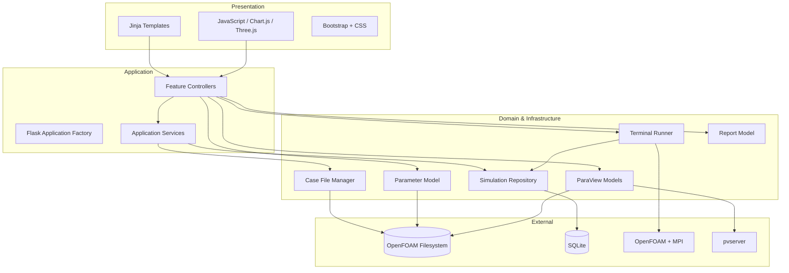
```mermaid
flowchart TB
    subgraph Presentation
        HTML[Jinja Templates]
        JS[JavaScript / Chart.js / Three.js]
        CSS[Bootstrap + CSS]
    end

    subgraph Application
        APP[Flask Application Factory]
        CTRL[Feature Controllers]
        SVC[Application Services]
    end

    subgraph DomainInfrastructure[Domain & Infrastructure]
        PARAM[Parameter Model]
        CASE[Case File Manager]
        RUNNER[Terminal Runner]
        REPO[Simulation Repository]
        PV[ParaView Models]
        REPORT[Report Model]
    end

    subgraph External
        FS[(OpenFOAM Filesystem)]
        DB[(SQLite)]
        OF[OpenFOAM + MPI]
        PVS[pvserver]
    end

    HTML --> CTRL
    JS --> CTRL
    CTRL --> SVC
    CTRL --> PARAM
    CTRL --> RUNNER
    CTRL --> PV
    CTRL --> REPORT
    SVC --> CASE
    SVC --> REPO
    CASE --> FS
    PARAM --> FS
    RUNNER --> OF
    RUNNER --> REPO
    PV --> FS
    PV --> PVS
    REPO --> DB
```

### 10.2 Prinsip dependensi

```text
Request -> Controller -> Service/Model -> Filesystem, SQLite, atau process eksternal
                    |
                    +-> Template/JSON -> Response
```

Model dan service tidak mengimpor controller. Semua controller fitur berbagi blueprint `dashboard` agar nama endpoint `dashboard.*` tetap stabil.

### 10.3 Application factory

`create_app()` menjalankan urutan:

1. membuat instance Flask;
2. memuat `AppConfig`;
3. menerapkan override untuk test/deployment;
4. memuat session secret;
5. membuat service app-scoped;
6. menginisialisasi dan memigrasikan SQLite;
7. menutup abandoned runs;
8. mendaftarkan controller;
9. mendaftarkan CLI.

---

## 11. Struktur Source Code

```text
Interface 1onproduct/
├── app.py                         # Application factory dan entry point
├── config.py                      # Konfigurasi dan lokasi resource
├── cli.py                         # Command seed/remove demo data
├── requirements.txt               # Dependency Python
├── ARCHITECTURE.md                 # Ringkasan aturan arsitektur
├── PARAVIEW_REMOTE.md              # Panduan operasional pvserver
├── DOKUMENTASI_SISTEM.md           # Dokumen lengkap ini
├── controllers/
│   ├── auth_controller.py          # Login, logout, route guard
│   ├── dashboard_controller.py     # Dashboard dan filter history
│   ├── case_file_controller.py     # HTTP Case File Manager
│   ├── parameter_controller.py     # Input Parameter
│   ├── processor_controller.py     # Set Processor
│   ├── meshing_controller.py       # Halaman Meshing
│   ├── solver_controller.py        # Halaman Solver
│   ├── simulation_controller.py    # API eksekusi Meshing/Solver
│   ├── terminal_controller.py      # Case Terminal berbasis web
│   ├── graph_controller.py         # Grafik residual
│   ├── paraview_controller.py      # Viewer dan remote pvserver
│   ├── report_controller.py        # Report, capture, PDF
│   └── helpers.py                  # CSRF dan temporary archive
├── models/
│   ├── case_file_manager.py        # Operasi aman pada file case
│   ├── parameter_model.py          # Mapping/edit dictionary dan formula
│   ├── terminal_runner.py          # Background process dan state
│   ├── sandbox_terminal.py         # Terminal bercwd CASE_ROOT dengan filter command
│   ├── simulation_run_repository.py# Repository SQLite
│   ├── paraview_model.py           # Metadata dan konversi mesh ke VTP
│   ├── paraview_server.py          # Lifecycle pvserver
│   ├── report_model.py             # Folder report, capture, PDF
│   ├── parameter_templates.json    # Parameter mode Developer
│   ├── parameter_ckr.json          # Parameter mode Production CKR
│   ├── parameter_bmt.json          # Parameter mode Production BMT
│   ├── const_ckr.json              # Konstanta CKR
│   └── const_bmt.json              # Konstanta BMT
├── services/
│   ├── graph_service.py            # Menjalankan generator grafik
│   ├── processor_service.py        # Baca/tulis decomposeParDict
│   ├── simulation_history_service.py# Metrik dan presentasi history
│   └── database_seeder.py          # Demo history idempotent
├── templates/                      # View Jinja per modul
├── static/
│   ├── css/style.css               # Desain dan tema
│   └── js/                          # UI, viewer, remote ParaView
├── grafik/
│   └── 2plot_residuals.py          # Parser log dan generator PNG
├── report/                         # Output report, diabaikan Git
├── instance/                       # SQLite runtime, diabaikan Git
└── tests/                          # Unit dan integration tests
```

Folder case default berada sebagai sibling aplikasi:

```text
1onproduct/
├── Interface 1onproduct/
└── sprayDryer-6.0.0-onProduct-Trial02/
```

---

## 12. Model Data dan Database

### 12.1 Teknologi database

Sistem menggunakan SQLite pada `instance/simulation_history.sqlite3`. Database dibuat otomatis. Koneksi bersifat singkat per operasi dengan:

- `journal_mode = WAL`;
- `synchronous = NORMAL`;
- `foreign_keys = ON`;
- `busy_timeout = 30000` ms;
- commit otomatis bila berhasil;
- rollback bila terjadi exception.

Versi schema disimpan melalui `PRAGMA user_version`. Versi saat dokumen dibuat adalah 3.

### 12.2 Entity Relationship Diagram

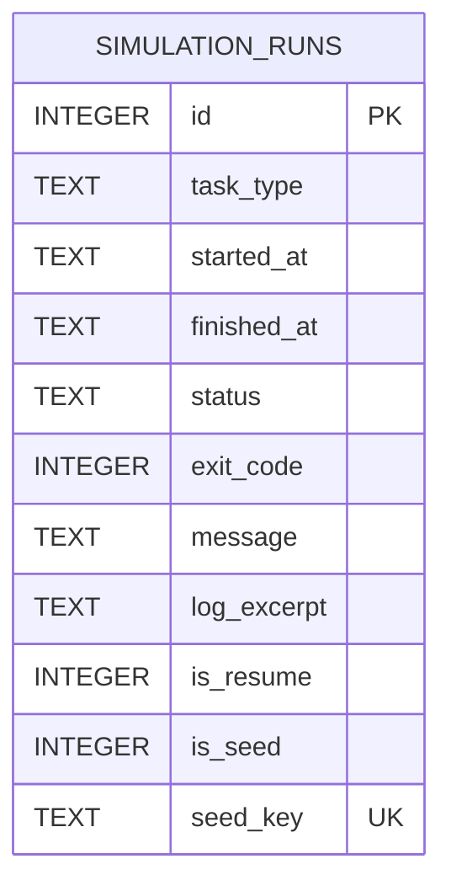
```mermaid
erDiagram
    SIMULATION_RUNS {
        INTEGER id PK
        TEXT task_type
        TEXT started_at
        TEXT finished_at
        TEXT status
        INTEGER exit_code
        TEXT message
        TEXT log_excerpt
        INTEGER is_resume
        INTEGER is_seed
        TEXT seed_key UK
    }
```

### 12.3 Data dictionary `simulation_runs`

| Kolom | Tipe | Aturan | Keterangan |
| --- | --- | --- | --- |
| `id` | INTEGER | PK, autoincrement | Identitas run. |
| `task_type` | TEXT | `meshing` atau `solver` | Jenis proses. |
| `started_at` | TEXT | wajib | Timestamp ISO-8601 UTC. |
| `finished_at` | TEXT | nullable | Waktu selesai UTC. |
| `status` | TEXT | running/success/failed/stopped/cancelled | Status persisten. |
| `exit_code` | INTEGER | nullable | Kode keluar process. |
| `message` | TEXT | maksimal 2.000 karakter pada service | Ringkasan hasil/kegagalan. |
| `log_excerpt` | TEXT | maksimal 12.000 karakter | Potongan log terakhir. |
| `is_resume` | INTEGER | 0 atau 1 | Run dimulai sebagai resume. |
| `is_seed` | INTEGER | 0 atau 1 | Penanda data demo. |
| `seed_key` | TEXT | unique, nullable | Identitas idempotent seed. |

### 12.4 Index

- `idx_simulation_runs_started_at` untuk urutan history;
- `idx_simulation_runs_status` untuk status;
- `idx_simulation_runs_task_type` untuk filter task;
- `idx_simulation_runs_seed_key` sebagai unique index seed.

### 12.5 Data filesystem

Selain SQLite, sistem menggunakan filesystem sebagai penyimpanan utama untuk:

| Data | Lokasi default |
| --- | --- |
| Input dan hasil CFD | `../sprayDryer-6.0.0-onProduct-Trial02` |
| File post-processing case | `<case>/postProcessing` |
| Grafik sementara | `grafik/output` |
| Report | `report` |
| Manifest/backup upload | `.case_file_manager` |
| Cache preview mesh | `<case>/postProcessing/webInternalMesh` |
| State/log pvserver | `/run/kmi-cfd-paraview` |
| Session secret Linux | `/run/kmi-cfd-session-secret` |

---

## 13. Integrasi dengan OpenFOAM

### 13.1 Struktur case

| Bagian | Fungsi |
| --- | --- |
| `0/` | Initial field dan boundary condition seperti `U`, `T`, `p`, `p_rgh`, `H2O`, `k`, dan `omega`. |
| `constant/` | Properti fisik, gravitasi, turbulence, reacting cloud, radiation, dan geometri. |
| `constant/triSurface/` | Geometri STL dan feature mesh. |
| `constant/polyMesh/` | Mesh hasil. |
| `system/` | `controlDict`, `fvSchemes`, `fvSolution`, meshing dictionary, dan decomposition. |
| `processorN/` | Hasil dekomposisi domain untuk MPI. |
| Time directory | Hasil field per waktu simulasi. |
| `postProcessing/` | Surface, field min/max, cloud info, dan cache web. |

### 13.2 Model fisik yang terlihat pada case

Berdasarkan dictionary case saat pemetaan:

- simulasi transient dan compressible;
- `application` pada `controlDict` adalah `reactingParcelFoam`;
- carrier gas adalah campuran `air` dan `H2O`;
- parcel/droplet memakai `reactingCloud1`;
- injection model memakai `coneNozzleInjection`;
- ukuran droplet memakai mass Rosin-Rammler;
- komposisi memakai `singleMixtureFraction` untuk gas, liquid water, dan solid proxy;
- heat transfer model memakai Ranz-Marshall;
- particle forces memuat sphere drag dan gravity;
- turbulence memakai RAS `kOmegaSST`;
- radiation dimatikan;
- adaptive time step diaktifkan;
- algoritma coupling memakai PIMPLE;
- limiter field dan function object monitoring tersedia.

Model dan nilai tersebut adalah konfigurasi case saat ini, bukan ketetapan permanen aplikasi. Perubahan dictionary dapat mengubah model fisik tanpa perubahan kode web.

### 13.3 Pemrosesan paralel

Metode dekomposisi menggunakan `scotch`. Service web menyelaraskan `numberOfSubdomains` dan `processorWeight`. Tahap `decomposePar -force` membuat folder processor, kemudian solver dijalankan dengan jumlah proses MPI yang sama.

### 13.4 Perbedaan solver yang harus diperhatikan

Terdapat ketidaksesuaian penting pada snapshot saat ini:

- `system/controlDict` menyatakan `application reactingParcelFoam`;
- `terminal_runner.py` dan `Allrun` menjalankan `buoyantPimpleFoam`.

Sebelum eksperimen skripsi final, solver harus diselaraskan dan divalidasi terhadap versi OpenFOAM yang digunakan. Ketidaksesuaian executable, dictionary, atau model parcel dapat menyebabkan konfigurasi tidak dipakai sebagaimana dimaksud atau solver gagal dijalankan.

### 13.5 Perbedaan header versi

Beberapa dictionary menampilkan header OpenFOAM Foundation version 12, sedangkan file lain menampilkan OpenFOAM.com version 2506. Header komentar tidak selalu menentukan parser runtime, tetapi campuran fork/versi dapat mempunyai perbedaan keyword dan model. Seluruh case sebaiknya divalidasi menggunakan satu distribusi OpenFOAM yang menjadi lingkungan penelitian resmi.

---

## 14. Daftar Endpoint

Semua endpoint berikut memerlukan session login kecuali `/login` dan `/static/*`.

### 14.1 Autentikasi dan dashboard

| Method | Endpoint | Fungsi |
| --- | --- | --- |
| GET, POST | `/login` | Menampilkan form dan memproses login. |
| GET | `/logout` | Menghapus session dan kembali ke login. |
| GET | `/` | Redirect ke dashboard. |
| GET | `/dashboard` | Dashboard; query `history_type=all|meshing|solver`. |

### 14.2 Case File Manager

| Method | Endpoint | Fungsi |
| --- | --- | --- |
| GET | `/case-files` | List, statistik, search, filter, pagination. |
| GET | `/case-files/text/<path>` | Membaca file text sebagai JSON. |
| POST | `/case-files/upload` | Upload satu/banyak file; memerlukan CSRF. |
| POST | `/case-files/replace/<path>` | Mengganti isi file; memerlukan CSRF. |
| POST | `/case-files/replace-folder/<path>` | Mengganti isi folder target; memerlukan CSRF. |
| POST | `/case-files/save/<path>` | Menyimpan edit text; memerlukan CSRF. |
| GET | `/case-files/download/<path>` | Download satu file. |
| POST | `/case-files/delete/<path>` | Menghapus file; memerlukan CSRF. |
| GET | `/case-files/download-all` | ZIP case + report + graph. |
| GET | `/case-files/download-logs` | ZIP seluruh sumber log. |
| POST | `/case-files/clear` | Clear/reset; CSRF dan konfirmasi `CLEAR`. |

### 14.3 Parameter dan prosesor

| Method | Endpoint | Fungsi |
| --- | --- | --- |
| GET, POST | `/input-parameter` | Memuat/menyimpan parameter Developer atau Production. |
| GET, POST | `/set-processor` | Membaca/menulis jumlah prosesor. |

### 14.4 Case Terminal

| Method | Endpoint | Fungsi |
| --- | --- | --- |
| GET | `/terminal` | Halaman Case Terminal yang dibatasi ke `CASE_ROOT`. |
| GET | `/terminal/status` | Snapshot status, prompt, output, dan command terakhir. |
| POST | `/terminal/run` | Menjalankan satu command pada folder case aktif. |
| POST | `/terminal/stop` | Menghentikan command Case Terminal yang sedang berjalan. |

### 14.5 Meshing dan solver

| Method | Endpoint | Fungsi |
| --- | --- | --- |
| GET | `/meshing` | Halaman progress meshing. |
| GET | `/solver` | Halaman progress solver dan safety monitor. |
| POST | `/terminal/<task>/start` | Start atau resume `meshing|solver`. |
| POST | `/terminal/<task>/stop` | Stop dengan resume tersedia. |
| POST | `/terminal/<task>/cancel` | Cancel tanpa resume. |
| GET | `/terminal/<task>/logs` | State dan log JSON. |
| GET | `/terminal/<task>/download-logs` | Download log text. |

### 14.6 Graph

| Method | Endpoint | Fungsi |
| --- | --- | --- |
| GET | `/graph` | Menampilkan daftar PNG. |
| GET | `/graph/image/<filename>` | Mengirim satu PNG yang valid. |
| POST | `/graph/update` | Menjalankan parser/generator grafik. |

### 14.7 ParaView

| Method | Endpoint | Fungsi |
| --- | --- | --- |
| GET | `/paraview` | Preview web dan metadata case. |
| POST | `/paraview/open` | Membuka `case.foam` melalui ParaView lokal/default app. |
| GET | `/paraview/internal-mesh` | Membuat/mengirim cache VTP internal mesh. |
| GET | `/paraview/surface/<surface_id>` | Mengirim VTP surface post-processing yang terdaftar. |
| GET | `/paraview/remote` | Halaman kontrol remote ParaView. |
| POST | `/paraview/remote/start` | Menyalakan `pvserver`; CSRF header. |
| POST | `/paraview/remote/stop` | Menghentikan `pvserver`; CSRF header. |
| GET | `/paraview/remote/status` | Status, log, dan konfigurasi koneksi JSON. |

### 14.8 Report

| Method | Endpoint | Fungsi |
| --- | --- | --- |
| GET | `/report` | List dan report terbaru. |
| GET | `/report/<report_name>` | Detail report. |
| POST | `/report/get` | Membuat report baru dan menyalin grafik. |
| POST | `/report/<report_name>/delete` | Menghapus report. |
| POST | `/report/capture` | Menyimpan screenshot base64. |
| GET | `/report/file/<report>/<folder>/<filename>` | Mengirim screenshot/graph. |
| GET | `/report/<report_name>/export-pdf` | Download report PDF. |

---

## 15. Algoritma dan Aturan Bisnis Penting

### 15.1 Start proses

```text
1. Validasi task meshing/solver.
2. Pastikan task lain tidak running.
3. Untuk solver, pastikan semua processor polyMesh tersedia.
4. Tentukan apakah run merupakan resume.
5. Buat record SQLite berstatus running.
6. Reset atau pertahankan state sesuai kondisi resume.
7. Buat background thread.
8. Jalankan subprocess dan stream stdout.
9. Perbarui progress/state.
10. Finalisasi record SQLite berdasarkan exit code atau aksi pengguna.
```

### 15.2 Deteksi kesiapan solver

Misalkan jumlah processor adalah `N`. Solver dinyatakan siap jika:

```text
untuk setiap i pada 0 <= i < N:
    processor{i}/constant/polyMesh tersedia
    boundary, faces, neighbour, owner, points semuanya tersedia
```

### 15.3 Success rate

```math
Success\ Rate = \frac{Jumlah\ run\ success}{Jumlah\ run\ selesai} \times 100\%
```

Run selesai adalah semua status selain `running`.

### 15.4 Compute time

Untuk setiap run:

```math
durasi_i = max(0, waktu\ selesai_i - waktu\ mulai_i)
```

Untuk proses aktif, waktu selesai diganti waktu saat ini. Total compute time adalah jumlah seluruh durasi, bukan penggunaan CPU core-hour.

### 15.5 Aktivitas tujuh hari

Timestamp mulai disimpan dalam UTC, dikonversi ke `APP_TIMEZONE`, dikelompokkan berdasarkan tanggal lokal, kemudian dihitung untuk hari ini dan enam hari sebelumnya.

### 15.6 Atomic text save

```text
1. Validasi path dan jenis file.
2. Encode content sebagai UTF-8 dan cek batas 2 MB.
3. Tulis ke temporary file pada folder yang sama.
4. Salin permission file asli.
5. Ganti file asli menggunakan os.replace.
6. Hapus temporary file bila terjadi kegagalan.
```

### 15.7 Pemilihan pesan kegagalan

Sistem menelusuri log dari baris terakhir dan mencari marker `error`, `fatal`, `failed`, `cannot`, `not found`, atau `traceback`. Detail relevan ditambahkan ke pesan fallback agar dashboard memberi penyebab yang lebih informatif.

### 15.8 Cache internal mesh

Cache VTP dianggap valid jika timestamp cache lebih baru atau sama dengan `points`, `faces`, dan `boundary`. Jika salah satu sumber lebih baru, cache dibangun ulang secara atomik.

---

## 16. Teknologi yang Digunakan

Bagian ini merangkum teknologi yang digunakan oleh implementasi aktual sistem, baik yang menjadi dependency Python, library frontend, komponen komputasi CFD, maupun format data yang diproses.

### 16.1 Bahasa, runtime, dan framework backend

| Teknologi | Versi / sumber | Fungsi dalam sistem |
| --- | ---: | --- |
| Python | Minimal 3.10; snapshot pengembangan terdeteksi 3.14.3 | Bahasa utama aplikasi web, orkestrasi proses, parsing file, dan otomasi OpenFOAM. |
| Flask | 3.1.3 | Web framework untuk routing, request/response, session, blueprint controller, dan application factory. |
| Jinja2 | 3.1.6 | Template engine untuk rendering halaman HTML dinamis. |
| Werkzeug | 3.1.8 | Utilitas WSGI, request handling, upload file, dan response file. |
| Click | 8.3.3 | Command-line interface Flask dan perintah utilitas aplikasi. |
| Blinker | 1.9.0 | Infrastruktur signal yang digunakan ekosistem Flask. |
| ItsDangerous | 2.2.0 | Signing dan proteksi data session/token pada ekosistem Flask. |
| MarkupSafe | 3.0.3 | Escaping string HTML untuk template Jinja. |
| Standard Library Python | Bawaan Python | `sqlite3`, `pathlib`, `subprocess`, `threading`, `zipfile`, `json`, `hmac`, `secrets`, `tempfile`, `shutil`, `datetime`, `zoneinfo`, `re`, `uuid`, dan utilitas lain. |

### 16.2 Arsitektur aplikasi web

| Teknologi / pola | Implementasi | Fungsi dalam sistem |
| --- | --- | --- |
| Application factory | `create_app()` pada `app.py` | Membuat instance Flask secara terkonfigurasi dan mudah diuji. |
| Blueprint Flask | `controllers/__init__.py` dan modul controller | Memisahkan route dashboard, auth, parameter, processor, simulation, graph, ParaView, report, case file, dan terminal. |
| MVC / service layer ringan | `controllers`, `models`, `services` | Memisahkan antarmuka HTTP, logika domain, akses data, dan orkestrasi proses. |
| Session-based authentication | Flask session | Menjaga status login pengguna. |
| CSRF token dasar | Token session dan validasi header/form | Melindungi request perubahan data pada form dan request tertentu. |
| Environment-based configuration | `config.py` | Mengatur path case, database, report, graph, secret, cookie, timezone, dan ParaView. |
| Background process orchestration | `subprocess` dan `threading` | Menjalankan meshing, solver, command terminal, script graph, dan `pvserver` dari web. |

### 16.3 Database, penyimpanan, dan state

| Teknologi | Versi / sumber | Fungsi dalam sistem |
| --- | ---: | --- |
| SQLite | Modul `sqlite3` bawaan Python | Database riwayat meshing dan solver. |
| SQLite WAL | Fitur SQLite | Meningkatkan ketahanan dan konkurensi akses database. |
| Filesystem server | OS/VPS | Penyimpanan case OpenFOAM, log, upload, backup, graph, screenshot, report, dan ZIP archive. |
| JSON | Bawaan Python / browser | Parameter produk, konstanta, manifest upload, state ParaView, dan pertukaran data frontend. |
| ZIP archive | Modul `zipfile` | Download case, log, report, dan hasil sebagai arsip. |
| Temporary file/directory | `tempfile` | Staging upload, archive sementara, dan operasi file yang lebih aman. |

### 16.4 Library analisis, grafik, dan dokumen

| Teknologi | Versi pada requirements | Fungsi dalam sistem |
| --- | ---: | --- |
| Matplotlib | 3.10.9 | Membuat grafik residual, Courant number, dan time step ke format PNG. |
| NumPy | 2.4.4 | Pengolahan data numerik untuk grafik dan parsing log. |
| Pillow | 12.2.0 | Validasi gambar, pengolahan screenshot, dan pembuatan PDF report berbasis gambar. |
| ReportLab | 4.5.0 | Tercantum sebagai dependency PDF; implementasi report saat ini lebih banyak memakai Pillow. |
| Python Dateutil | 2.9.0.post0 | Dependency pendukung pengolahan tanggal pada ekosistem plotting. |
| ContourPy | 1.3.3 | Dependency Matplotlib untuk kontur/plot. |
| Cycler | 0.12.1 | Dependency Matplotlib untuk siklus warna/style plot. |
| FontTools | 4.62.1 | Dependency Matplotlib/Pillow untuk pengelolaan font. |
| Kiwisolver | 1.5.0 | Dependency Matplotlib untuk layout constraint. |
| PyParsing | 3.3.2 | Dependency Matplotlib untuk parsing konfigurasi/ekspresi. |
| Packaging | 26.2 | Dependency Python untuk pembacaan versi paket. |
| Six | 1.17.0 | Dependency kompatibilitas Python yang dibawa library lain. |
| Charset Normalizer | 3.4.7 | Deteksi/normalisasi encoding teks pada dependency HTTP/teks. |
| Colorama | 0.4.6 | Dukungan warna terminal pada Windows untuk dependency CLI. |

### 16.5 Frontend dan antarmuka pengguna

| Teknologi | Versi / sumber | Fungsi dalam sistem |
| --- | ---: | --- |
| HTML5 | Native browser | Struktur halaman login, dashboard, form parameter, report, graph, terminal, dan ParaView. |
| CSS3 | Native browser | Styling visual, layout responsif, tema, komponen dashboard, dan tampilan case explorer. |
| JavaScript | Native ES6+ | Polling status, kontrol UI, fetch API, editor file, case explorer, terminal, graph dashboard, dan viewer 3D. |
| Bootstrap | 5.3.3 via CDN jsDelivr | Grid, layout, tombol, navbar, form, alert, modal, responsivitas, dan komponen UI. |
| Bootstrap Bundle | 5.3.3 via CDN jsDelivr | JavaScript Bootstrap, termasuk modal dan komponen interaktif. |
| Bootstrap Icons | 1.11.3 via CDN jsDelivr | Ikon navigasi, tombol, status, workflow, dan elemen visual antarmuka. |
| Chart.js | 4.4.7 via CDN jsDelivr | Grafik aktivitas dan ringkasan dashboard pada browser. |
| Three.js | 0.160.0 via CDN jsDelivr | Render preview geometri/internal mesh 3D pada halaman ParaView browser. |
| OrbitControls | Three.js examples | Kontrol kamera 3D seperti rotate, zoom, dan pan. |
| Fetch API | Native browser | Komunikasi AJAX untuk polling proses, terminal, ParaView, dan request JSON. |
| FormData API | Native browser | Upload file dan submit data form kompleks dari browser. |
| Canvas API | Native browser | Render/capture visualisasi dan grafik pada sisi client. |
| Local/session UI state | Native browser | Penyimpanan preferensi tampilan seperti theme dan state interaksi tertentu. |

### 16.6 Komputasi CFD dan visualisasi ilmiah

| Teknologi | Versi / sumber | Fungsi dalam sistem |
| --- | --- | --- |
| OpenFOAM | Dipasang pada server/VPS | Mesin utama simulasi CFD, dictionary case, meshing, solver, dan post-processing. |
| OpenFOAM utilities | `blockMesh`, `surfaceFeatureExtract`, `snappyHexMesh`, `checkMesh`, `decomposePar`, dan utilitas terkait | Rangkaian persiapan mesh, validasi mesh, ekstraksi fitur geometri, dan dekomposisi domain. |
| OpenFOAM solver | Mengikuti `system/controlDict` dan runner aplikasi | Eksekusi simulasi numerik transient/parallel sesuai case. |
| OpenFOAM dictionary format | Folder `0`, `constant`, `system` | Format konfigurasi boundary condition, initial condition, model fisika, solver, skema numerik, dan dekomposisi. |
| MPI / OpenMPI | `mpirun` pada server | Menjalankan solver paralel pada beberapa subdomain/proses. |
| ParaView Desktop | Aplikasi client pengguna | Visualisasi hasil CFD secara ilmiah melalui koneksi ke server. |
| `pvserver` | ParaView server | Visualisasi remote client/server dari VPS tanpa memindahkan seluruh data hasil. |
| Xvfb / Mesa / OSMesa / EGL | Paket sistem bila diperlukan | Rendering headless untuk server tanpa display fisik atau GPU. |
| SSH tunnel | OpenSSH atau tooling setara | Mengamankan koneksi ParaView Desktop ke `pvserver` pada VPS. |

### 16.7 Format file dan data simulasi

| Format / tipe data | Fungsi dalam sistem |
| --- | --- |
| OpenFOAM case directory | Struktur utama simulasi yang berisi `0`, `constant`, `system`, `processorN`, dan `postProcessing`. |
| OpenFOAM log | Sumber status meshing, solver, residual, Courant number, time step, error, dan progress. |
| STL | Geometri permukaan input dan boundary spray dryer. |
| OBJ / eMesh / extendedFeatureEdgeMesh | File fitur geometri hasil ekstraksi OpenFOAM. |
| VTP / VTK PolyData | Format preview geometri/internal mesh untuk viewer browser. |
| FOAM marker file | File `.foam` untuk membuka case di ParaView. |
| PNG | Output grafik diagnostik dan screenshot visualisasi. |
| PDF | Output report akhir berbasis gambar. |
| JSON | Template parameter, konstanta produk, payload dashboard, dan state aplikasi. |
| Markdown | Dokumentasi teknis sistem. |
| Mermaid | Diagram alur dan arsitektur pada dokumentasi Markdown. |
| SQLite database file | File persisten riwayat simulasi. |
| ZIP | Distribusi case, log, report, dan hasil unduhan. |

### 16.8 Sistem operasi, deployment, dan operasional

| Teknologi / komponen | Fungsi dalam sistem |
| --- | --- |
| Linux/VPS | Lingkungan utama untuk menjalankan Flask, OpenFOAM, MPI, filesystem case, dan `pvserver`. |
| Windows development environment | Lingkungan kerja lokal yang terlihat pada snapshot repository. |
| Shell command | Menjalankan utilitas OpenFOAM, Python script, dan perintah operasional. |
| Bash/sh | Menjalankan script OpenFOAM dan script pendukung pada server Linux. |
| PowerShell | Perintah lokal pada lingkungan Windows saat pengembangan. |
| Environment variable | Konfigurasi deployment tanpa mengubah source code. |
| Reverse proxy/HTTPS | Direkomendasikan untuk deployment production di depan Flask. |
| Cookie security flags | `HttpOnly`, `SameSite=Lax`, dan opsi `Secure` untuk session. |
| Server filesystem permission | Mengontrol akses tulis/baca ke case, report, graph, database, dan runtime ParaView. |

### 16.9 Pengujian dan kualitas kode

| Teknologi / metode | Fungsi dalam sistem |
| --- | --- |
| `unittest` | Framework unit test bawaan Python. |
| Flask test client | Menguji route, autentikasi, dashboard, dan response aplikasi. |
| `tempfile` test fixture | Membuat case/database sementara untuk pengujian tanpa merusak data asli. |
| Mocking | Mengisolasi proses eksternal seperti command runner atau service tertentu. |
| Black-box testing manual | Memverifikasi workflow UI dari login sampai report. |
| End-to-end OpenFOAM test | Direkomendasikan untuk memverifikasi meshing/solver pada server target. |

### 16.10 Keamanan dan proteksi dasar

| Teknologi / mekanisme | Fungsi dalam sistem |
| --- | --- |
| `hmac.compare_digest` | Perbandingan kredensial dan token secara lebih aman terhadap timing attack sederhana. |
| `secrets` | Pembuatan secret session dan CSRF token. |
| Path normalization | Menolak path absolut, `..`, null byte, colon, dan akses keluar case root. |
| Symlink rejection | Mencegah akses file melalui symlink yang mengarah keluar root. |
| Atomic write dan backup upload | Mengurangi risiko kehilangan file ketika replace/upload. |
| Command filtering | Menetapkan cwd Case Terminal di dalam case serta menolak sejumlah pola path, shell, dan interpreter berisiko. |
| Header/form CSRF check | Proteksi dasar untuk request perubahan data. |
| Session cookie policy | `HttpOnly`, `SameSite`, dan opsi `Secure` untuk deployment HTTPS. |

---

## 17. Konfigurasi Sistem

### 17.1 Konfigurasi web dan path

| Environment variable | Default | Fungsi |
| --- | --- | --- |
| `CFD_CASE_ROOT` | sibling `sprayDryer-6.0.0-onProduct-Trial02` | Root case OpenFOAM. |
| `CFD_GRAPH_ROOT` | `grafik/output` | Output grafik. |
| `CFD_REPORT_ROOT` | `report` | Root report. |
| `CFD_CASE_FILE_STATE_ROOT` | `.case_file_manager` | Manifest dan backup upload. |
| `CFD_DATABASE_PATH` | `instance/simulation_history.sqlite3` | File SQLite. |
| `CFD_LOGIN_USERNAME` | `kmi.cfd` | Username login. |
| `CFD_LOGIN_PASSWORD` | `kmi.cfd` | Password login. |
| `FLASK_SECRET_KEY` | kosong | Secret eksplisit session. |
| `FLASK_SECRET_FILE` | `/run/kmi-cfd-session-secret` | File secret otomatis Linux. |
| `FLASK_COOKIE_SECURE` | `0` | Set `1` untuk HTTPS. |
| `TRUST_PROXY_HEADERS` | `0` | Percaya `X-Forwarded-Host` dari proxy tepercaya. |
| `APP_TIMEZONE` | `Asia/Jakarta` | Zona waktu dashboard. |

Konfigurasi internal default:

| Nama | Nilai |
| --- | ---: |
| `DEFAULT_PROCESSOR_COUNT` | 16 |
| `MAX_PROCESSOR_COUNT` | 32 |
| `MAX_CONTENT_LENGTH` | 5 GB |
| `SESSION_COOKIE_HTTPONLY` | True |
| `SESSION_COOKIE_SAMESITE` | Lax |

### 17.2 Konfigurasi remote ParaView

| Environment variable | Default | Fungsi |
| --- | --- | --- |
| `PVSERVER_PUBLIC_HOST` | host request | IP/domain yang ditampilkan. |
| `PVSERVER_SSH_USER` | `user-vps` | User pada contoh tunnel. |
| `PVSERVER_PORT` | 11112 | Port internal. |
| `PVSERVER_PUBLIC_PORT` | sama dengan internal | Port publik/tunnel. |
| `PVSERVER_BINARY` | autodetect | Path executable. |
| `PVSERVER_RUNTIME_DIR` | `/run/kmi-cfd-paraview` | State, lock, dan log. |
| `PVSERVER_HEADLESS_BACKEND` | `auto` | `auto`, `osmesa`, atau `egl`. |
| `PVSERVER_SOFTWARE_THREADS` | 4 | Thread software rendering, dibatasi 1–64. |

### 17.3 Contoh environment production

```bash
export CFD_LOGIN_USERNAME="admin-cfd"
export CFD_LOGIN_PASSWORD="PASSWORD_YANG_KUAT"
export FLASK_SECRET_KEY="SECRET_RANDOM_MINIMAL_32_KARAKTER"
export FLASK_COOKIE_SECURE="1"
export TRUST_PROXY_HEADERS="1"
export CFD_CASE_ROOT="/home/openfoam/project/sprayDryer-6.0.0-onProduct-Trial02"
export PVSERVER_PUBLIC_HOST="cfd.example.com"
export PVSERVER_SSH_USER="ubuntu"
export PVSERVER_BINARY="/opt/paraview-5.10.1/bin/pvserver"
```

Jangan menyimpan password dan secret nyata pada Git.

### 17.4 Konfigurasi VPS untuk simulasi CFD

Pada deployment skripsi atau uji produksi, VPS berperan sebagai mesin komputasi utama. Konfigurasi minimal yang perlu dicatat adalah:

- jumlah vCPU/core yang digunakan;
- kapasitas RAM;
- kapasitas dan jenis storage;
- sistem operasi;
- versi OpenFOAM, MPI, ParaView, Python, dan dependency web;
- jumlah subdomain/proses MPI yang dipilih pada aplikasi;
- lokasi `CFD_CASE_ROOT`, `CFD_GRAPH_ROOT`, dan `CFD_REPORT_ROOT`;
- alamat publik atau domain VPS;
- mekanisme koneksi remote, terutama SSH tunnel untuk `pvserver`.

Karena meshing dan solver bersifat CPU-bound, pemilihan VPS sebaiknya memprioritaskan jumlah core, performa single-core, kapasitas memori, dan kestabilan proses jangka panjang. GPU bukan kebutuhan utama untuk solver OpenFOAM pada konfigurasi ini, kecuali bila deployment ParaView menggunakan backend rendering berbasis GPU. Untuk visualisasi headless tanpa GPU, `pvserver` dapat berjalan dengan Xvfb/Mesa atau backend OSMesa sesuai ketersediaan paket.

---

## 18. Instalasi dan Menjalankan Aplikasi

### 18.1 Prasyarat pengembangan web

- Python minimal 3.10; snapshot telah diuji dengan Python 3.14.3.
- `pip` dan `venv`.
- Browser modern.
- Folder case sesuai konfigurasi.

### 18.2 Prasyarat eksekusi simulasi

- Sistem operasi Linux atau container Linux;
- OpenFOAM yang kompatibel dengan dictionary case;
- MPI dan `mpirun`;
- command `rm`, `blockMesh`, `surfaceFeatureExtract`, `snappyHexMesh`, `checkMesh`, dan `decomposePar` tersedia pada PATH;
- executable solver yang telah diselaraskan;
- permission read/write pada case.
- VPS atau server Linux dengan CPU dan RAM yang memadai untuk ukuran mesh dan durasi simulasi.

### 18.3 Membuat virtual environment

PowerShell:

```powershell
cd "C:\Users\Lenovo\Documents\KMI Projek\1onproduct\Interface 1onproduct"
py -m venv venv
.\venv\Scripts\Activate.ps1
python -m pip install --upgrade pip
pip install -r requirements.txt
```

Linux:

```bash
cd "/path/to/Interface 1onproduct"
python3 -m venv venv
source venv/bin/activate
python -m pip install --upgrade pip
pip install -r requirements.txt
```

### 18.4 Menjalankan mode development

PowerShell:

```powershell
.\venv\Scripts\python.exe app.py
```

Linux:

```bash
source /opt/openfoam*/etc/bashrc
source venv/bin/activate
python app.py
```

Server development default dapat diakses melalui `http://127.0.0.1:5000`.

`debug=True` pada entry point hanya untuk development. Jangan menggunakannya pada production.

### 18.5 Menjalankan CLI database

```powershell
.\venv\Scripts\flask.exe --app app seed-db
.\venv\Scripts\flask.exe --app app seed-db --reset
.\venv\Scripts\flask.exe --app app remove-seed-data
```

### 18.6 Deployment production

Untuk production Linux, gunakan WSGI server dan reverse proxy HTTPS. Contoh konseptual setelah menambahkan Gunicorn sebagai dependency deployment:

```bash
gunicorn --workers 1 --threads 4 --bind 127.0.0.1:8000 'app:create_app()'
```

Satu worker direkomendasikan untuk implementasi terminal runner dan Case Terminal saat ini karena state meshing/solver serta sesi command case disimpan di memory proses. Menambah worker tanpa memindahkan task state ke penyimpanan bersama dapat membuat status tidak konsisten antarrequest.

Pada penggunaan VPS, OpenFOAM, MPI, folder case, aplikasi web, database SQLite, grafik, report, dan runtime `pvserver` berada pada server yang sama. Komputer pengguna cukup menjalankan browser untuk mengendalikan aplikasi dan ParaView Desktop untuk analisis hasil melalui koneksi client/server. Skema ini mengurangi kebutuhan hardware lokal, tetapi menuntut pengamanan akses server, pengelolaan resource CPU, dan pencatatan spesifikasi server dalam laporan penelitian.

Reverse proxy harus:

- menyediakan HTTPS;
- membatasi ukuran request upload;
- meneruskan host hanya bila `TRUST_PROXY_HEADERS=1` dan proxy dipercaya;
- memberi timeout yang sesuai untuk download file besar;
- tidak mengekspos port `pvserver` ke internet publik.

### 18.7 Menyiapkan remote ParaView

```bash
install -d -m 0700 -o USER_APLIKASI -g GROUP_APLIKASI /run/kmi-cfd-paraview
apt-get update
apt-get install -y --no-install-recommends xvfb xauth
```

Publish port container hanya ke loopback:

```text
127.0.0.1:11112:11112
```

Versi ParaView Desktop sebaiknya sama dengan `pvserver`.

---

## 19. Panduan Penggunaan

### 19.1 Menyiapkan simulasi baru

1. Login menggunakan akun yang dikonfigurasi.
2. Buka **Case File Manager**.
3. Pastikan folder `0`, `constant`, `system`, `postProcessing`, geometri STL, dan dictionary tersedia.
4. Upload atau replace file yang diperlukan.
5. Download ZIP case sebagai backup awal bila diperlukan.
6. Buka **Set Processor** dan pilih jumlah core sesuai sumber daya server.
7. Simpan konfigurasi.

### 19.2 Menjalankan meshing

1. Buka **Meshing**.
2. Pilih **Execute Meshing**.
3. Pantau enam tahap dan log terminal.
4. Jika perlu berhenti sementara, tekan tombol utama yang berubah menjadi **Stop**.
5. Gunakan **Resume** untuk mengulang tahap yang terputus dan melanjutkan.
6. Gunakan **Cancel** bila hasil sementara tidak akan dilanjutkan.
7. Pastikan proses mencapai 100% dan exit code 0.

### 19.3 Mengisi parameter

#### Untuk pengembang CFD

1. Pilih mode **Developer**.
2. Buka grup parameter.
3. Periksa nilai yang dibaca dari dictionary.
4. Ubah nilai dengan satuan yang tertera.
5. Simpan setiap section yang diubah.
6. Periksa flash message jumlah entry yang berhasil diperbarui atau dilewati.

#### Untuk pengguna produksi

1. Pilih mode **Production**.
2. Pilih CKR atau BMT.
3. Masukkan nilai operasional.
4. Simpan parameter.
5. Sistem menghitung nilai turunan dan menulis dictionary target.
6. Lakukan pemeriksaan ulang nilai teknis sebelum eksperimen penting.

### 19.4 Menjalankan solver

1. Pastikan meshing/decomposePar berhasil untuk jumlah prosesor aktif.
2. Buka **Solver**.
3. Pastikan peringatan meshing tidak tampil.
4. Pilih **Execute Solver**.
5. Pantau terminal dan tabel batas aman.
6. Jika nilai melewati batas, evaluasi time step, mesh, boundary condition, dan model numerik.
7. Gunakan Stop jika ingin melanjutkan dari latest time.
8. Download log untuk analisis atau lampiran penelitian.

### 19.5 Membaca dashboard

1. Buka **Dashboard**.
2. Periksa total run, waktu komputasi, success rate, dan active run.
3. Gunakan grafik tujuh hari untuk melihat frekuensi eksekusi.
4. Gunakan doughnut status untuk melihat distribusi hasil.
5. Filter table ke Meshing atau Solver ketika menganalisis kegagalan tertentu.

### 19.6 Membuat grafik

1. Pastikan `log.run` berisi output solver yang sesuai pola parser.
2. Buka **Graph**.
3. Pilih **Update Graph**.
4. Periksa setiap residual, Courant number, dan deltaT.
5. Jika grafik kosong, periksa lokasi dan isi log.

### 19.7 Visualisasi hasil

#### Preview browser

1. Buka **ParaView**.
2. Tunggu internal mesh dimuat.
3. Gunakan mouse untuk orbit/zoom.
4. Gunakan tombol Left, Right, Front, Back, Top, dan Bottom.
5. Atur opacity bila perlu.
6. Gunakan solid color untuk interpretasi geometri yang aman.
7. Gunakan **Capture** atau **6 Sides** untuk report.

#### ParaView Desktop remote

1. Buka **Remote ParaView**.
2. Jalankan SSH tunnel dari komputer pengguna.
3. Pilih **Jalankan Server** pada web.
4. Tunggu status `waiting`.
5. Di ParaView Desktop pilih File → Connect.
6. Hubungkan ke localhost dan port tunnel.
7. Buka path `case.foam` yang ditampilkan.
8. Pilih reader OpenFOAM dan lakukan visualisasi field asli.

### 19.8 Membuat report

1. Buka **Report** dan pilih **Get Report**.
2. Sistem membuat snapshot grafik yang tersedia.
3. Buka **ParaView**, lakukan capture ke report terbaru.
4. Kembali ke Report untuk melihat screenshot dan graph.
5. Pilih **Export PDF**.
6. Simpan ZIP case/log secara terpisah bila diperlukan untuk reproduksibilitas.

---

## 20. Pengujian

### 20.1 Menjalankan test suite

```powershell
.\venv\Scripts\python.exe -m unittest discover -s tests -v
```

Hasil verifikasi pada 14 Agustus 2026:

```text
Ran 23 tests
OK
```

### 20.2 Cakupan pengujian yang tersedia

| Area | Skenario yang diuji |
| --- | --- |
| Application factory | Controller dan service terdaftar. |
| Authentication | Redirect ke login dan pencegahan external next URL. |
| Dashboard | Data SQLite nyata, filter task, bukan angka statis. |
| Seeder | Membuat 12 data, idempotent, reset, mempertahankan history asli. |
| Migration | Upgrade schema/index ke version 3. |
| History lifecycle | Success, failed, running, abandoned run. |
| Terminal runner | Kegagalan meshing dan penyimpanan alasan/log. |
| Case Terminal | Pembatasan ke `CASE_ROOT`, penolakan parent path, dan perubahan directory aman. |
| Processor | Load, normalize, update subdomain dan weights. |
| ParaView page | Kontrol model tetap tersedia dan stream tracer sudah dihapus. |
| Case file listing | Klasifikasi text, STL, log. |
| Path security | Penolakan path traversal. |
| File editing | Edit text dan penolakan binary. |
| Upload/replace | File baru, replacement, backup, restore. |
| Archive | Isi ZIP case, report, graph, dan log. |
| Clear results | Menghapus hasil sambil menjaga input inti. |
| Routes | CSRF case manager, upload, edit, download, delete, legacy route. |

### 20.3 Pengujian yang disarankan untuk skripsi

#### Black-box functional testing

Gunakan tabel berisi ID test, prasyarat, langkah, input, expected result, actual result, dan status. Minimal uji:

- login benar/salah;
- akses tanpa session;
- input parameter valid/tidak valid;
- pemilihan jumlah prosesor di bawah/di atas batas;
- meshing sukses/gagal;
- solver sebelum/sesudah meshing;
- stop/cancel/resume;
- grafik dengan log valid/kosong;
- report dan PDF;
- upload file aman/path berbahaya;
- remote pvserver tersedia/tidak tersedia/port sibuk.

#### Usability testing

Gunakan System Usability Scale (SUS) atau instrumen sejenis kepada process engineer/peneliti. Jangan mengklaim peningkatan usability tanpa hasil responden.

#### Performance testing

Ukur terpisah:

- response time halaman web;
- waktu index case berdasarkan jumlah file;
- waktu membuat ZIP;
- waktu membuat grafik;
- waktu konversi internal mesh ke VTP;
- durasi meshing;
- durasi solver dan pengaruh jumlah prosesor.

#### Scientific validation

Validasi ilmiah CFD harus mencakup, bila tersedia:

- mesh independence study;
- pemeriksaan kualitas mesh;
- convergence/residual history;
- conservation error;
- perbandingan temperatur/tekanan/moisture dengan data aktual;
- sensitivitas time step dan model turbulensi;
- dokumentasi versi solver dan boundary condition.

Keberhasilan test aplikasi web tidak sama dengan validitas hasil CFD.

---

## 21. Keamanan

### 21.1 Kontrol yang sudah diterapkan

| Kontrol | Implementasi |
| --- | --- |
| Route guard | Semua area kerja membutuhkan session autentikasi. |
| Constant-time comparison | Username/password dibandingkan dengan `hmac.compare_digest`. |
| Safe redirect | `next` dibatasi ke path internal. |
| Session cookie | HttpOnly dan SameSite Lax. Secure dapat diaktifkan. |
| CSRF | Diterapkan pada perubahan Case File Manager dan start/stop remote ParaView. |
| Path traversal | Normalisasi, containment check, dan penolakan symlink. |
| Case Terminal guard | Command dimulai dari `CASE_ROOT`; filter menolak sejumlah path absolut, `..`, nested shell, dan interpreter inline. Kontrol ini bukan sandbox OS penuh. |
| Atomic writes | Editor dan manifest memakai temporary file/replace. |
| Image validation | Screenshot diverifikasi dengan Pillow sebelum disimpan. |
| Report path | Nama report memakai regex dan hasil resolve harus berada di root. |
| Graph path | File gambar harus child langsung output root. |
| Runtime ParaView | Directory harus milik user proses, mode 0700, bukan symlink. |
| Inter-worker lock | Lifecycle pvserver menggunakan file lock pada Linux. |
| Log cap | Log pvserver dibatasi ukuran/tail. |
| SQLite integrity | Constraint, transaksi, WAL, dan rollback. |

### 21.2 Risiko yang belum sepenuhnya ditangani

1. Kredensial default diketahui dan berbahaya bila tidak diganti.
2. Tidak ada hashing password karena aplikasi membandingkan satu password dari environment.
3. Tidak ada role atau pembatasan fitur per pengguna.
4. Tidak ada rate limiting atau lockout login.
5. CSRF belum diterapkan secara konsisten pada input parameter, set processor, start/stop/cancel simulasi, update graph, pembuatan/penghapusan report, capture, dan logout.
6. Logout menggunakan GET, padahal perubahan state idealnya POST dengan CSRF.
7. Batas request upload global sudah ada 5 GB, tetapi belum ada kuota storage atau batas per kategori file.
8. Capture base64 belum memiliki batas ukuran eksplisit sebelum decode.
9. File upload tidak memiliki allowlist ekstensi karena sistem memang harus menerima banyak format case.
10. Process command meshing/solver memakai shell command internal; Case Terminal juga menjalankan command pengguna yang sudah dibatasi tetapi tetap memperbesar permukaan risiko.
11. Log dapat berisi path atau detail sistem yang sensitif.
12. `pvserver` tidak menyediakan autentikasi/enkripsi bawaan.

### 21.3 Baseline keamanan production

- ganti username/password default;
- gunakan secret acak minimal 32 karakter;
- aktifkan HTTPS dan `FLASK_COOKIE_SECURE=1`;
- tambahkan CSRF ke seluruh operasi perubahan;
- tambahkan rate limit login;
- selaraskan batas upload pada Flask dan reverse proxy, lalu tambahkan kuota storage;
- jalankan service dengan user non-root bila memungkinkan;
- expose `pvserver` hanya ke loopback dan gunakan SSH tunnel;
- batasi permission folder case;
- simpan backup di media terpisah;
- audit dependency dan update keamanan secara berkala.

---

## 22. Kinerja, Keandalan, dan Skalabilitas

### 22.1 Karakteristik saat ini

- Meshing dan solver berjalan di background thread dalam proses web.
- State task tersimpan pada dictionary global di memory.
- Hanya satu meshing/solver boleh aktif.
- Case Terminal mempunyai satu sesi command per proses aplikasi dan state-nya juga berada di memory.
- Log task di memory tidak mempunyai batas total selama proses, walaupun response hanya mengirim 300 baris terakhir.
- History persisten di SQLite.
- Remote pvserver mempunyai state file dan lock lintas worker.
- Grafik dijalankan sinkron terhadap request dengan timeout lima menit.
- ZIP dibuat ke temporary file lalu dihapus setelah response ditutup.
- Listing case melakukan scan filesystem pada setiap request.

### 22.2 Konsekuensi

- Restart aplikasi menghentikan background thread dan menghilangkan state resume in-memory.
- Deployment multi-worker dapat mengarahkan polling ke worker berbeda sehingga state meshing/solver atau Case Terminal tidak konsisten.
- Log solver yang sangat panjang dapat meningkatkan pemakaian memory.
- Case dengan sangat banyak file dapat memperlambat listing dan pembuatan ZIP.
- Pembuatan grafik atau PDF menggunakan resource proses web.

### 22.3 Arah skalabilitas

Untuk skala lebih besar, pindahkan pekerjaan ke task queue seperti Celery/RQ atau service runner terpisah, simpan state/log ke Redis atau database, dan gunakan object storage untuk hasil besar. Gunakan job ID dan case ID agar banyak simulasi dapat diantrikan tanpa berbagi state global.

---

## 23. Batasan Implementasi Saat Ini

Bagian ini penting untuk menjaga akurasi laporan skripsi.

1. Sistem hanya mendukung satu case root aktif per instance aplikasi.
2. Autentikasi hanya satu akun dan tidak mempunyai manajemen pengguna.
3. State meshing/solver dan Case Terminal berada di memory dan tidak aman untuk banyak worker.
4. Resume meshing hanya berbasis step; proses yang terputus di tengah step diulang.
5. Resume solver bergantung pada time directory dan `startFrom latestTime`, bukan checkpoint yang dikelola web.
6. Solver command `buoyantPimpleFoam` tidak selaras dengan `reactingParcelFoam` pada `controlDict`.
7. Dictionary case memuat header dari versi/fork OpenFOAM berbeda.
8. Preview browser hanya memvisualisasikan boundary geometry dari internal mesh.
9. Coloring field pada browser adalah pseudo-color geometris, bukan nilai hasil CFD.
10. Route surface VTP tersedia, tetapi UI utama saat ini hanya memilih internal mesh.
11. Parameter tertentu dan tab Validation belum dapat ditulis.
12. Parser dictionary berbasis regex/block matching, bukan parser grammar OpenFOAM lengkap.
13. Perubahan parameter tidak mempunyai version history atau rollback.
14. Threshold solver pada UI bersifat rule-of-thumb dan tidak otomatis menghentikan proses.
15. Graph bergantung pada format teks log yang cocok dengan regex.
16. PDF berisi gambar dan ringkasan dasar, belum memuat metadata parameter/run secara otomatis.
17. CSRF belum konsisten pada semua operasi perubahan.
18. Batas upload global ada 5 GB, tetapi belum ada kuota penyimpanan, allowlist ekstensi, atau batas granular per folder.
19. CDN diperlukan untuk Bootstrap, Chart.js, dan Three.js; tampilan tertentu tidak lengkap saat offline.
20. Pengujian otomatis belum menjalankan OpenFOAM nyata, MPI nyata, atau ParaView nyata.

---

## 24. Rekomendasi Pengembangan

### 24.1 Prioritas kritis sebelum eksperimen final

1. Tetapkan satu distribusi dan versi OpenFOAM resmi.
2. Selaraskan solver web, `Allrun`, dan `controlDict`.
3. Jalankan end-to-end meshing dan solver pada server target.
4. Validasi seluruh mapping parameter CKR/BMT dan satuannya.
5. Tambahkan backup/version snapshot sebelum parameter ditulis.
6. Terapkan CSRF pada semua perubahan state.
7. Ganti kredensial default dan aktifkan HTTPS.

### 24.2 Prioritas arsitektur

1. Pindahkan job CFD ke worker/service khusus.
2. Simpan log secara streaming ke file atau database, bukan seluruhnya di memory.
3. Tambahkan entitas `cases`, `simulation_configs`, `users`, dan `artifacts`.
4. Tambahkan job queue dan resource scheduler.
5. Gunakan WebSocket atau Server-Sent Events untuk log realtime.
6. Tambahkan locking saat file dictionary diubah.

### 24.3 Prioritas fitur penelitian

1. Simpan snapshot parameter setiap run.
2. Kaitkan report dengan run ID tertentu.
3. Masukkan parameter, durasi, exit code, dan metrik konvergensi ke PDF.
4. Implementasikan validation dataset dan perhitungan error, misalnya MAE, RMSE, atau MAPE.
5. Tambahkan mesh quality summary dari `checkMesh`.
6. Tambahkan parser mass/energy balance dan moisture outlet.
7. Tambahkan perbandingan antar-run.
8. Tambahkan ekspor CSV untuk metrik.

### 24.4 Prioritas visualisasi

1. Ekspor array scalar/vector aktual ke VTP.
2. Tambahkan color bar, range, timestep selector, dan unit.
3. Tambahkan surface selector ke UI.
4. Tambahkan slice, clip, glyph, dan stream tracer hanya setelah field asli tersedia.
5. Bedakan tegas preview geometri dan scientific result visualization.

---

## 25. Pemeliharaan dan Troubleshooting

### 25.1 Aplikasi tidak dapat login

Periksa:

- `CFD_LOGIN_USERNAME` dan `CFD_LOGIN_PASSWORD` pada environment service;
- service telah direstart setelah environment berubah;
- session secret konsisten pada seluruh worker;
- cookie Secure tidak diaktifkan pada akses HTTP biasa.

### 25.2 Folder case tidak ditemukan

Periksa nilai `CFD_CASE_ROOT` dan permission user aplikasi:

```bash
ls -la "$CFD_CASE_ROOT"
```

Folder harus memuat `0`, `constant`, dan `system`.

### 25.3 Meshing gagal pada tahap pertama

Periksa:

- aplikasi berjalan di Linux/container, bukan PowerShell native untuk command `rm`;
- environment OpenFOAM sudah di-*source*;
- `blockMesh` tersedia di PATH;
- user dapat menghapus `processor*`, `constant/polyMesh`, dan `log.*`;
- dictionary serta geometri valid.

### 25.4 Solver tetap terkunci

Periksa:

1. nilai `numberOfSubdomains`;
2. jumlah folder `processorN`;
3. setiap `processorN/constant/polyMesh` berisi lima file wajib;
4. jalankan kembali `decomposePar -force` setelah jumlah prosesor diubah.

### 25.5 Solver command not found atau konfigurasi tidak cocok

```bash
which buoyantPimpleFoam
which reactingParcelFoam
grep application system/controlDict
```

Selaraskan executable yang dipanggil oleh runner dengan solver yang memang kompatibel dengan case.

### 25.6 Grafik tidak muncul

Periksa:

- `CFD_GRAPH_ROOT` dapat ditulis;
- `GRAPH_LOG_PATH` menunjuk `log.run` yang benar;
- log mengandung `Time =`, `Solving for`, atau `Courant Number`;
- Matplotlib dan NumPy terinstal;
- lihat flash message baris error terakhir.

Jalankan parser manual:

```powershell
.\venv\Scripts\python.exe grafik\2plot_residuals.py "..\sprayDryer-6.0.0-onProduct-Trial02\log.run" --output grafik\output --linear --dpi 150
```

### 25.7 Preview internal mesh gagal

Periksa:

- `constant/polyMesh/points`, `faces`, dan `boundary` tersedia;
- file menggunakan format binary yang didukung reader saat ini;
- boundary mempunyai `nFaces` dan `startFace`;
- cache directory dapat ditulis;
- hapus hanya cache `postProcessing/webInternalMesh/internalMesh.vtp` bila perlu dibangun ulang.

### 25.8 Remote ParaView gagal start

Periksa:

```bash
which pvserver
pvserver --version
ss -ltnp | grep 11112
ls -la /run/kmi-cfd-paraview
```

Kemungkinan penyebab:

- binary tidak ditemukan;
- port dipakai proses lain;
- runtime directory salah owner;
- Xvfb/Mesa tidak tersedia;
- versi desktop dan server tidak kompatibel;
- firewall/tunnel tidak benar.

### 25.9 Database terkunci atau history tidak muncul

Periksa permission `instance`, ruang disk, dan proses yang mengakses SQLite. Aplikasi mempunyai busy timeout 30 detik. Jangan menaruh SQLite pada filesystem jaringan yang tidak mendukung locking dengan baik.

### 25.10 Backup rutin

Backup minimal harus mencakup:

- folder case inti;
- SQLite history;
- report;
- grafik yang dibutuhkan;
- JSON parameter dan konstanta;
- environment template tanpa secret;
- catatan versi OpenFOAM/ParaView.

---

## 26. Bahan Penyusunan Skripsi

### 26.1 Contoh judul

> Rancang Bangun Platform Web Terintegrasi untuk Pengelolaan dan Pemantauan Simulasi Computational Fluid Dynamics pada Proses Spray Drying Menggunakan Flask dan OpenFOAM

Alternatif fokus:

- implementasi antarmuka web untuk otomasi workflow CFD;
- sistem monitoring dan visualisasi simulasi spray dryer;
- integrasi OpenFOAM, MPI, dan ParaView pada platform berbasis web;
- transformasi parameter operasional menjadi boundary condition CFD.

### 26.2 Contoh rumusan masalah

1. Bagaimana merancang platform web yang mengintegrasikan konfigurasi, meshing, solving, monitoring, visualisasi, dan reporting OpenFOAM?
2. Bagaimana menerjemahkan parameter operasional pengguna menjadi konfigurasi teknis OpenFOAM secara terstruktur?
3. Bagaimana menyajikan status, log, dan metrik diagnostik agar proses simulasi lebih mudah dipantau?
4. Bagaimana memanfaatkan VPS sebagai lingkungan komputasi CFD untuk mengatasi keterbatasan hardware lokal?
5. Bagaimana menguji fungsi, keamanan dasar, usability, dan kinerja platform yang dibangun?

### 26.3 Contoh batasan penelitian

1. Sistem menggunakan satu case spray dryer aktif.
2. Mesin numerik menggunakan OpenFOAM pada server Linux/VPS.
3. Komputasi paralel menggunakan MPI dengan maksimum konfigurasi UI 32 prosesor.
4. Produk pada mode production dibatasi pada CKR dan BMT.
5. Visualisasi browser difokuskan pada geometri; kontur hasil ilmiah menggunakan ParaView Desktop.
6. Preview dan analisis hasil lengkap dilakukan melalui `pvserver` pada VPS.
7. Pengujian ilmiah disesuaikan dengan data validasi yang tersedia.

### 26.4 Metodologi pengembangan yang digunakan

Pengembangan sistem ini menggunakan metode Agile dengan pendekatan iteratif dan inkremental. Agile dipilih karena kebutuhan sistem CFD berbasis web berkembang secara bertahap: mulai dari kebutuhan dasar pengelolaan case, input parameter, eksekusi OpenFOAM, pemantauan proses, visualisasi, sampai penyusunan report. Setiap fitur dapat dibangun, diuji, dievaluasi, lalu disempurnakan pada iterasi berikutnya.

Dalam konteks skripsi, Agile dapat dijelaskan melalui tahapan berikut:

1. **Identifikasi kebutuhan awal**: mengumpulkan kebutuhan workflow simulasi CFD, kendala penggunaan OpenFOAM manual, kebutuhan monitoring, kebutuhan visualisasi, dan kebutuhan laporan.
2. **Penyusunan product backlog**: memecah kebutuhan menjadi daftar fitur seperti login, dashboard, case file manager, input parameter, set processor, meshing, solver, graph, ParaView, report, dan pengujian.
3. **Sprint planning**: menentukan prioritas fitur yang dikerjakan pada setiap iterasi berdasarkan urgensi dan ketergantungan teknis.
4. **Sprint implementation**: mengimplementasikan fitur secara bertahap menggunakan Flask, SQLite, OpenFOAM command runner, Three.js, ParaView, dan modul pendukung lain.
5. **Testing dan review**: menguji fitur yang selesai melalui unit test, black-box testing, dan pemeriksaan alur penggunaan.
6. **Sprint evaluation**: mencatat hasil, kekurangan, bug, dan kebutuhan penyempurnaan untuk dimasukkan ke backlog iterasi berikutnya.
7. **Increment release**: menghasilkan versi sistem yang semakin lengkap, dari fondasi aplikasi sampai platform terintegrasi.

Artefak Agile yang dapat dimasukkan ke skripsi meliputi product backlog, sprint backlog, hasil increment tiap sprint, catatan pengujian, perubahan fitur, dan evaluasi sprint.

### 26.5 Variabel evaluasi yang dapat diukur

| Aspek | Contoh metrik |
| --- | --- |
| Fungsional | Persentase test case yang lulus. |
| Usability | Nilai SUS, task completion rate, waktu menyelesaikan task. |
| Efisiensi workflow | Perbandingan jumlah langkah/waktu sebelum dan sesudah sistem. |
| Web performance | Response time, waktu render, waktu pembuatan grafik/PDF. |
| Computational performance | Durasi solver pada variasi jumlah prosesor dan speedup. |
| VPS utilization | Pemakaian CPU, RAM, storage, dan kestabilan proses saat meshing/solver berjalan. |
| Remote visualization | Waktu start `pvserver`, keberhasilan koneksi ParaView Desktop, dan kemampuan membuka `case.foam` di VPS. |
| Reliability | Jumlah kegagalan yang terdeteksi dan tercatat dengan benar. |
| CFD validity | Error terhadap data aktual, residual, mesh independence, conservation. |

### 26.6 Rumus evaluasi komputasi paralel

Jika menguji pengaruh prosesor:

```math
Speedup(N) = \frac{T_1}{T_N}
```

```math
Efficiency(N) = \frac{Speedup(N)}{N} \times 100\%
```

`T1` adalah waktu eksekusi satu prosesor dan `TN` adalah waktu pada `N` prosesor. Gunakan case, mesh, parameter, hardware, dan kondisi server yang sama.

Untuk membandingkan kebutuhan hardware, catat juga spesifikasi VPS yang dipakai, beban CPU rata-rata, beban CPU puncak, pemakaian RAM puncak, ukuran hasil simulasi, serta waktu yang dibutuhkan pada tahap meshing dan solver. Data ini dapat digunakan untuk menjelaskan alasan teknis mengapa simulasi dijalankan pada VPS, bukan pada komputer lokal.

### 26.7 Artefak yang sebaiknya disertakan dalam lampiran

- diagram use case;
- activity/sequence diagram;
- arsitektur sistem;
- struktur database;
- daftar endpoint;
- data dictionary parameter;
- screenshot setiap modul;
- black-box test table;
- hasil unit test;
- sample log meshing dan solver;
- grafik residual dan Courant number;
- hasil mesh quality;
- spesifikasi VPS dan konfigurasi jumlah prosesor;
- bukti monitoring CPU/RAM saat meshing dan solver;
- screenshot koneksi `pvserver` dan ParaView Desktop;
- konfigurasi hardware/software;
- versi OpenFOAM, MPI, ParaView, Python, dan dependency;
- hasil validasi ilmiah;
- source code atau tautan repository sesuai kebijakan kampus.

### 26.8 Pernyataan akurasi akademik

Dalam penulisan skripsi, bedakan tiga jenis hasil:

1. **Keberhasilan perangkat lunak**, yaitu fitur web bekerja sesuai requirement.
2. **Keberhasilan komputasi**, yaitu proses OpenFOAM selesai tanpa error dan menunjukkan konvergensi yang memadai.
3. **Validitas ilmiah**, yaitu hasil CFD mewakili kondisi nyata berdasarkan verifikasi dan validasi.

Sistem yang lulus unit test belum otomatis menghasilkan model CFD yang valid. Klaim ilmiah harus didukung studi mesh, konvergensi, parameter fisik, dan perbandingan data aktual.

---

## 27. Matriks Ketertelusuran

| Tujuan | Fitur | Komponen kode | Data/output | Metode verifikasi |
| --- | --- | --- | --- | --- |
| Mengelola case | Case File Manager | `case_file_controller.py`, `case_file_manager.py` | File, manifest, ZIP | Unit test path/upload/archive dan black-box UI. |
| Mempermudah konfigurasi | Input Parameter | `parameter_controller.py`, `parameter_model.py`, JSON | Dictionary OpenFOAM | Uji nilai sebelum/sesudah dan validasi engineer. |
| Menyiapkan paralelisme | Set Processor | `processor_service.py` | `decomposeParDict` | Unit test dan pemeriksaan folder processor. |
| Mengotomasi mesh | Meshing | `terminal_runner.py` | polyMesh, processor, log | Exit code, `checkMesh`, history. |
| Menjalankan simulasi | Solver | `terminal_runner.py` | Time directory dan log | End-to-end OpenFOAM, exit code, convergence. |
| Memantau proses | Terminal dan dashboard | `meshing.html`, `solver.html`, `simulation_terminal.js`, history service | JSON state, SQLite | Unit test lifecycle dan observasi polling. |
| Menganalisis diagnostik | Graph | `graph_service.py`, `2plot_residuals.py` | PNG | Bandingkan parser dengan sample log. |
| Melihat geometri | Web ParaView | `paraview_model.py`, `paraview_viewer.js` | VTP/cache/capture | Uji load mesh dan pemeriksaan visual. |
| Melihat field ilmiah | Remote ParaView | `paraview_server.py` | Koneksi client/server | Uji pvserver, tunnel, OpenFOAMReader. |
| Menjalankan command terbatas | Case Terminal | `terminal_controller.py`, `sandbox_terminal.py` | Output command, status, cwd | Unit test path boundary dan observasi UI. |
| Mengarsipkan hasil | Report | `report_controller.py`, `report_model.py` | Folder, PNG, PDF | Uji create/capture/export/delete. |
| Menjaga history | SQLite repository | `simulation_run_repository.py` | `simulation_runs` | Unit test schema/lifecycle/seeder. |

---

## 28. Realisasi Pengembangan Sistem

Bagian ini merangkum pekerjaan yang sudah dilakukan selama pengembangan KMI CFD Simulation Platform. Ringkasan ini dapat digunakan sebagai bahan Bab Implementasi, Bab Metodologi, atau Bab Hasil dan Pembahasan pada skripsi.

### 28.1 Ringkasan pekerjaan yang sudah dilakukan

| Area pengembangan | Realisasi |
| --- | --- |
| Fondasi aplikasi web | Membuat aplikasi Flask dengan pola application factory, pemisahan controller, model, service, template, static asset, dan konfigurasi environment. |
| Autentikasi | Membuat login, logout, route guard, session, CSRF token dasar, dan validasi redirect internal. |
| Dashboard | Membuat ringkasan total run, compute time, success rate, active run, grafik aktivitas, status breakdown, dan recent runs berbasis data SQLite. |
| Database history | Membuat penyimpanan riwayat simulasi pada SQLite, schema migration, index, lifecycle status, dan seeder data demo. |
| Case File Manager | Membuat fitur daftar file case, pencarian, filter, pagination, editor teks, upload, replace file, replace folder, download, delete, ZIP archive, clear results, clear logs, clear uploads, dan reset case. |
| Keamanan filesystem | Menambahkan normalisasi path, containment check, penolakan path traversal, penolakan symlink, atomic write, backup upload, dan mekanisme restore file. |
| Case Terminal | Membuat terminal web yang memulai command dari folder case aktif, dengan validasi command, polling output, stop command, dan filter terhadap path absolut tertentu, parent path, nested shell, serta interpreter inline. |
| Input Parameter | Membuat mode Developer untuk parameter teknis OpenFOAM dan mode Production untuk parameter operasional produk CKR dan BMT. |
| Mapping parameter | Menghubungkan input web ke dictionary OpenFOAM, termasuk transformasi satuan, formula produk, boundary condition, initial condition, droplet/nozzle, thermophysical properties, sub-model, dan numerical settings. |
| Set Processor | Membuat pembacaan dan pembaruan `decomposeParDict`, normalisasi jumlah subdomain, serta pembagian processor weights. |
| Meshing | Membuat runner untuk menjalankan rangkaian meshing, menyimpan log, mencatat status, durasi, exit code, dan mendukung stop/cancel/resume berbasis step. |
| Solver | Membuat eksekusi solver paralel menggunakan MPI, pemeriksaan kesiapan processor folder, pemantauan log, indikator residual/Courant number/time step, dan pencatatan lifecycle ke database. |
| Terminal progress | Membuat endpoint dan halaman progress untuk polling status proses, menampilkan log terbaru, serta mengelola proses aktif. |
| Graph | Membuat integrasi script Matplotlib/NumPy untuk menghasilkan grafik residual, Courant number, dan time step dari log OpenFOAM. |
| Visualisasi browser | Membuat viewer Three.js untuk preview geometri internal mesh berbasis VTP, kontrol kamera, tampilan mesh/surface, dan capture screenshot. |
| Remote ParaView | Membuat integrasi `pvserver`, kontrol start/stop dari web, runtime directory, lock lintas worker, log tail, dan panduan koneksi ParaView Desktop. |
| Report | Membuat folder report, daftar screenshot/grafik, capture dari visualisasi, export PDF, download ZIP, dan penghapusan report. |
| Antarmuka | Menyusun template Jinja, navigasi dashboard, halaman modul, responsive layout, tema visual, komponen tabel, form, tombol, dan feedback flash message. |
| Pengujian | Menambahkan unit test untuk application factory, authentication, dashboard, migration, history lifecycle, terminal runner, Case Terminal, processor, ParaView page, case file listing, path security, edit/upload/replace folder/archive/clear, dan routes. |
| Dokumentasi | Menyusun dokumentasi teknis, arsitektur, konfigurasi, endpoint, pengujian, keamanan, troubleshooting, bahan skripsi, dan matriks ketertelusuran. |

### 28.2 Tahapan pengembangan berdasarkan Agile

Pengembangan dilakukan secara bertahap sesuai prinsip Agile, yaitu menghasilkan increment yang dapat diuji pada setiap iterasi. Contoh pembagian sprint yang dapat digunakan dalam penulisan skripsi:

| Sprint | Fokus pekerjaan | Increment yang dihasilkan |
| --- | --- | --- |
| Sprint 1 | Analisis kebutuhan dan fondasi aplikasi | Struktur Flask, konfigurasi environment, template dasar, dan route awal. |
| Sprint 2 | Autentikasi dan dashboard | Login, proteksi route, session, dashboard, dan riwayat awal. |
| Sprint 3 | Pengelolaan file case | Case File Manager, validasi path, editor, upload, download, ZIP, dan clear/reset. |
| Sprint 4 | Parameter dan processor | Mode Developer, mode Production CKR/BMT, mapping dictionary, dan konfigurasi `decomposeParDict`. |
| Sprint 5 | Integrasi OpenFOAM | Eksekusi meshing, solver paralel, status proses, log, stop/cancel/resume, dan pencatatan history. |
| Sprint 6 | Analisis dan visualisasi | Grafik diagnostik, preview Three.js, capture, dan integrasi remote ParaView Desktop. |
| Sprint 7 | Report dan stabilisasi | Report PDF/ZIP, pengujian otomatis, hardening keamanan dasar, troubleshooting, dan dokumentasi sistem. |

Pembagian sprint di atas dapat disesuaikan dengan catatan pengembangan aktual. Inti narasi Agile yang perlu dipertahankan adalah bahwa sistem dibangun secara berulang, fitur diprioritaskan berdasarkan backlog, setiap increment diuji, lalu hasil evaluasi digunakan untuk memperbaiki iterasi berikutnya.

### 28.3 Kesesuaian hasil implementasi dengan kebutuhan awal

| Kebutuhan awal | Status realisasi | Bukti implementasi |
| --- | --- | --- |
| Pengguna dapat mengakses sistem melalui browser | Sudah dilakukan | Flask route, template Jinja, static asset, dan session login. |
| Pengguna dapat mengelola file case OpenFOAM | Sudah dilakukan | Case File Manager dengan listing, edit, upload, replace file/folder, download, archive, clear/reset, termasuk folder `postProcessing`. |
| Pengguna dapat mengubah parameter simulasi tanpa edit manual | Sudah dilakukan sebagian besar | Input Parameter mode Developer dan Production, dengan beberapa location yang masih dibatasi. |
| Pengguna dapat mengatur jumlah prosesor | Sudah dilakukan | Service pembacaan dan penulisan `decomposeParDict`. |
| Pengguna dapat menjalankan meshing dari web | Sudah dilakukan | Runner meshing, status, log, history, dan resume step. |
| Pengguna dapat menjalankan solver paralel dari web | Sudah dilakukan | Runner solver MPI, pengecekan processor folder, log, status, dan history. |
| Pengguna dapat memantau proses simulasi | Sudah dilakukan | Terminal progress, dashboard, polling status, log tail, dan indikator kestabilan. |
| Pengguna dapat membuat grafik diagnostik | Sudah dilakukan | Graph service dan script plotting log OpenFOAM. |
| Pengguna dapat melihat hasil secara visual | Sudah dilakukan | Preview browser berbasis Three.js dan koneksi remote ParaView Desktop. |
| Pengguna dapat menyusun laporan hasil | Sudah dilakukan | Report folder, capture screenshot, export PDF, dan ZIP archive. |
| Sistem memiliki pengujian dasar | Sudah dilakukan | Unit test pada controller, model, service, route, security path, database, dan archive. |
| Sistem siap production penuh | Belum sepenuhnya | Masih perlu hardening keamanan, validasi OpenFOAM end-to-end, multi-user, queue, dan validasi ilmiah CFD. |

### 28.4 Catatan untuk penulisan skripsi

Dalam skripsi, bagian hasil implementasi dapat ditulis sebagai realisasi increment Agile. Setiap increment menjelaskan fitur yang dibangun, komponen kode yang digunakan, hasil pengujian, serta evaluasi kekurangannya. Dengan demikian, pembahasan tidak hanya menjelaskan bahwa aplikasi sudah dibuat, tetapi juga menunjukkan proses pengembangan yang sistematis.

Contoh narasi singkat:

> Sistem dikembangkan menggunakan metode Agile secara iteratif dan inkremental. Setiap iterasi menghasilkan increment berupa modul yang dapat diuji, dimulai dari fondasi aplikasi, autentikasi, dashboard, pengelolaan case, input parameter, integrasi OpenFOAM, monitoring, visualisasi, hingga report. Hasil review pada setiap iterasi digunakan untuk memperbaiki backlog dan menentukan prioritas pengembangan berikutnya.

### 28.5 Pekerjaan lanjutan yang direkomendasikan

Walaupun fitur utama sudah terealisasi, terdapat beberapa pekerjaan lanjutan yang penting sebelum sistem digunakan sebagai platform production atau dasar validasi ilmiah akhir:

1. Menjalankan pengujian end-to-end OpenFOAM pada server target.
2. Menetapkan versi OpenFOAM, MPI, ParaView, Python, dan dependency yang resmi digunakan.
3. Menyelaraskan solver pada web runner, `Allrun`, dan `system/controlDict`.
4. Memvalidasi mapping parameter CKR/BMT bersama process engineer.
5. Menambahkan snapshot parameter per run agar setiap hasil simulasi dapat direproduksi.
6. Meningkatkan keamanan dengan CSRF menyeluruh, password policy, rate limiting, HTTPS, dan role-based access control.
7. Memindahkan eksekusi simulasi ke worker atau queue bila sistem akan menangani banyak case atau banyak pengguna.
8. Melakukan validasi ilmiah CFD melalui mesh independence study, convergence check, dan perbandingan dengan data aktual.

---

## 29. Alur Teknis Per Halaman

Bagian ini menjelaskan proses di balik antarmuka pada tingkat request HTTP, controller, service/model, filesystem, database, dan subprocess. Diagram ditulis dengan Mermaid sehingga dapat dirender sebagai gambar alur oleh GitHub, GitLab, VS Code dengan dukungan Mermaid, atau alat dokumentasi yang kompatibel.

### 29.1 Gambaran umum hubungan browser, Flask, dan VPS

Browser tidak membuka terminal Linux, file OpenFOAM, database, atau proses MPI secara langsung. Browser hanya mengirim request HTTP ke aplikasi Flask. Flask berjalan pada VPS dengan satu user sistem operasi, lalu kode backend membaca file atau membuat subprocess menggunakan hak akses user OS tersebut.

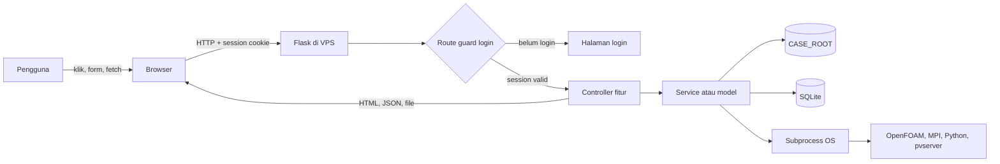
```mermaid
flowchart LR
    U[Pengguna] -->|klik, form, fetch| B[Browser]
    B -->|HTTP + session cookie| F[Flask di VPS]
    F --> G{Route guard login}
    G -->|belum login| L[Halaman login]
    G -->|session valid| C[Controller fitur]
    C --> S[Service atau model]
    S --> CR[(CASE_ROOT)]
    S --> DB[(SQLite)]
    S --> OS[Subprocess OS]
    OS --> OF[OpenFOAM, MPI, Python, pvserver]
    C -->|HTML, JSON, file| B
```

Urutan inisialisasi saat aplikasi dinyalakan adalah:

1. `create_app()` membuat aplikasi Flask dan memuat `AppConfig`.
2. Path seperti `CASE_ROOT`, database, output grafik, report, dan state Case File Manager ditentukan dari environment atau nilai default.
3. `init_services()` membuat satu instance `CaseFileManager`, `SandboxTerminal`, `GraphService`, `ProcessorService`, repository SQLite, dan history service pada `app.extensions`.
4. SQLite diinisialisasi dan record `running` yang tertinggal dari proses aplikasi sebelumnya ditandai `failed`.
5. Controller didaftarkan pada blueprint.
6. `before_app_request` memeriksa session untuk setiap request selain login dan static asset.

Konsekuensi desain ini adalah seluruh operasi file dan proses menggunakan hak akses user yang menjalankan Flask. Browser tidak menerima kredensial shell VPS dan tidak membuat koneksi SSH. Untuk deployment production, service Flask sebaiknya dijalankan oleh user khusus dengan permission minimum pada folder case.

### 29.2 Alur login dan pembentukan session

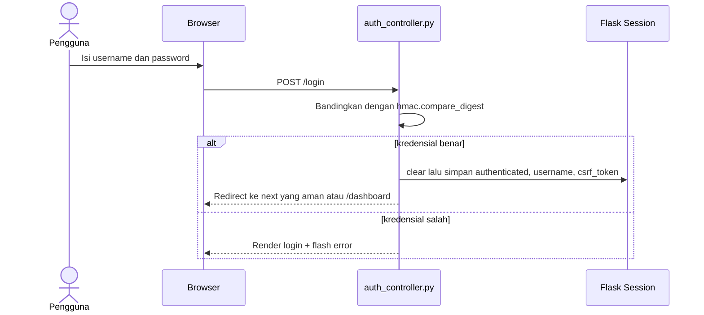
```mermaid
sequenceDiagram
    actor User as Pengguna
    participant Browser
    participant Auth as auth_controller.py
    participant Session as Flask Session
    User->>Browser: Isi username dan password
    Browser->>Auth: POST /login
    Auth->>Auth: Bandingkan dengan hmac.compare_digest
    alt kredensial benar
        Auth->>Session: clear lalu simpan authenticated, username, csrf_token
        Auth-->>Browser: Redirect ke next yang aman atau /dashboard
    else kredensial salah
        Auth-->>Browser: Render login + flash error
    end
```

Setelah login, cookie session dikirim otomatis oleh browser pada request berikutnya. Route guard tidak membedakan role; semua pengguna yang terautentikasi mempunyai akses yang sama. Token CSRF dibuat di session, tetapi saat ini baru diperiksa secara konsisten pada mutasi Case File Manager dan start/stop Remote ParaView.

### 29.3 Alur Dashboard dan riwayat simulasi

Saat halaman `/dashboard` dibuka, controller tidak membaca proses OpenFOAM secara langsung. Data dashboard dihitung dari tabel SQLite `simulation_runs`.

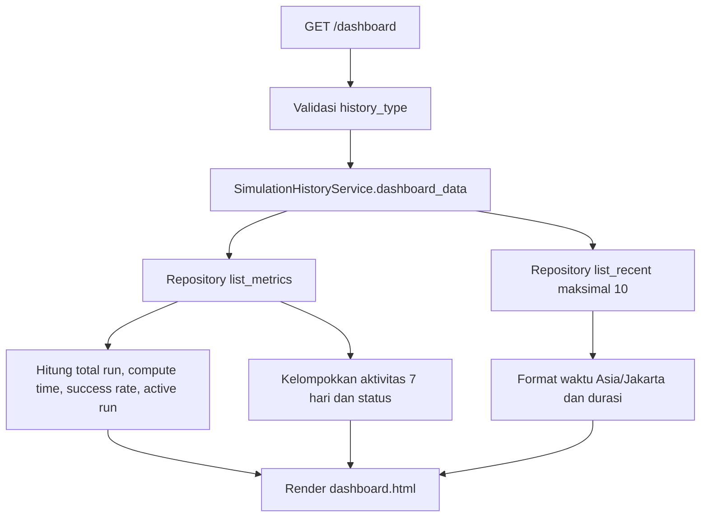
```mermaid
flowchart TD
    A[GET /dashboard] --> B[Validasi history_type]
    B --> C[SimulationHistoryService.dashboard_data]
    C --> D[Repository list_metrics]
    C --> E[Repository list_recent maksimal 10]
    D --> F[Hitung total run, compute time, success rate, active run]
    D --> G[Kelompokkan aktivitas 7 hari dan status]
    E --> H[Format waktu Asia/Jakarta dan durasi]
    F --> I[Render dashboard.html]
    G --> I
    H --> I
```

Record history dibuat ketika meshing atau solver dimulai, bukan ketika halaman dashboard dibuka. Pada akhir proses, runner memperbarui record yang sama dengan `finished_at`, status, exit code, pesan, dan cuplikan maksimal 80 baris atau 12.000 karakter.

### 29.4 Alur Case Terminal

#### 29.4.1 Cara halaman memperoleh akses command

Case Terminal bukan emulator SSH, bukan PTY interaktif, dan tidak menggunakan WebSocket. Ia adalah form web yang mengirim satu baris command ke Flask. Backend lalu menjalankannya sebagai subprocess non-interaktif dengan current working directory di dalam `CASE_ROOT`.

Komponen yang terlibat:

| Lapisan | Komponen | Tanggung jawab |
| --- | --- | --- |
| View | `templates/terminal.html` | Menyediakan layar output, prompt, input, tombol stop, dan clear. |
| Frontend | `static/js/case_terminal.js` | Mengirim command JSON, polling satu detik, render output, dan command history lokal. |
| Controller | `controllers/terminal_controller.py` | Endpoint halaman, status, run, dan stop. |
| Model | `models/sandbox_terminal.py` | Menyimpan state, memvalidasi command, mengelola cwd, menjalankan subprocess, dan menghentikan proses. |
| Configuration | `services/__init__.py` | Membuat satu `SandboxTerminal` app-scoped dengan `CASE_ROOT`. |

#### 29.4.2 Urutan menjalankan command

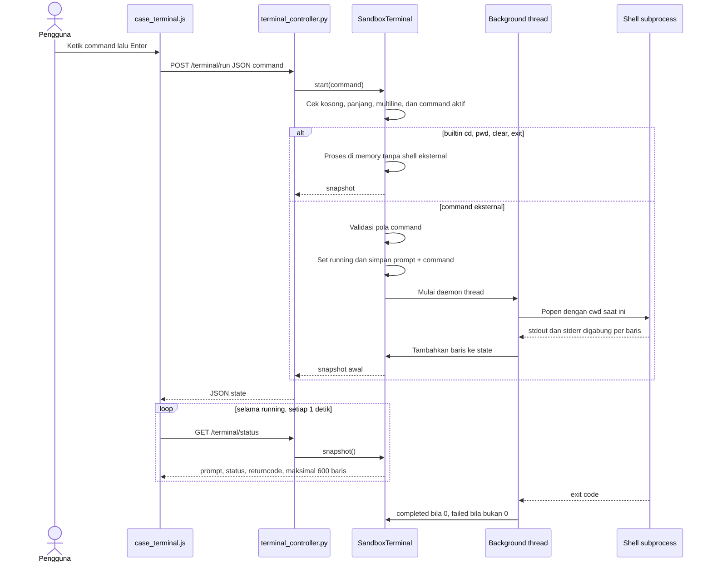
```mermaid
sequenceDiagram
    actor User as Pengguna
    participant JS as case_terminal.js
    participant API as terminal_controller.py
    participant ST as SandboxTerminal
    participant TH as Background thread
    participant OS as Shell subprocess

    User->>JS: Ketik command lalu Enter
    JS->>API: POST /terminal/run JSON command
    API->>ST: start(command)
    ST->>ST: Cek kosong, panjang, multiline, dan command aktif
    alt builtin cd, pwd, clear, exit
        ST->>ST: Proses di memory tanpa shell eksternal
        ST-->>API: snapshot
    else command eksternal
        ST->>ST: Validasi pola command
        ST->>ST: Set running dan simpan prompt + command
        ST->>TH: Mulai daemon thread
        TH->>OS: Popen dengan cwd saat ini
        OS-->>TH: stdout dan stderr digabung per baris
        TH->>ST: Tambahkan baris ke state
        ST-->>API: snapshot awal
    end
    API-->>JS: JSON state
    loop selama running, setiap 1 detik
        JS->>API: GET /terminal/status
        API->>ST: snapshot()
        ST-->>JS: prompt, status, returncode, maksimal 600 baris
    end
    OS-->>TH: exit code
    TH->>ST: completed bila 0, failed bila bukan 0
```

Pada Linux, proses dibuat dengan shell dari environment `SHELL` atau `/bin/bash` melalui opsi `-lc`. Pada Windows development, proses dibuat melalui `powershell.exe -NoProfile -NonInteractive`. `stdout` dan `stderr` digabung, dibaca baris demi baris, lalu disimpan di memory. Karena bukan PTY, program yang membutuhkan input lanjutan, editor interaktif, full-screen TUI, atau prompt password tidak cocok dijalankan dari halaman ini.

#### 29.4.3 Builtin dan perpindahan directory

- `cd`, `chdir`, `set-location`, dan `sl` diproses oleh Python, bukan diteruskan sebagai state shell permanen.
- Target `cd` di-resolve relatif terhadap cwd terminal saat ini dan harus tetap berada di bawah `CASE_ROOT`.
- `cd -` bertukar ke directory sebelumnya.
- `pwd` atau `cwd` menampilkan path aktual backend.
- `clear` atau `cls` mengosongkan buffer tampilan.
- `exit` atau `logout` tidak mematikan session web; hanya menampilkan pesan.

Setiap command eksternal memakai subprocess baru. Karena itu, perubahan state shell seperti variable hasil `export`, alias, atau aktivasi environment pada satu command tidak otomatis bertahan pada command berikutnya. Cwd dapat bertahan karena disimpan eksplisit oleh model.

#### 29.4.4 Alur stop command

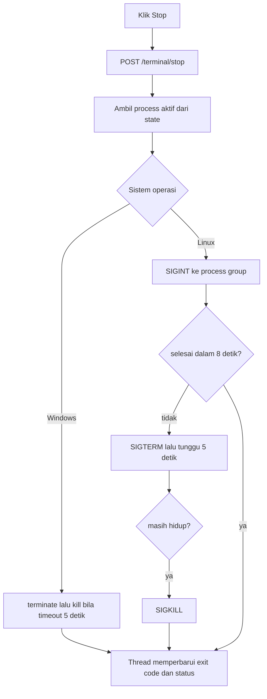
```mermaid
flowchart TD
    A[Klik Stop] --> B[POST /terminal/stop]
    B --> C[Ambil process aktif dari state]
    C --> D{Sistem operasi}
    D -->|Windows| E[terminate lalu kill bila timeout 5 detik]
    D -->|Linux| F[SIGINT ke process group]
    F --> G{selesai dalam 8 detik?}
    G -->|tidak| H[SIGTERM lalu tunggu 5 detik]
    H --> I{masih hidup?}
    I -->|ya| J[SIGKILL]
    E --> K[Thread memperbarui exit code dan status]
    J --> K
    G -->|ya| K
```

#### 29.4.5 Batas keamanan yang sebenarnya

Validasi menolak banyak pola berisiko seperti newline, `..`, `~`, drive Windows/UNC, beberapa ekspansi environment, nested shell, interpreter inline `-c/-e`, dan penggunaan command perubahan directory di tengah ekspresi shell. Namun mekanisme ini adalah filter string dan pengaturan working directory, bukan isolasi kernel seperti container, chroot, AppArmor, seccomp, atau user OS terpisah.

Artinya, `cwd=CASE_ROOT` tidak dengan sendirinya menjamin executable yang dipanggil tidak dapat membaca atau mengubah path lain yang dapat diakses oleh user Flask. Command juga tetap diproses oleh shell. Karena itu Case Terminal hanya layak diberikan kepada pengguna tepercaya, permission user service harus dibatasi, dan fitur sebaiknya dinonaktifkan atau diganti dengan allowlist command untuk deployment multi-user.

State Case Terminal berada di memory proses Flask. Satu worker memiliki satu sesi bersama; restart menghapus state; deployment beberapa worker dapat menghasilkan status berbeda tergantung worker yang menerima request.

### 29.5 Alur Case File Manager

#### 29.5.1 Membuka halaman dan membentuk Explorer

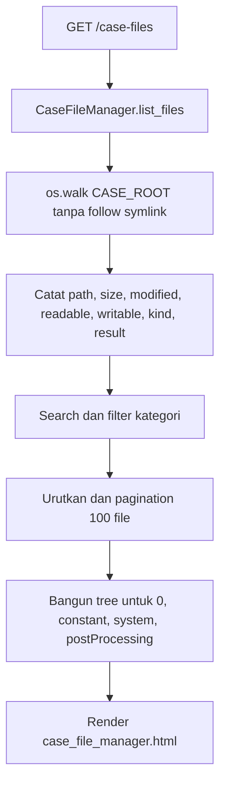
```mermaid
flowchart TD
    A[GET /case-files] --> B[CaseFileManager.list_files]
    B --> C[os.walk CASE_ROOT tanpa follow symlink]
    C --> D[Catat path, size, modified, readable, writable, kind, result]
    D --> E[Search dan filter kategori]
    E --> F[Urutkan dan pagination 100 file]
    F --> G[Bangun tree untuk 0, constant, system, postProcessing]
    G --> H[Render case_file_manager.html]
```

Setiap request halaman melakukan scan filesystem terbaru. Symlink directory tidak ditelusuri dan symlink file dilewati. File dianggap dapat dibaca editor bila ukurannya tidak lebih dari 2 MB, bukan ekstensi binary yang dikenal, sampel awal tidak memiliki null byte, dan dapat didecode sebagai UTF-8.

#### 29.5.2 Membuka dan menyimpan file teks

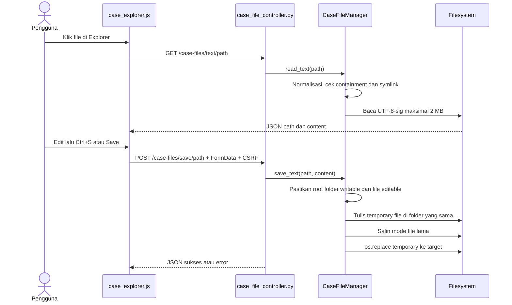
```mermaid
sequenceDiagram
    actor User as Pengguna
    participant JS as case_explorer.js
    participant API as case_file_controller.py
    participant FM as CaseFileManager
    participant FS as Filesystem

    User->>JS: Klik file di Explorer
    JS->>API: GET /case-files/text/path
    API->>FM: read_text(path)
    FM->>FM: Normalisasi, cek containment dan symlink
    FM->>FS: Baca UTF-8-sig maksimal 2 MB
    FS-->>JS: JSON path dan content
    User->>JS: Edit lalu Ctrl+S atau Save
    JS->>API: POST /case-files/save/path + FormData + CSRF
    API->>FM: save_text(path, content)
    FM->>FM: Pastikan root folder writable dan file editable
    FM->>FS: Tulis temporary file di folder yang sama
    FM->>FS: Salin mode file lama
    FM->>FS: os.replace temporary ke target
    API-->>JS: JSON sukses atau error
```

Penulisan editor bersifat atomic pada filesystem yang sama karena file baru ditulis lengkap sebelum `os.replace`. Akan tetapi, edit inline tidak membuat backup manifest. Tombol **Clear uploaded files** tidak dapat mengembalikan perubahan yang dibuat melalui editor.

#### 29.5.3 Mengganti satu file

Ketika pengguna menekan **Replace**, browser tidak mengganti path atau nama target. File yang dipilih hanya menjadi sumber isi baru.

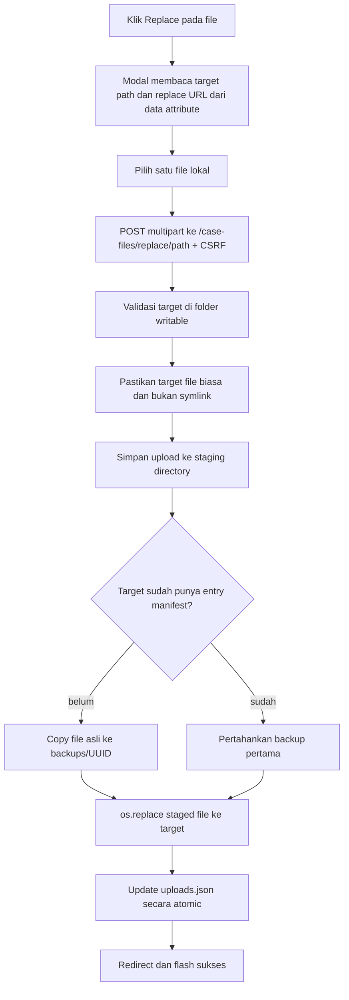
```mermaid
flowchart TD
    A[Klik Replace pada file] --> B[Modal membaca target path dan replace URL dari data attribute]
    B --> C[Pilih satu file lokal]
    C --> D[POST multipart ke /case-files/replace/path + CSRF]
    D --> E[Validasi target di folder writable]
    E --> F[Pastikan target file biasa dan bukan symlink]
    F --> G[Simpan upload ke staging directory]
    G --> H{Target sudah punya entry manifest?}
    H -->|belum| I[Copy file asli ke backups/UUID]
    H -->|sudah| J[Pertahankan backup pertama]
    I --> K[os.replace staged file ke target]
    J --> K
    K --> L[Update uploads.json secara atomic]
    L --> M[Redirect dan flash sukses]
```

Backup pertama dipertahankan walaupun file yang sama di-replace beberapa kali. Dengan demikian, **Clear uploaded files** mengembalikan versi sebelum rangkaian replace melalui UI, bukan versi replace sebelumnya.

#### 29.5.4 Mengganti satu folder

Replace folder adalah operasi sinkronisasi isi, bukan sekadar copy tambahan:

1. Browser memakai `webkitdirectory` dan mengirim setiap file beserta relative path-nya.
2. Backend memastikan hanya satu root folder yang dipilih dan membuang nama root upload sebelum memetakannya ke folder target.
3. Semua destination dinormalisasi, dicek duplikasi, dicek konflik file-versus-folder, dan harus tetap berada di folder target.
4. Seluruh upload disimpan ke staging lebih dahulu.
5. File lama yang tidak ada pada folder baru dicadangkan bila merupakan file asli, lalu dihapus.
6. File dengan path yang sama dicadangkan sekali lalu diganti.
7. File baru dicatat sebagai `created`.
8. Directory kosong dibersihkan dan manifest disimpan.

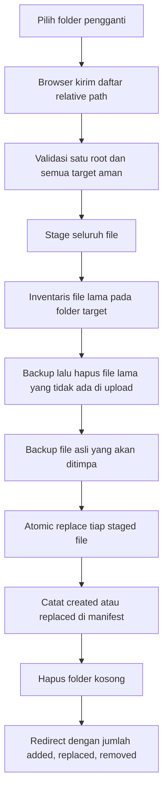
```mermaid
flowchart TD
    A[Pilih folder pengganti] --> B[Browser kirim daftar relative path]
    B --> C[Validasi satu root dan semua target aman]
    C --> D[Stage seluruh file]
    D --> E[Inventaris file lama pada folder target]
    E --> F[Backup lalu hapus file lama yang tidak ada di upload]
    F --> G[Backup file asli yang akan ditimpa]
    G --> H[Atomic replace tiap staged file]
    H --> I[Catat created atau replaced di manifest]
    I --> J[Hapus folder kosong]
    J --> K[Redirect dengan jumlah added, replaced, removed]
```

Folder kosong tidak dapat menjadi sumber replace karena browser tidak mengirim entry untuk folder tanpa file.

#### 29.5.5 Upload file/folder dan pemulihan

Upload biasa menempatkan file ke folder tujuan. Jika nama sudah ada, request hanya diterima bila opsi replace aktif. Upload folder mempertahankan subfolder dan mensyaratkan nama root upload sama dengan target top-level yang dipilih.

Manifest `.case_file_manager/uploads.json` membedakan:

| Jenis manifest | Arti | Saat Clear uploaded files |
| --- | --- | --- |
| `created` | File tidak ada sebelum upload UI. | File dihapus. |
| `replaced` + UUID backup | File asli pernah ditimpa atau dihapus oleh operasi replace. | Backup disalin kembali lalu backup dihapus. |

Staging mencegah file target menerima upload parsial sebelum file sumber selesai diterima. Manifest juga ditulis melalui temporary file dan `os.replace`. Meski demikian, rangkaian replace folder melibatkan banyak file dan bukan satu transaksi filesystem global; kegagalan di tengah rangkaian dapat memerlukan pemeriksaan manual.

#### 29.5.6 Perbedaan setiap aksi file

| Aksi UI | Isi berubah | Nama/path target | Backup untuk clear uploads | Teknik utama |
| --- | --- | --- | --- | --- |
| Save editor | Ya | Tetap | Tidak | temporary file + atomic replace |
| Upload file baru | Membuat file | Mengikuti nama upload | Dicatat sebagai `created` | staging + atomic replace |
| Upload dengan replace | Ya | Mengikuti target upload | Ya, satu backup awal | staging + backup + atomic replace |
| Replace file | Ya | Selalu tetap | Ya, satu backup awal | staging + backup + atomic replace |
| Replace folder | Isi folder disamakan | Root target tetap | Ya untuk file asli | staging + sinkronisasi + manifest |
| Delete | File dihapus | Tidak berlaku | Tidak; entry/backup terkait juga dibuang | unlink |
| Clear uploads | Restore/hapus | Berdasarkan manifest | Mengonsumsi backup | copy2/unlink |
| Clear results | Menghapus output CFD dan log | Tidak berlaku | Tidak ada undo | rmtree/unlink |

#### 29.5.7 Boundary path

Semua operasi sensitif melewati `_normalize_relative()` dan `resolve_path()`. Path absolut, `..`, `:`, null byte, symlink pada setiap komponen, dan hasil resolve di luar `CASE_ROOT` ditolak. Mutasi juga melewati `_require_writable_path()` sehingga hanya root `0`, `constant`, `system`, dan `postProcessing` yang dapat diubah.

### 29.6 Alur Input Parameter

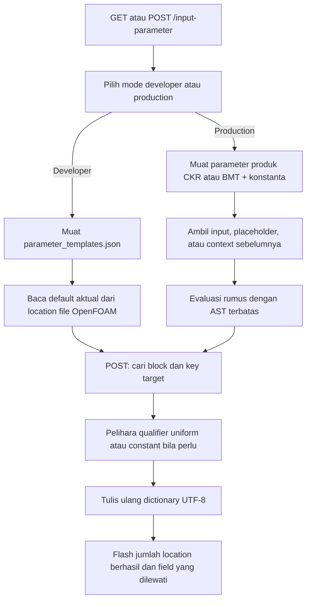
```mermaid
flowchart TD
    A[GET atau POST /input-parameter] --> B[Pilih mode developer atau production]
    B -->|Developer| C[Muat parameter_templates.json]
    B -->|Production| D[Muat parameter produk CKR atau BMT + konstanta]
    C --> E[Baca default aktual dari location file OpenFOAM]
    D --> F[Ambil input, placeholder, atau context sebelumnya]
    F --> G[Evaluasi rumus dengan AST terbatas]
    E --> H[POST: cari block dan key target]
    G --> H
    H --> I[Pelihara qualifier uniform atau constant bila perlu]
    I --> J[Tulis ulang dictionary UTF-8]
    J --> K[Flash jumlah location berhasil dan field yang dilewati]
```

Pada mode Developer, `location` berbentuk urutan `file > block > key`. Model membaca file, mencari pasangan kurung kurawal untuk block, lalu mencari entry yang berakhir dengan titik koma. Pada mode Production, input operasional dikonversi menjadi angka teknis menggunakan konstanta dan `rumus_logika`; evaluator hanya menerima konstanta angka, variable yang dikenal, operasi tambah, kurang, kali, bagi, pangkat, dan unary.

Penulisan parameter saat ini langsung menggunakan `Path.write_text`, bukan mekanisme backup Case File Manager dan bukan atomic replace. Tidak ada snapshot parameter per run. Karena itu perubahan harus diverifikasi sebelum meshing/solver dan sebaiknya diarsipkan untuk reproduksibilitas.

### 29.7 Alur Set Processor

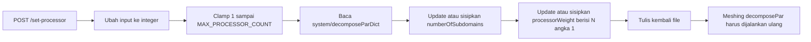
```mermaid
flowchart LR
    A[POST /set-processor] --> B[Ubah input ke integer]
    B --> C[Clamp 1 sampai MAX_PROCESSOR_COUNT]
    C --> D[Baca system/decomposeParDict]
    D --> E[Update atau sisipkan numberOfSubdomains]
    E --> F[Update atau sisipkan processorWeight berisi N angka 1]
    F --> G[Tulis kembali file]
    G --> H[Meshing decomposePar harus dijalankan ulang]
```

Perubahan ini hanya mengubah konfigurasi. Folder `processor0` sampai `processorN-1` tidak otomatis dibuat oleh halaman Set Processor; folder tersebut baru dibuat pada tahap `decomposePar -force` dalam meshing.

### 29.8 Alur Meshing

#### 29.8.1 Start dan eksekusi tahapan

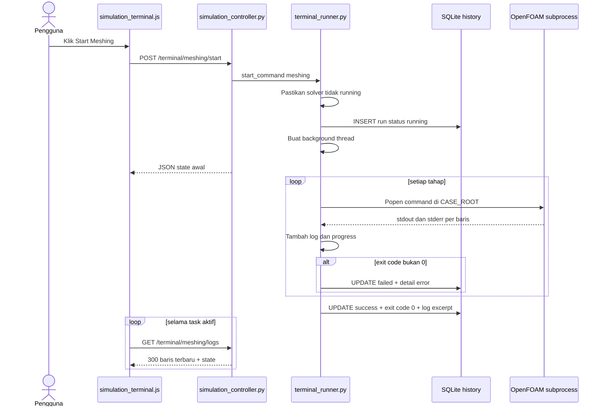
```mermaid
sequenceDiagram
    actor User as Pengguna
    participant JS as simulation_terminal.js
    participant API as simulation_controller.py
    participant Runner as terminal_runner.py
    participant DB as SQLite history
    participant OF as OpenFOAM subprocess

    User->>JS: Klik Start Meshing
    JS->>API: POST /terminal/meshing/start
    API->>Runner: start_command meshing
    Runner->>Runner: Pastikan solver tidak running
    Runner->>DB: INSERT run status running
    Runner->>Runner: Buat background thread
    API-->>JS: JSON state awal
    loop setiap tahap
        Runner->>OF: Popen command di CASE_ROOT
        OF-->>Runner: stdout dan stderr per baris
        Runner->>Runner: Tambah log dan progress
        alt exit code bukan 0
            Runner->>DB: UPDATE failed + detail error
        end
    end
    Runner->>DB: UPDATE success + exit code 0 + log excerpt
    loop selama task aktif
        JS->>API: GET /terminal/meshing/logs
        API-->>JS: 300 baris terbaru + state
    end
```

Tahap dijalankan berurutan dan tahap berikutnya hanya dimulai bila exit code tahap sebelumnya nol. Pembersihan awal menghapus `processor*`, `constant/polyMesh`, dan `log.*`, kemudian runner memanggil `blockMesh`, `surfaceFeatureExtract`, `snappyHexMesh -overwrite`, `checkMesh`, dan `decomposePar -force`.

#### 29.8.2 Stop, cancel, dan resume

- Stop menandai `stop_requested`, mengirim sinyal ke process group, menyimpan status `stopped`, dan mengaktifkan `resume_available`.
- Cancel menandai `cancel_requested`, menghentikan process group, menyimpan status `cancelled`, dan menonaktifkan resume.
- Saat resume, `current_step` menentukan tahap berikutnya. Jika proses dihentikan ketika sebuah tahap masih berjalan, tahap tersebut dijalankan lagi.
- Status UI `completed` dipetakan ke status persisten `success` pada database.

State proses, object `Popen`, log penuh, progress, dan current step berada di dictionary global memory. SQLite hanya menyimpan lifecycle dan excerpt, bukan state yang dapat dipakai untuk melanjutkan runner setelah restart.

### 29.9 Alur Solver dan safety monitor

#### 29.9.1 Pemeriksaan kesiapan dan eksekusi MPI

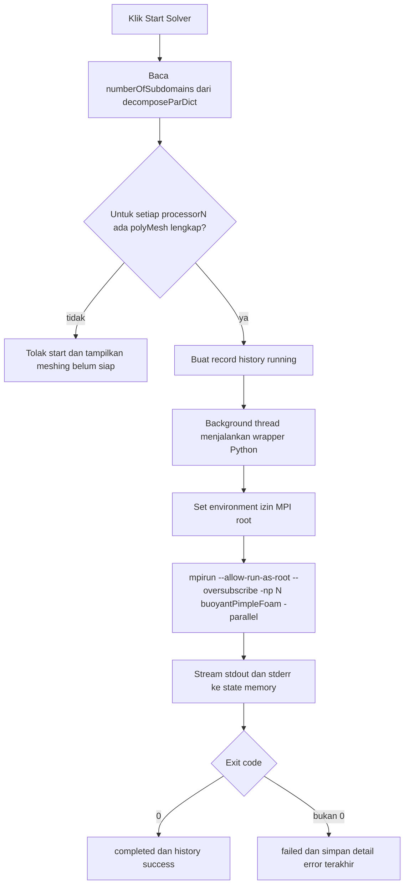
```mermaid
flowchart TD
    A[Klik Start Solver] --> B[Baca numberOfSubdomains dari decomposeParDict]
    B --> C{Untuk setiap processorN ada polyMesh lengkap?}
    C -->|tidak| D[Tolak start dan tampilkan meshing belum siap]
    C -->|ya| E[Buat record history running]
    E --> F[Background thread menjalankan wrapper Python]
    F --> G[Set environment izin MPI root]
    G --> H[mpirun --allow-run-as-root --oversubscribe -np N buoyantPimpleFoam -parallel]
    H --> I[Stream stdout dan stderr ke state memory]
    I --> J{Exit code}
    J -->|0| K[completed dan history success]
    J -->|bukan 0| L[failed dan simpan detail error terakhir]
```

Kesiapan berarti setiap folder processor yang diharapkan memiliki `boundary`, `faces`, `neighbour`, `owner`, dan `points` di `constant/polyMesh`. Pemeriksaan ini memastikan hasil dekomposisi tersedia, tetapi tidak memvalidasi kualitas mesh atau konsistensi seluruh dictionary solver.

Resume menjalankan command solver dari awal lagi. Kelanjutan numerik bergantung pada konfigurasi OpenFOAM seperti `startFrom latestTime` dan keberadaan time directory terakhir; web tidak membuat checkpoint solver tersendiri.

#### 29.9.2 Monitoring log di browser

Frontend mengambil state solver dan meshing secara paralel setiap sekitar satu detik. Browser, bukan backend, menjalankan regex untuk mencari Courant number, final residual beberapa field, dan continuity error dari maksimal 300 baris log terbaru.

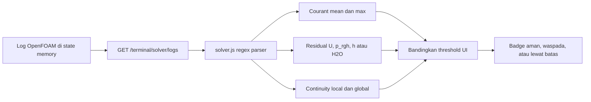
```mermaid
flowchart LR
    A[Log OpenFOAM di state memory] --> B[GET /terminal/solver/logs]
    B --> C[solver.js regex parser]
    C --> D[Courant mean dan max]
    C --> E[Residual U, p_rgh, h atau H2O]
    C --> F[Continuity local dan global]
    D --> G[Bandingkan threshold UI]
    E --> G
    F --> G
    G --> H[Badge aman, waspada, atau lewat batas]
```

Safety monitor bersifat observasi saja. Nilai yang melewati batas tidak mengirim stop ke solver. Karena parser hanya melihat window log terakhir, nilai lama dapat hilang dari evaluasi UI.

### 29.10 Alur Graph

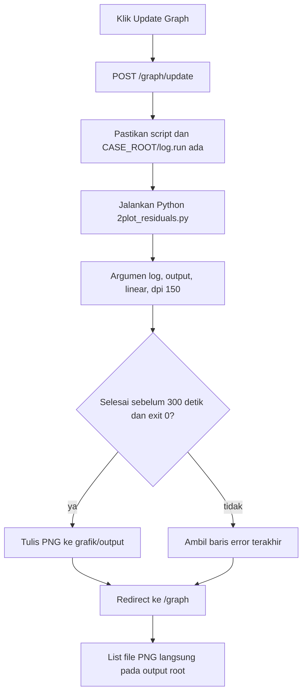
```mermaid
flowchart TD
    A[Klik Update Graph] --> B[POST /graph/update]
    B --> C[Pastikan script dan CASE_ROOT/log.run ada]
    C --> D[Jalankan Python 2plot_residuals.py]
    D --> E[Argumen log, output, linear, dpi 150]
    E --> F{Selesai sebelum 300 detik dan exit 0?}
    F -->|ya| G[Tulis PNG ke grafik/output]
    F -->|tidak| H[Ambil baris error terakhir]
    G --> I[Redirect ke /graph]
    H --> I
    I --> J[List file PNG langsung pada output root]
```

Update graph sinkron terhadap request HTTP. Gambar dilayani melalui endpoint yang me-resolve filename dan hanya menerima file yang parent-nya tepat sama dengan output root, sehingga nested path dan path traversal tidak diterima.

### 29.11 Alur ParaView browser

```mermaid
flowchart TD
    A[GET /paraview] --> B[Scan metadata case]
    B --> C[Daftar time directory, field terbaru, processor, surface VTP]
    B --> D[Cek constant/polyMesh points, faces, boundary]
    D --> E{Cache internalMesh.vtp lebih baru dari sumber?}
    E -->|ya| F[Kirim cache]
    E -->|tidak| G[Parse boundary patch dan binary list OpenFOAM]
    G --> H[Ambil boundary faces dan compact point IDs]
    H --> I[Tulis VTP sementara lalu replace cache]
    I --> F
    F --> J[Browser VTKLoader]
    J --> K[Three.js BufferGeometry dan render WebGL]
```

Browser mengambil VTP melalui `/paraview/internal-mesh`. Cache ditempatkan di `postProcessing/webInternalMesh/internalMesh.vtp` dan dipakai kembali selama mtime cache tidak lebih lama daripada sumber. Viewer merender geometri di sisi client; server hanya membangun dan mengirim data VTP.

Capture memakai `canvas.toDataURL`, lalu mengirim base64 ke `/report/capture`. Backend memverifikasi bahwa payload dapat dibuka sebagai gambar menggunakan Pillow sebelum menyimpan bytes ke folder screenshot report.

### 29.12 Alur Remote ParaView Desktop

```mermaid
sequenceDiagram
    actor User as Pengguna
    participant JS as paraview_remote.js
    participant API as paraview_controller.py
    participant Manager as paraview_server.py
    participant PVS as pvserver
    participant Desktop as ParaView Desktop

    User->>JS: Klik Jalankan Server
    JS->>API: POST /paraview/remote/start + X-CSRF-Token
    API->>Manager: start_server()
    Manager->>Manager: Kunci lifecycle dan siapkan runtime directory
    Manager->>PVS: Popen backend terpilih pada port konfigurasi
    Manager-->>JS: status, PID, log, URL, SSH command
    loop polling 0.9 sampai 2.2 detik
        JS->>API: GET /paraview/remote/status
        API->>Manager: get_server_state()
        Manager-->>JS: state + log tail + connection config
    end
    User->>Desktop: Buka SSH tunnel lalu connect cs://localhost:port
    Desktop->>PVS: Koneksi ParaView client/server
    User->>Desktop: Buka case.foam pada path server
```

Berbeda dari runner meshing/solver, state pvserver ditulis pada runtime directory dan lifecycle dilindungi file lock pada Linux agar lebih konsisten lintas worker. SSH tunnel tetap berada di luar browser; pengguna menjalankannya pada komputer lokal. `pvserver` sebaiknya bind ke loopback dan tidak diekspos langsung karena tidak menyediakan autentikasi dan enkripsi bawaan.

### 29.13 Alur Report

```mermaid
flowchart TD
    A[Klik Get Report] --> B[Coba update graph terbaru]
    B --> C[Buat nama DD_MM_YYYY_NNN]
    C --> D[Buat graphs dan screenshots]
    D --> E[Copy PNG graph yang tersedia]
    E --> F[Render detail report]
    G[Capture viewer] --> H[POST base64 ke /report/capture]
    H --> I[Decode base64 dan verifikasi Pillow]
    I --> J[Simpan screenshots/sisi.png]
    F --> K[Klik Export PDF]
    J --> K
    K --> L[Buat title page dan satu page per image]
    L --> M[Resize proporsional dan simpan ke BytesIO PDF]
    M --> N[Download report_nama.pdf]
```

Nama sisi capture dinormalisasi ke huruf kecil, angka, underscore, atau dash. Capture dengan nama sama menimpa file PNG sebelumnya. PDF dibangun saat request export dan dikirim dari memory; PDF tidak disimpan permanen di folder report. Penghapusan report menggunakan `shutil.rmtree` setelah nama dan containment folder tervalidasi.

### 29.14 Matriks alur halaman ke komponen teknis

| Halaman | Request utama | Frontend | Controller | Service/model utama | Resource yang berubah |
| --- | --- | --- | --- | --- | --- |
| Login | `POST /login` | Form login | `auth_controller.py` | Flask session | Cookie/session |
| Dashboard | `GET /dashboard` | Chart/template | `dashboard_controller.py` | History service + repository | Tidak ada pada GET |
| Case Files | `/case-files/*` | `case_explorer.js` | `case_file_controller.py` | `CaseFileManager` | File case, staging, backup, manifest |
| Input Parameter | `POST /input-parameter` | Form parameter | `parameter_controller.py` | `parameter_model.py` | Dictionary OpenFOAM |
| Set Processor | `POST /set-processor` | Form processor | `processor_controller.py` | `ProcessorService` | `decomposeParDict` |
| Case Terminal | `/terminal/run`, `/status`, `/stop` | `case_terminal.js` | `terminal_controller.py` | `SandboxTerminal` | Subprocess dan state memory; command dapat mengubah case |
| Meshing | `/terminal/meshing/*` | `simulation_terminal.js`, `meshing.js` | `simulation_controller.py` | `terminal_runner.py` | Mesh, processor folders, log memory, SQLite |
| Solver | `/terminal/solver/*` | `simulation_terminal.js`, `solver.js` | `simulation_controller.py` | `terminal_runner.py` | Time directories, log memory, SQLite |
| Graph | `/graph`, `/graph/update` | Template | `graph_controller.py` | `GraphService` + plotting script | PNG grafik |
| ParaView Web | `/paraview/internal-mesh` | `paraview_viewer.js` | `paraview_controller.py` | `paraview_model.py` | Cache VTP dan optional capture |
| ParaView Remote | `/paraview/remote/*` | `paraview_remote.js` | `paraview_controller.py` | `paraview_server.py` | Proses pvserver, runtime state, log |
| Report | `/report/*` | Viewer capture + template | `report_controller.py` | `report_model.py` | Folder report, PNG, PDF in-memory |

### 29.15 Lokasi data dan umur state

```mermaid
flowchart TB
    subgraph Persistent[Persisten setelah restart]
        CASE[(CASE_ROOT: input dan output CFD)]
        SQL[(SQLite simulation history)]
        GRAPH[(PNG graph)]
        REPORT[(Report dan screenshot)]
        MANIFEST[(Upload manifest dan backup)]
        PVRUN[(Runtime state pvserver, selama runtime dir tersedia)]
    end
    subgraph Memory[Hilang saat proses Flask restart]
        TERM[State Case Terminal]
        TASK[State meshing dan solver]
        LOG[Log penuh runner di memory]
        RESUME[Current step dan resume flag]
    end
```

| Data/state | Lokasi | Ketahanan |
| --- | --- | --- |
| Case OpenFOAM | `CFD_CASE_ROOT` | Persisten pada filesystem |
| Riwayat run | `CFD_DATABASE_PATH` | Persisten SQLite/WAL |
| Upload manifest/backup | `CFD_CASE_FILE_STATE_ROOT` | Persisten sampai clear/manual delete |
| Grafik | `CFD_GRAPH_ROOT` | Persisten sampai ditimpa/dihapus |
| Report | `CFD_REPORT_ROOT` | Persisten sampai report dihapus |
| Case Terminal | Memory `SandboxTerminal` | Hilang saat worker restart |
| Meshing/solver state | Global dictionary `terminal_runner.py` | Hilang saat worker restart |
| pvserver state/log | `PVSERVER_RUNTIME_DIR` | Dapat dibaca lintas worker; mengikuti lifecycle runtime directory |

### 29.16 Catatan operasional penting

1. Gunakan satu worker untuk Case Terminal serta meshing/solver pada implementasi saat ini; state keduanya belum berada di shared storage.
2. Jangan menganggap Case Terminal sebagai sandbox OS penuh. Batasi user service dan pertimbangkan allowlist command.
3. Jangan menutup atau restart aplikasi ketika runner aktif jika mengharapkan fitur resume UI; state resume berada di memory.
4. Setelah mengubah jumlah processor, jalankan meshing/decompose ulang sebelum solver.
5. Setelah mengganti dictionary atau geometri, verifikasi file dan jalankan pemeriksaan mesh sebelum solver.
6. Simpan snapshot parameter dan konfigurasi secara terpisah karena halaman parameter belum membuat version history.
7. Gunakan SSH tunnel untuk Remote ParaView dan jangan membuka port `pvserver` langsung ke internet.
8. Tambahkan CSRF pada seluruh endpoint mutasi sebelum deployment production penuh.
9. Monitor kapasitas disk karena hasil OpenFOAM, backup upload, graph, screenshot, ZIP sementara, dan report berada pada filesystem server.
10. Bedakan status proses web, keberhasilan executable, dan validitas ilmiah CFD; ketiganya memerlukan verifikasi berbeda.

---

## Penutup

KMI CFD Simulation Platform telah menyediakan fondasi terintegrasi untuk mengelola workflow CFD spray dryer melalui web. Kekuatan utamanya terletak pada penyatuan filesystem case, parameter, eksekusi OpenFOAM, monitoring, history, visualisasi, dan report dalam arsitektur modular yang telah memiliki pengujian otomatis.

Untuk digunakan sebagai objek skripsi dan sistem production, tahap berikutnya yang paling penting adalah menyelaraskan solver serta versi OpenFOAM, menjalankan pengujian end-to-end pada server target, menerapkan hardening keamanan secara menyeluruh, dan melakukan verifikasi serta validasi CFD dengan data yang dapat dipertanggungjawabkan.
