# Activity Diagram dengan Swimlane

Setiap diagram dipisahkan per proses. Swimlane menunjukkan pihak yang bertanggung jawab atas aktivitas: **Pengguna CFD**, **Sistem Web**, **Service/Model**, dan **Sistem Eksternal/Penyimpanan** bila diperlukan.

## 1. Login

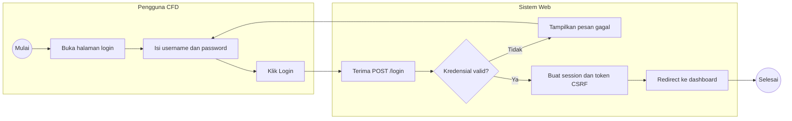

## 2. Menampilkan Dashboard

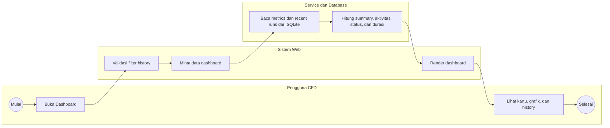

## 3. Membuka dan Menyimpan File Case

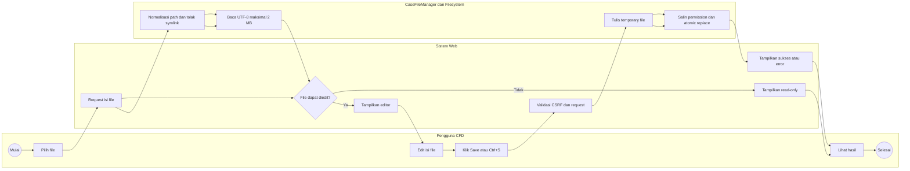

## 4. Upload File atau Folder

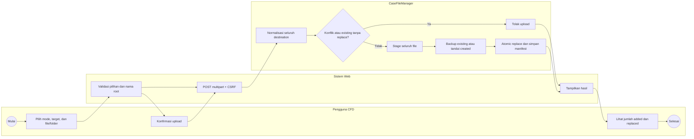

## 5. Replace Satu File

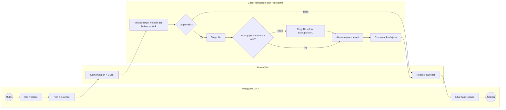

## 6. Replace Folder

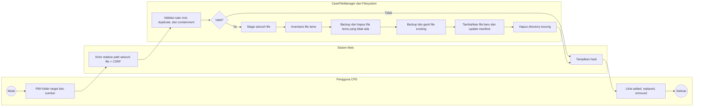

## 7. Clear atau Reset Case

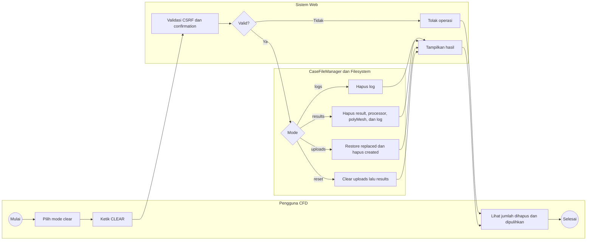

## 8. Input Parameter

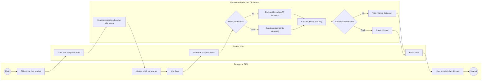

## 9. Set Processor

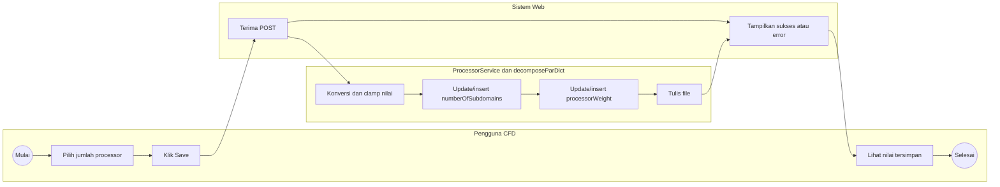

## 10. Menjalankan Case Terminal

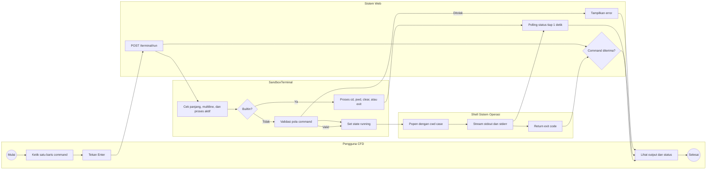

## 11. Meshing

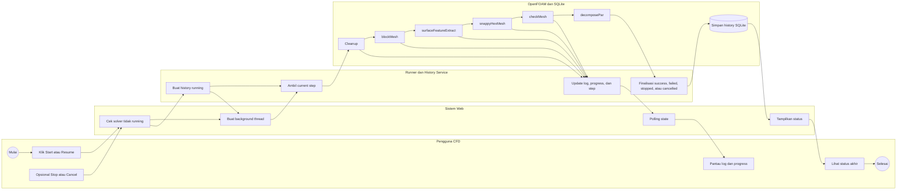

## 12. Solver

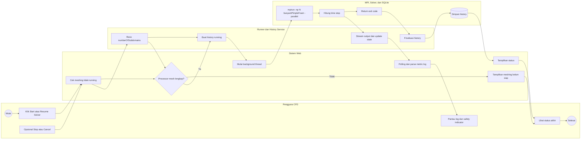

## 13. Update Graph

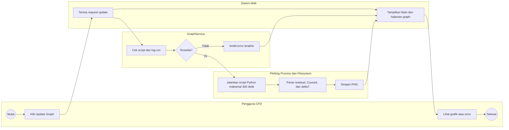

## 14. Visualisasi ParaView di Browser

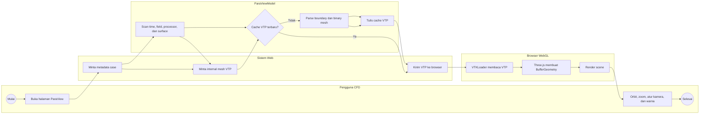

## 15. Remote ParaView

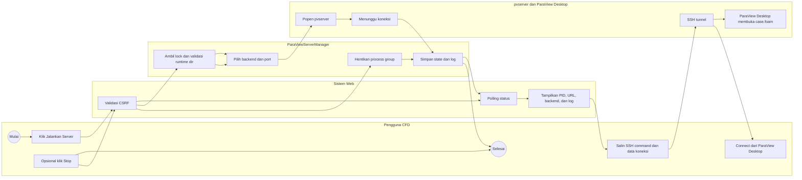

## 16. Get Report

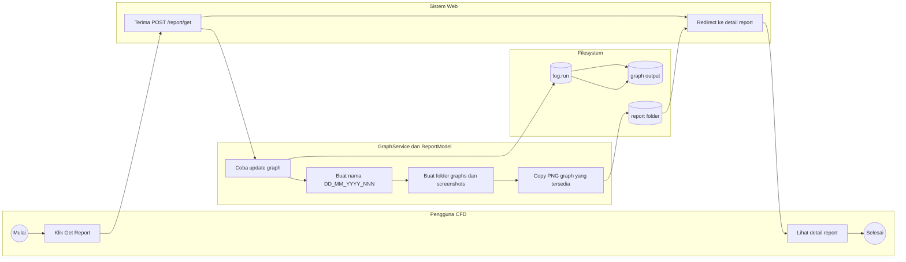

## 17. Capture Report

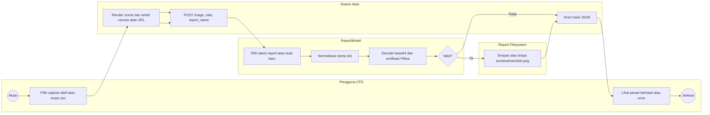

## 18. Export PDF Report

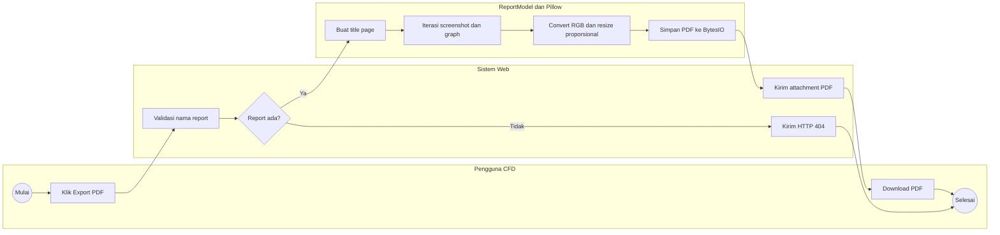

## 19. Delete File Case

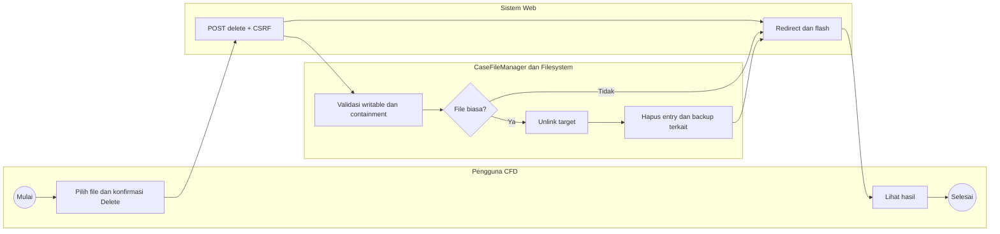

## 20. Download ZIP Case atau Log

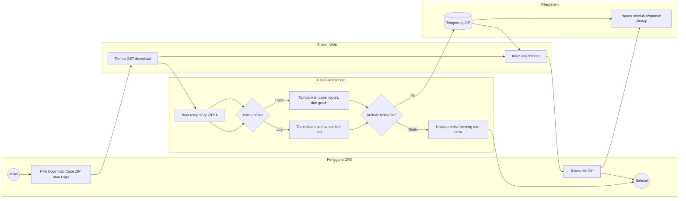

## 21. Delete Report

```mermaid
flowchart LR
    subgraph U[Pengguna CFD]
        direction TB
        U0((Mulai)) --> U1[Pilih report dan klik Delete]
        U2[Lihat daftar report terbaru] --> U3((Selesai))
    end
    subgraph S[Sistem Web]
        direction TB
        S1[POST delete report] --> S2[Redirect dan flash]
    end
    subgraph M[ReportModel dan Filesystem]
        direction TB
        M1[Validasi pola nama dan containment] --> M2{Report valid?}
        M3[shutil.rmtree report folder]
    end
    U1 --> S1 --> M1
    M2 -->|Tidak| S2
    M2 -->|Ya| M3 --> S2
    S2 --> U2
```

## 22. Logout

```mermaid
flowchart LR
    subgraph U[Pengguna CFD]
        direction TB
        U0((Mulai)) --> U1[Klik Logout]
        U2[Lihat halaman login] --> U3((Selesai))
    end
    subgraph S[Sistem Web]
        direction TB
        S1[GET /logout] --> S2[Hapus seluruh session]
        S2 --> S3[Redirect ke login]
    end
    U1 --> S1
    S3 --> U2
```

