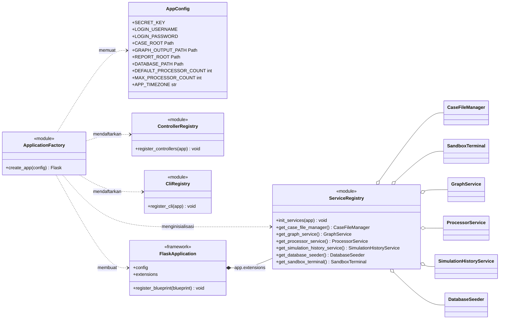
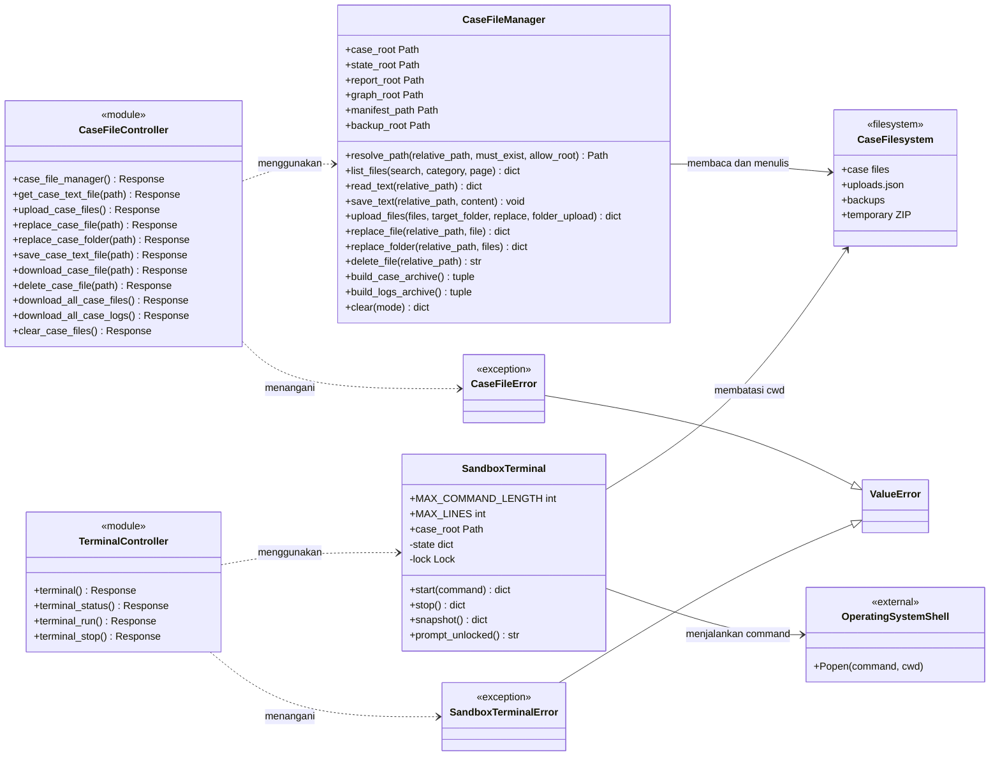
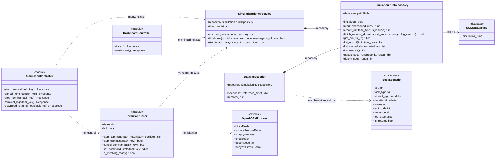
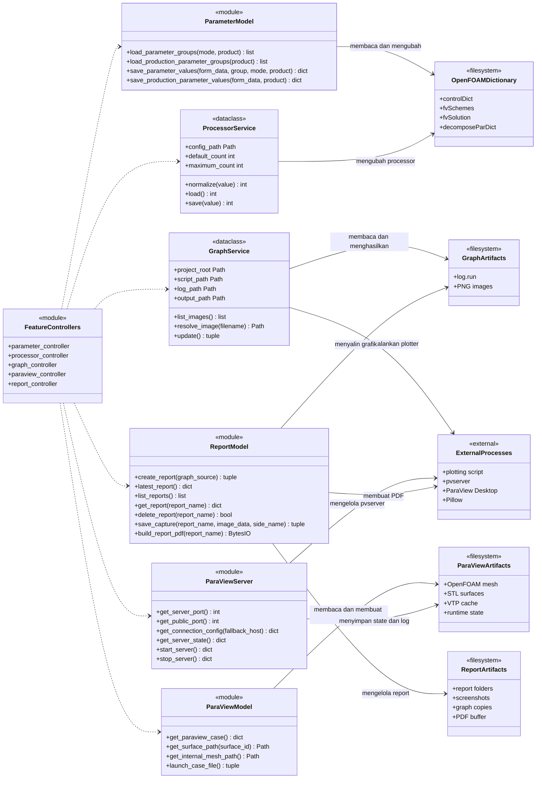

# Class Diagram

Class diagram ini merepresentasikan struktur implementasi aktual aplikasi KMI CFD Simulation Platform. Diagram dipisahkan per domain agar relasi tetap terbaca.

- `class` menunjukkan class Python yang benar-benar ada pada source code.
- `module` menunjukkan modul prosedural yang menyediakan sekumpulan fungsi, bukan class Python.
- Metode privat dan helper internal tidak ditampilkan agar diagram berfokus pada kontrak publik.

## 1. Komposisi Aplikasi dan Dependency Injection

## 2. Manajemen File Case dan Web Terminal

## 3. Eksekusi Simulasi dan Riwayat

## 4. Parameter, Processor, Grafik, ParaView, dan Report

## Ringkasan Relasi Utama

1. `ApplicationFactory` membuat aplikasi Flask, memuat `AppConfig`, lalu mendaftarkan service dan controller.
2. `ServiceRegistry` menyimpan instance service pada `FlaskApplication.extensions` agar dependency dapat diganti saat pengujian.
3. `TerminalRunner` menjalankan Meshing atau Solver dan memakai `SimulationHistoryService` untuk mencatat lifecycle proses.
4. `SimulationHistoryService` mengatur use case riwayat, sedangkan `SimulationRunRepository` menangani persistensi SQLite.
5. `CaseFileManager`, `SandboxTerminal`, `ParameterModel`, `ParaViewModel`, dan `ReportModel` berinteraksi dengan filesystem sesuai domain masing-masing.
