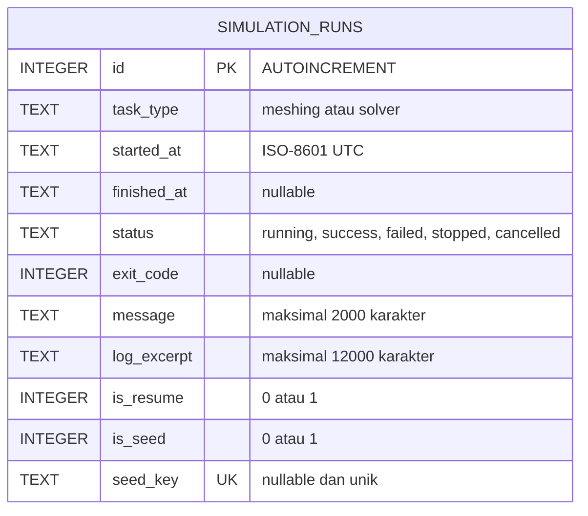
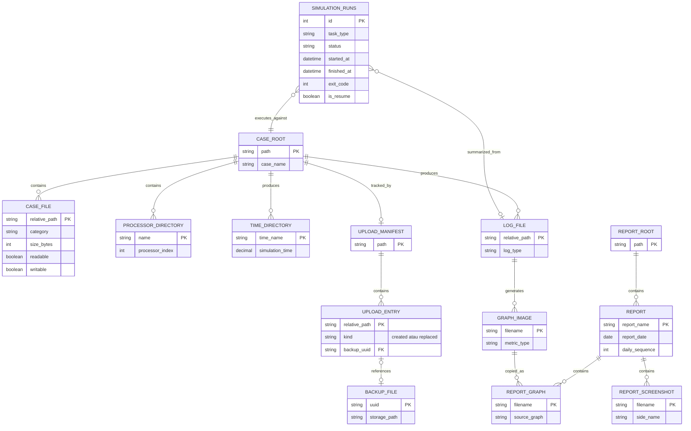
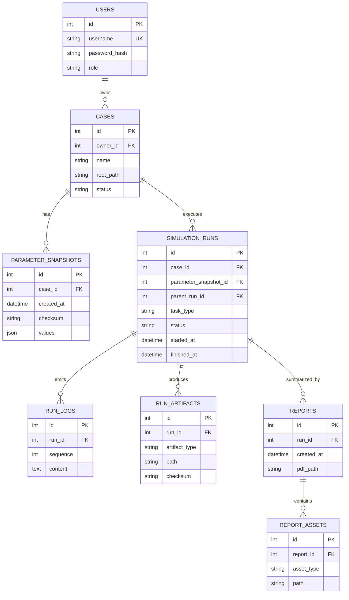

# Entity Relationship Diagram

## 1. ERD SQLite Aktual

Database relasional aktual hanya memiliki tabel `simulation_runs`. Session autentikasi memakai signed Flask session cookie, sedangkan case, graph, report, manifest, dan backup disimpan pada filesystem.

## 2. ERD Konseptual Penyimpanan Sistem

Diagram ini memperlihatkan hubungan data logis antara SQLite dan filesystem. Entity selain `SIMULATION_RUNS` bukan tabel SQL.

## 3. ERD Rekomendasi Multi-Case

Diagram berikut adalah rekomendasi pengembangan dan belum diimplementasikan.

