# Sequence Diagram Boundary-Control-Entity

Setiap proses memakai stereotype `«boundary»`, `«control»`, `«entity»`, `«database»`, dan `«external»` untuk memperjelas tanggung jawab komponen.

## 1. Login

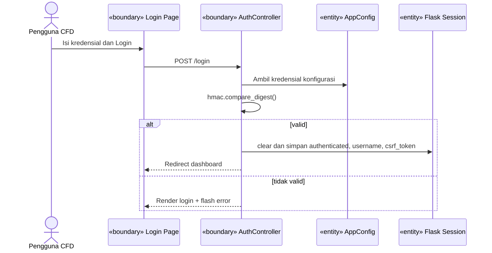

## 2. Dashboard

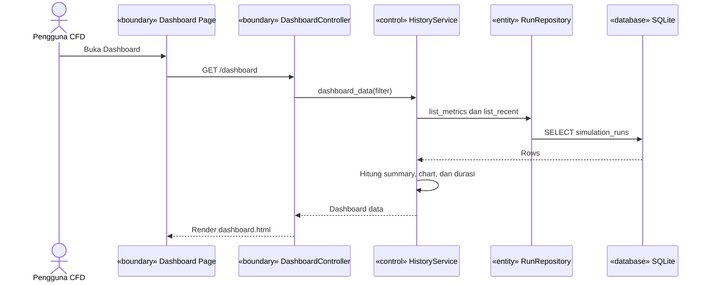

## 3. Membuka dan Menyimpan File Case

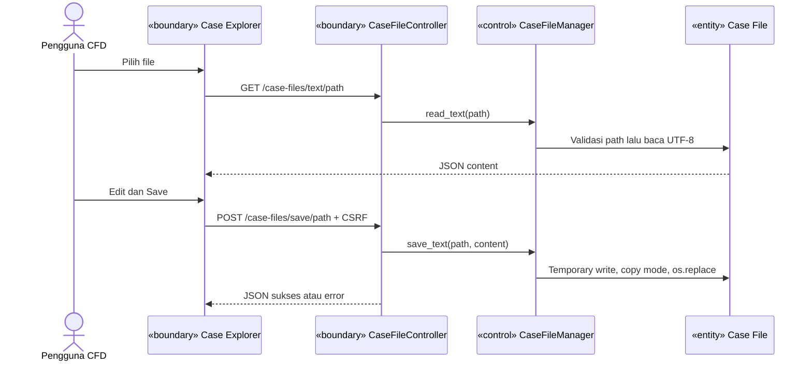

## 4. Upload File atau Folder

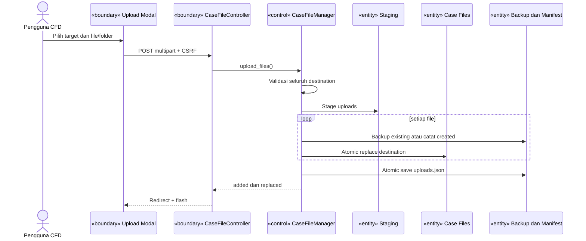

## 5. Replace Satu File

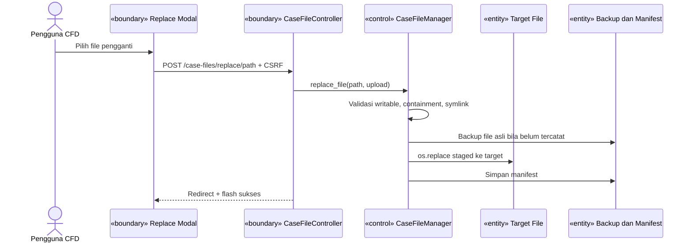

## 6. Replace Folder

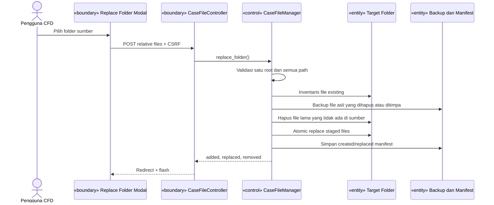

## 7. Clear atau Reset Case

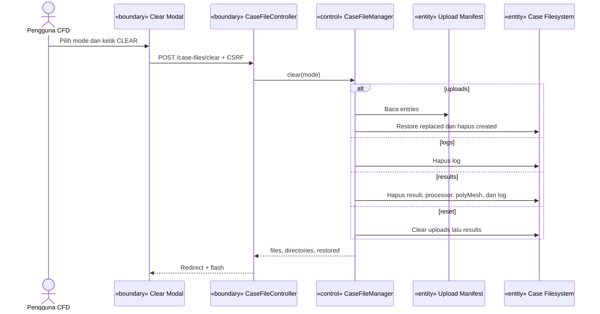

## 8. Input Parameter

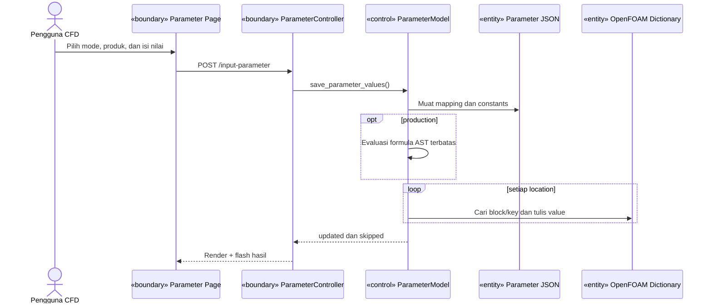

## 9. Set Processor

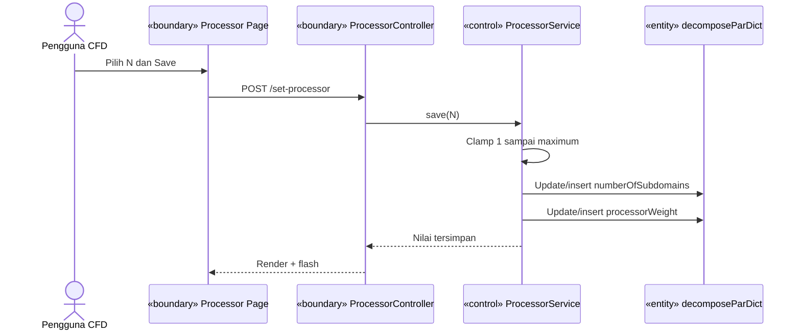

## 10. Case Terminal

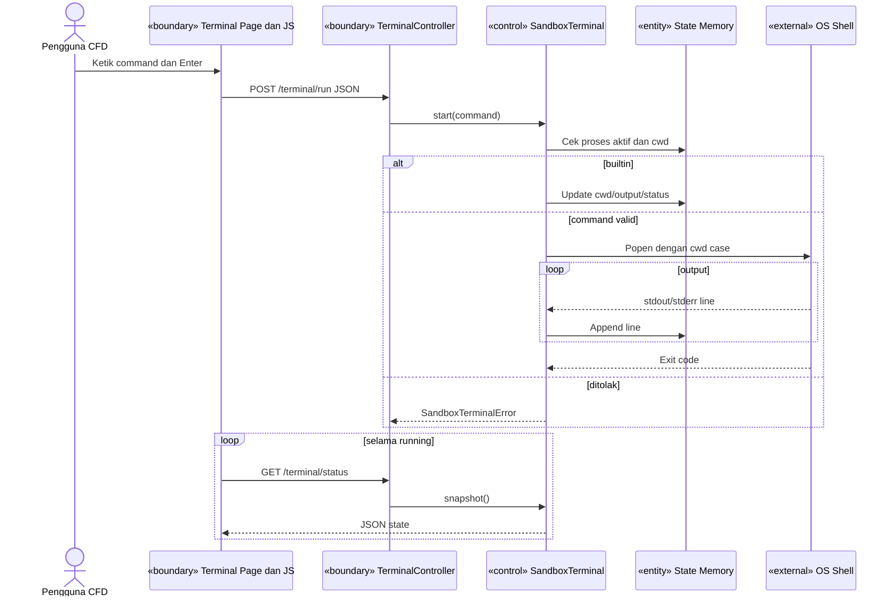

## 11. Meshing

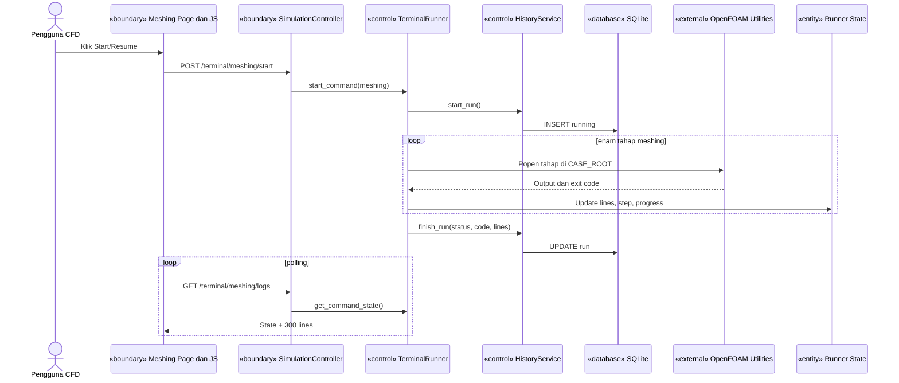

## 12. Solver

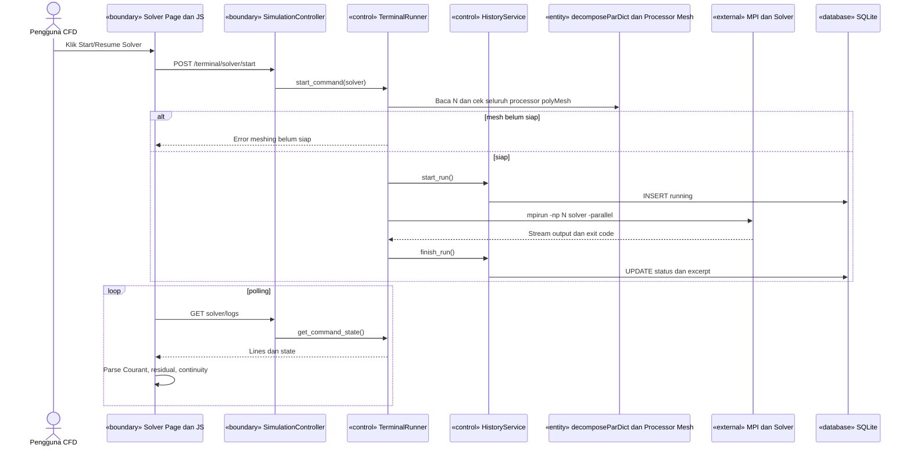

## 13. Stop dan Resume Meshing/Solver

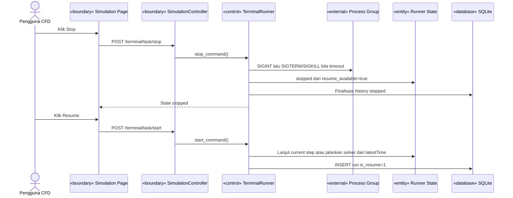

## 14. Update Graph

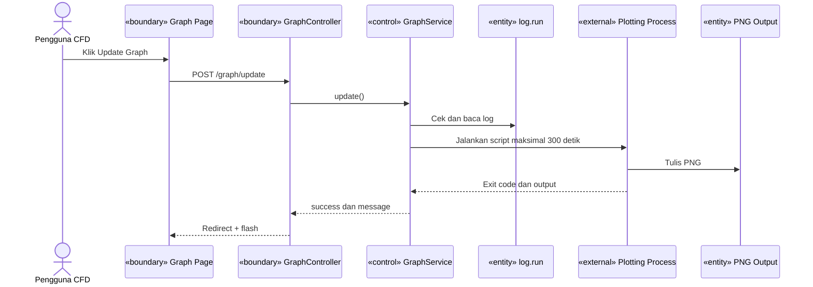

## 15. ParaView Browser

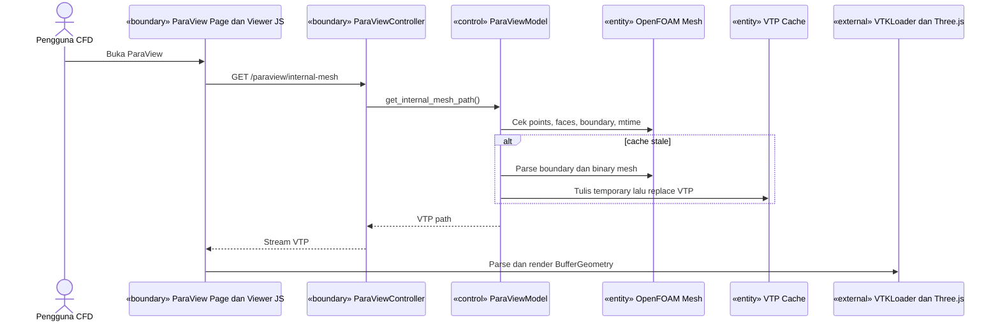

## 16. Remote ParaView

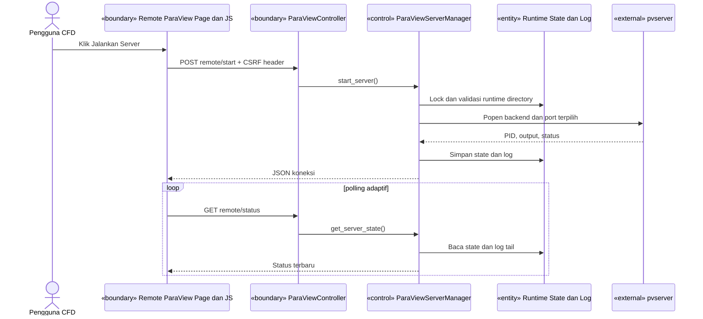

## 17. Get Report

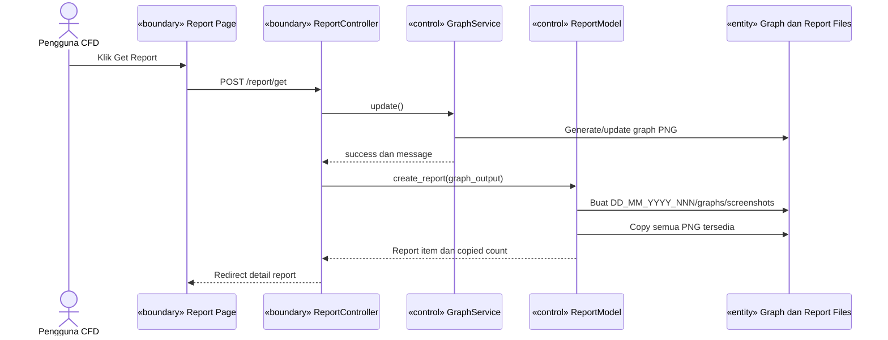

## 18. Capture Report

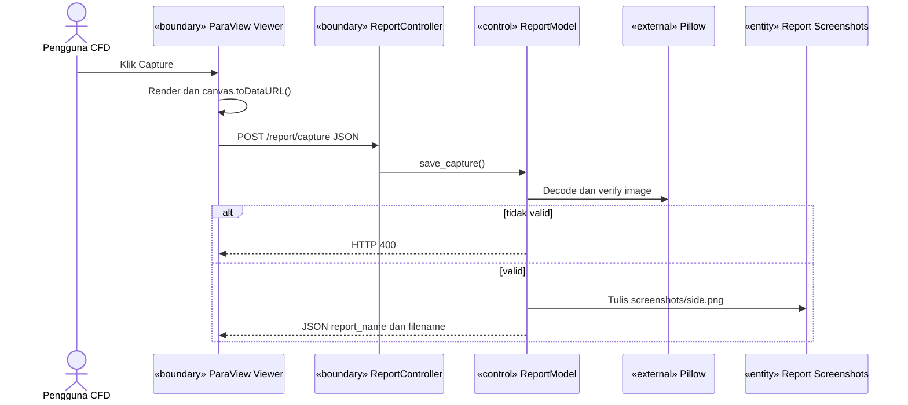

## 19. Export PDF Report

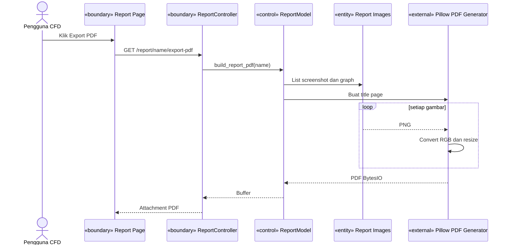

## 20. Delete File Case

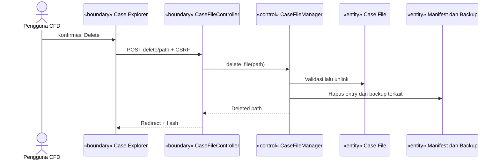

## 21. Download ZIP Case atau Log

```mermaid
sequenceDiagram
    actor U as Pengguna CFD
    participant UI as «boundary» Case File Manager
    participant C as «boundary» CaseFileController
    participant M as «control» CaseFileManager
    participant F as «entity» Source Files
    participant Z as «entity» Temporary ZIP
    U->>UI: Klik download archive
    UI->>C: GET download-all atau download-logs
    C->>M: build archive
    M->>Z: Buat ZIP64
    loop setiap source file
        M->>F: Baca file tanpa symlink
        M->>Z: Tambah entry
    end
    M-->>C: ZIP path dan count
    C-->>UI: Stream attachment
    C->>Z: Hapus setelah response ditutup
```

## 22. Delete Report

```mermaid
sequenceDiagram
    actor U as Pengguna CFD
    participant UI as «boundary» Report Page
    participant C as «boundary» ReportController
    participant R as «control» ReportModel
    participant F as «entity» Report Folder
    U->>UI: Klik Delete Report
    UI->>C: POST /report/name/delete
    C->>R: delete_report(name)
    R->>F: Validasi containment
    alt report valid
        R->>F: shutil.rmtree()
        R-->>C: true
    else tidak valid
        R-->>C: false
    end
    C-->>UI: Redirect + flash
```

## 23. Logout

```mermaid
sequenceDiagram
    actor U as Pengguna CFD
    participant UI as «boundary» Navigation UI
    participant C as «boundary» AuthController
    participant SS as «entity» Flask Session
    U->>UI: Klik Logout
    UI->>C: GET /logout
    C->>SS: clear()
    C-->>UI: Redirect /login + flash
```
