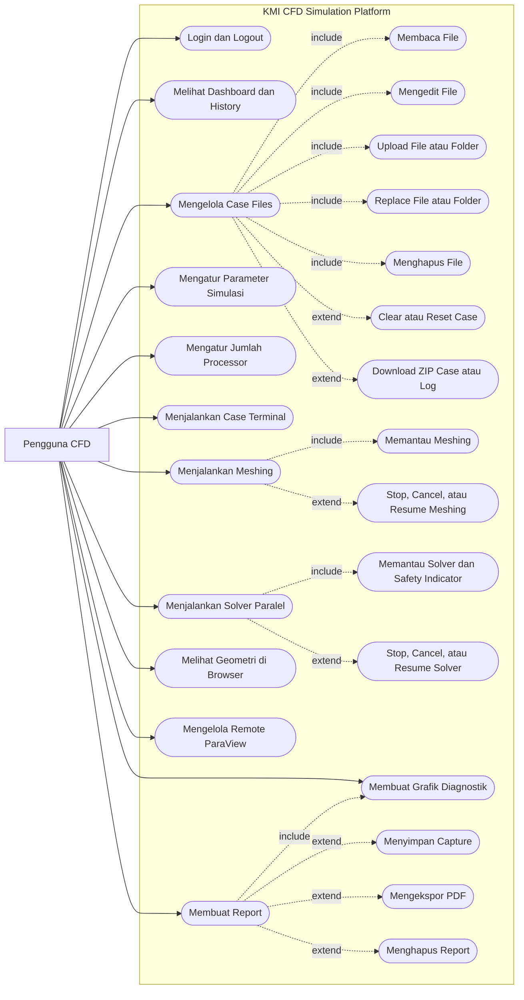

# Use Case Diagram

## Aktor

Sistem hanya menampilkan satu aktor pada use case diagram, yaitu **Pengguna CFD**. OpenFOAM, MPI, filesystem, SQLite, dan ParaView diperlakukan sebagai bagian dari lingkungan teknis implementasi, bukan aktor use case.

## Diagram Use Case Utama

## Deskripsi Use Case

| Use case | Prasyarat | Alur ringkas | Hasil |
| --- | --- | --- | --- |
| Login | Aplikasi aktif dan kredensial tersedia. | Pengguna mengirim kredensial, sistem memvalidasi dan membuat session. | Pengguna masuk ke workspace. |
| Dashboard | Pengguna sudah login. | Sistem membaca history SQLite dan menghitung metrik. | Ringkasan dan riwayat tampil. |
| Kelola Case Files | `CASE_ROOT` dapat diakses. | Pengguna membaca, mengubah, mengunggah, mengganti, menghapus, atau mengarsipkan file. | Filesystem case berubah atau file diunduh. |
| Input Parameter | Mapping dan dictionary tersedia. | Nilai form dipetakan ke file, block, dan key OpenFOAM. | Dictionary diperbarui. |
| Set Processor | `decomposeParDict` tersedia. | Sistem memperbarui jumlah subdomain dan bobot processor. | Konfigurasi paralel tersimpan. |
| Case Terminal | Pengguna sudah login. | Satu command divalidasi dan dijalankan dari cwd case. | Output command ditampilkan. |
| Meshing | Dictionary dan geometri tersedia. | Enam tahap meshing dijalankan berurutan. | Mesh dan processor directory terbentuk. |
| Solver | Processor mesh lengkap. | Solver dijalankan paralel melalui MPI. | Time directory dan log solver dihasilkan. |
| Graph | Log solver tersedia. | Script plotting membaca log dan membuat PNG. | Grafik diagnostik tersedia. |
| ParaView Browser | PolyMesh atau VTP tersedia. | Sistem membuat/mengirim VTP dan browser merender geometri. | Preview geometri tampil. |
| Remote ParaView | `pvserver` tersedia. | Sistem mengelola server dan menampilkan data koneksi. | Sesi remote siap digunakan. |
| Report | Folder report dapat ditulis. | Sistem memperbarui graph, membuat folder, dan menyalin aset. | Report baru tersedia. |

